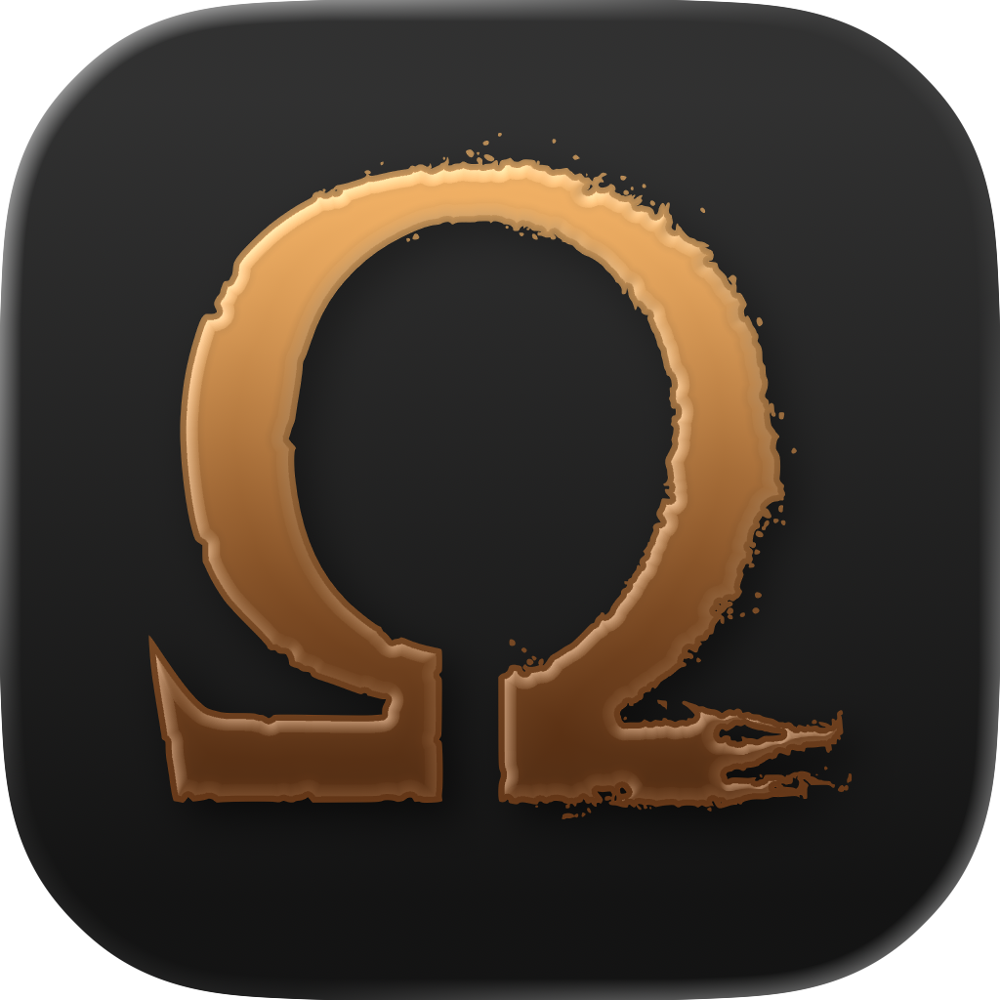
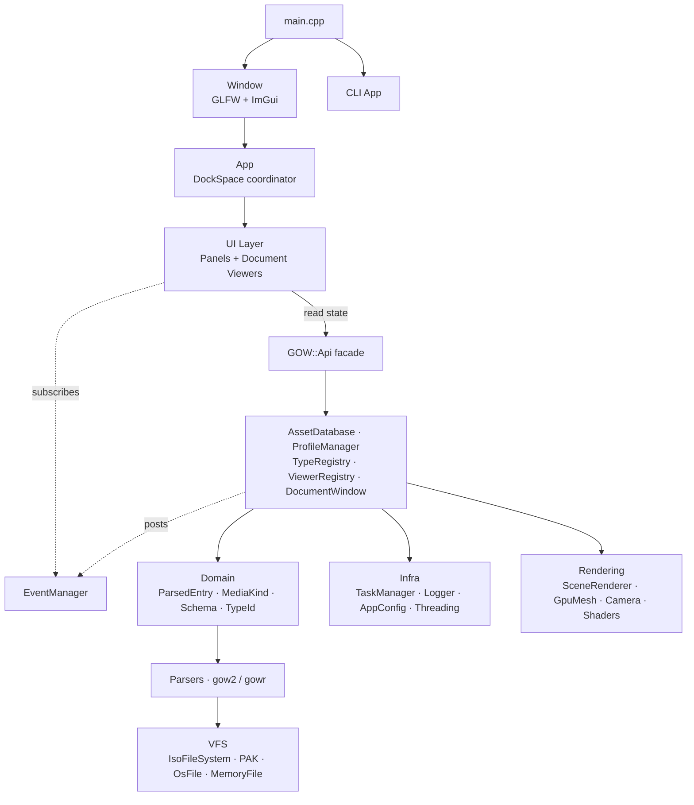

<p align="center">
  
  <h1 align="center">God Of War Toolkit</h1>
  <p align="center">
    <strong>Cross-platform toolkit for browsing and extracting God of War game assets.</strong>
  </p>
  <p align="center">
    <a href="https://github.com/JeanxPereira/GoWToolkit/actions/workflows/ci.yml"></a>
    
    
    
  </p>
</p>

---

GoWToolkit is a native C++ desktop application for exploring game assets from the *God of War* franchise. It currently targets **God of War II** (PS2) and **God of War Ragnarök** (PS4/PS5/PC), with a full GUI for 3D mesh, texture, material, audio and video preview, plus a CLI for scripted workflows.

## Features

| Area | What it does |
|---|---|
| Containers | Reads ISO 9660 images, GOW2 VPK and WAD, GOWR WAD (WTOC v2 + LZ4) |
| Browsers | `IsoBrowser`, `PakBrowser`, `WadBrowser` panels with hierarchical tree and async load via `TaskManager` |
| Media filter | Tree filter by `MediaKind` (Image, Mesh, Audio, Video, Material, Animation) — game-agnostic |
| Inspector | Schema-driven field view of the selected node (`StructDef` + `NodeInstance`) |
| Viewport3D | OpenGL mesh preview with multi-LOD, joint hierarchy, infinite grid, orbit/pan/zoom camera |
| ImageViewer | PS2 TXR decode; GOWR GNF with RDNA2 detiling and BC1–BC7 via `bcdec` |
| MaterialViewer | Multi-layer slot view (diffuse, normal, gloss, AO, parallax) |
| SoundPlayer | SBK/VAG/ADPCM playback via miniaudio |
| VideoPlayer | Cinematic playback via FFmpeg |
| AnimCurveView | Skeletal curve plotting via ImPlot |
| MapViewer | Level layout and instance placement |
| CLI | `parse-wad`, `inspect`, `extract` |

## Supported Games

| Game | Platform | Formats |
|---|---|---|
| God of War II | PS2 | WAD, VPK, ISO, MDL, TXR, MAT, ANM, SBK/VAG, OBJ, SCR |
| God of War Ragnarök | PS4 / PS5 / PC | WAD (WTOC v2 + LZ4), MESH\_/MG\_, GNF (RDNA2 BC1 to BC7), MAT, MDL, PEM/PTC, Shaders, LodPack |

## Screenshots

<p align="center">
  
  &nbsp;
  
  
  
</p>

## Quick Start

### macOS

```sh
brew install cmake ninja ffmpeg
git clone --recursive https://github.com/JeanxPereira/GoWToolkit.git
cd GoWToolkit
mkdir -p build && cd build
cmake -G Ninja -DCMAKE_BUILD_TYPE=Release ..
ninja
```

### Windows (MSVC)

```cmd
git clone --recursive https://github.com/JeanxPereira/GoWToolkit.git
cd GoWToolkit
mkdir build && cd build
cmake -G "Visual Studio 17 2022" -A x64 ..
cmake --build . --config Release
```

> FFmpeg is fetched automatically from [BtbN prebuilt binaries](https://github.com/BtbN/FFmpeg-Builds) on Windows.

### Linux (Ubuntu / Debian)

```sh
sudo apt install cmake ninja-build g++ pkg-config \
  libgl-dev libx11-dev libxrandr-dev libxinerama-dev libxcursor-dev libxi-dev \
  libwayland-dev libxkbcommon-dev \
  libavformat-dev libavcodec-dev libswscale-dev libswresample-dev libavutil-dev

git clone --recursive https://github.com/JeanxPereira/GoWToolkit.git
cd GoWToolkit
mkdir -p build && cd build
cmake -G Ninja -DCMAKE_BUILD_TYPE=Release ..
ninja
```

> For Fedora and Arch, see the [platform-specific build guides](dist/compiling/).

## CLI Usage

When invoked with arguments, GoWToolkit runs without spawning the GUI:

```sh
# Parse a WAD and print the node tree
GoWToolkit parse-wad PAND01A.WAD

# Inspect a specific entry inside a WAD
GoWToolkit inspect PAND01A.WAD gohero00

# Inspect with explicit game profile
GoWToolkit inspect r_heroa00.wad MDL_heroa00 --game ragnarok

# Extract all WADs from an ISO
GoWToolkit extract game.iso ./output/
```

Without arguments, the GUI launches.

## Architecture

The codebase is layered top-down. UI talks to Core through a single facade (`GOW::Api`) and reacts to a pub/sub bus (`EventManager`). Core never depends on UI. Parsers are game-specific and feed a game-agnostic domain (`MediaKind`, `ParsedEntry`, schema nodes) that the UI consumes uniformly.



### Layers

| Layer | Path | Role |
|---|---|---|
| Window | `src/window/` | GLFW + ImGui lifecycle, per-platform setup (`.cpp` Win/Linux, `.mm` macOS), frame loop |
| App | `src/App.{h,cpp}` | DockSpace coordinator, panel and viewer registration, menu bar, config persistence |
| UI | `src/ui/` | Dockable panels (`PanelRegistry`) and document viewers (`ViewerRegistry`). State accessed via `GOW::Api`; updates driven by `EventManager` |
| Core | `src/core/` | Game-format logic with no UI dependency: facade, events, async, asset database, profile dispatch, parsers, schema, VFS |
| Rendering | `src/rendering/` | OpenGL scene rendering: `SceneRenderer`, `GpuMesh`, `Camera`, `GridRenderer`, `ShaderManager` |

### Key Concepts

| Symbol | Purpose |
|---|---|
| `GOW::Api` | Global facade. Replaces the old `AppContext` god-struct. Exposes `Database()`, `Profiles()`, `Types()`, `Viewers()`, `Documents()`, `Config()` and selection state |
| `EventManager` | Pub/sub for UI-Core decoupling. Events: `EventAssetSelected`, `EventWadOpened/Closed`, `EventDocumentOpened`, `EventAllClosed` |
| `TaskManager` | Thread pool backing async loads. `AssetDatabase::LoadWadAsync` and `LoadIsoPakAsync` post tasks and update the StatusBar via running-task introspection |
| `MediaKind` | Game-agnostic asset category (`Image`, `Mesh`, `Audio`, `Video`, `Material`, `Animation`, ...). Both profiles populate `ParsedEntry::kind`; `ViewerRegistry::OpenByKind` lets the UI route assets without knowing the game |
| `IGameProfile` | Game variant detection and WAD parsing. Implemented by `ProfileGOW2` and `ProfileGOWR` |
| `TypeRegistry` / `ITypeHandler` | Per-type metadata and content rendering hooks, registered per game version via `REGISTER_TYPE` macros |
| `IPanel` | All dockable UI panels. Signature reduced to `Draw()`; state flows through `GOW::Api` and event subscriptions |
| `IDocumentContent` | All document viewers (3D, image, material, sound, video, map) |
| `IVirtualFileSystem` / `IFile` | Filesystem abstraction over ISO images, PAK archives and OS files |

The refactor that introduced `GOW::Api`, `EventManager` wiring and `MediaKind` is tracked in `docs/state/` (CURRENT, COMPLETED, DECISIONS).

## Dependencies

All libraries are fetched via CMake `FetchContent` on first configure.

| Library | Version | Purpose |
|---|---|---|
| [ImGui](https://github.com/ocornut/imgui) | docking | UI framework (docking branch) |
| [GLFW](https://github.com/glfw/glfw) | 3.3.9 | Window and input |
| [GLM](https://github.com/g-truc/glm) | 1.0.1 | Math (vectors, matrices) |
| [lz4](https://github.com/lz4/lz4) | 1.9.4 | LZ4 decompression (GOWR WAD) |
| [ImPlot](https://github.com/epezent/implot) | master | 2D plotting (animation curves) |
| [doctest](https://github.com/doctest/doctest) | 2.4.11 | Unit test framework |
| [nlohmann/json](https://github.com/nlohmann/json) | 3.11.3 | JSON for golden tests |
| [glad](https://glad.dav1d.de/) | bundled | OpenGL loader |
| [miniaudio](https://miniaud.io/) | bundled | Audio playback |
| bcdec | bundled | BC1 to BC7 block decoder |
| [FFmpeg](https://ffmpeg.org/) | system / BtbN | Video decoding (auto-fetched on Windows, pkg-config on Linux/macOS) |

## Building from Source

Platform-specific guides:

- [macOS](dist/compiling/macos.md) — Apple Clang, Xcode or Ninja
- [Windows](dist/compiling/windows.md) — MSVC (Visual Studio 2022) or MSYS2/MinGW
- [Linux](dist/compiling/linux.md) — GCC or Clang with Ninja (Debian, Fedora, Arch)

### Build Types

| Type | Flags | Use Case |
|---|---|---|
| `Debug` | `-O0 -g` | Development and debugging |
| `Release` | `-O2 -DNDEBUG` | Distribution builds |
| `RelWithDebInfo` | `-O2 -g` | Profiling |

### Tests

Tests run via CTest after the build:

```sh
ctest --test-dir build --output-on-failure
```

Currently shipping: `unit`, `Golden_GOW2`, `Golden_GOWR`, `Metrics`, `Logger`, `Threading`, plus `MediaKind` and `ViewerRegistry` smoke tests.

## Acknowledgements

This project builds on the work of the God of War modding community.

| Project | Author | Contribution |
|---|---|---|
| [god_of_war_browser](https://github.com/mogaika/god_of_war_browser) | mogaika | Authoritative Go reference for GOW2 (PS2) parsing: WAD, VPK, mesh, texture, material, animation, VIF/DMA and ISO/PAK VFS. Primary reference for every GOW2 parser here. |
| [GOWTool](https://github.com/kainotoa/GOWTool) | kainotoa | God of War 2018 / Ragnarök asset browser and extractor. Key reference for GOWR WAD containers and asset formats. |
| [GoWRknk](https://reshax.com/files/file/21-god-of-war-ragnarok-ps4-model-tool/) | id-daemon | GOWR PS4 model export tool with bone and weight support. Reference for reverse-engineered mesh and skeleton binary formats. |
| GOWR Modding Guide | HitmanHimself | Community mesh replacement tutorial and tooling ecosystem. [Blacksmith's Kingdom Discord](https://discord.gg/z58z836hX9). |

## License

Provided as-is for educational and research purposes. See [LICENSE](LICENSE).

---

<p align="center">
  Made by <a href="https://github.com/JeanxPereira">JeanxPereira</a>
</p>
