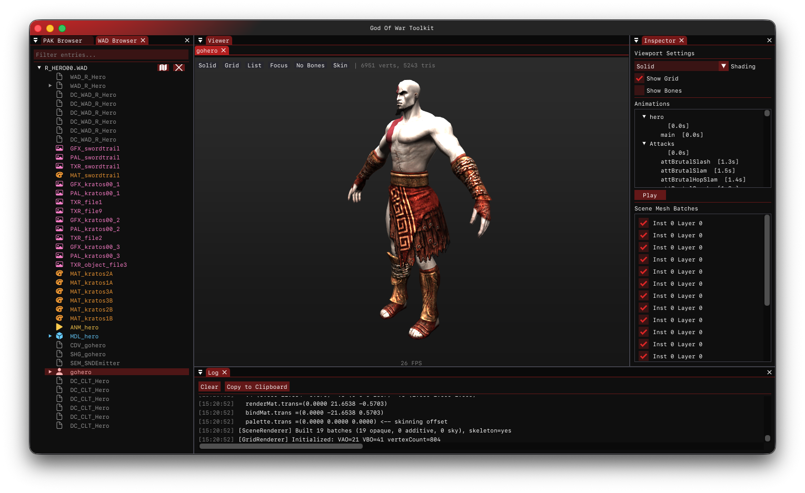
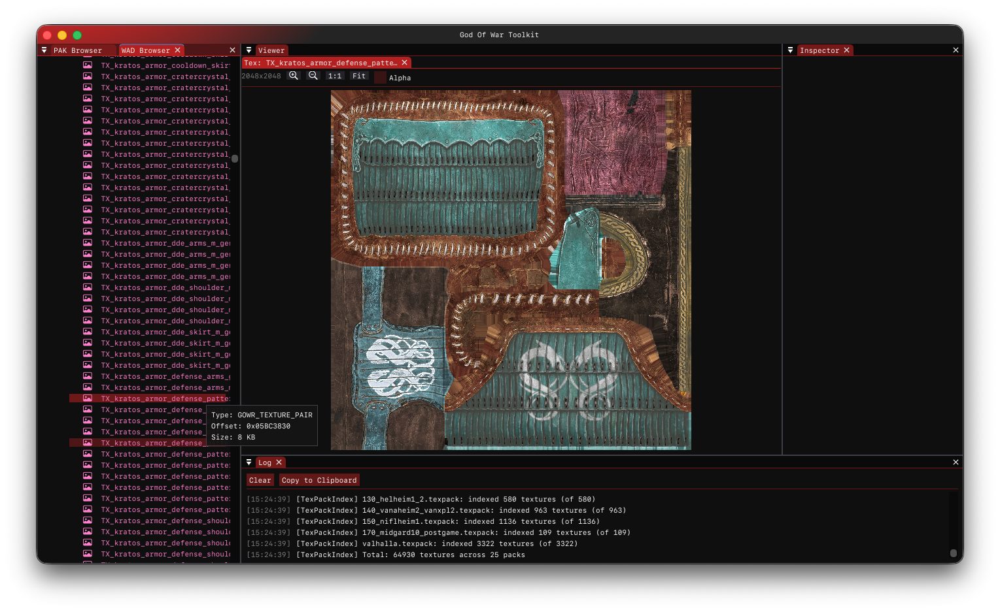
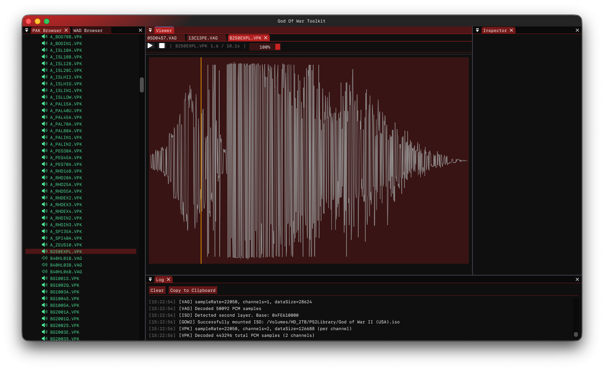
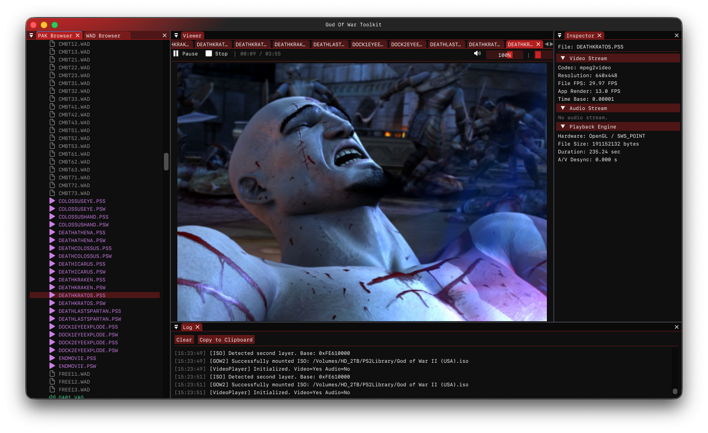
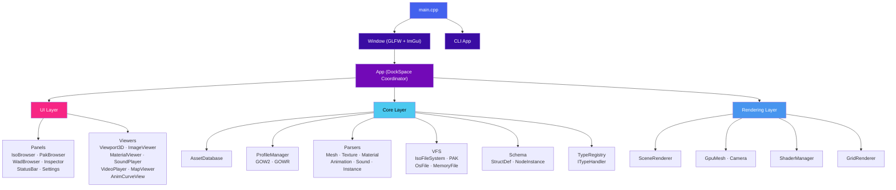

<p align="center">
  <h1 align="center">GoW Toolkit</h1>
  <p align="center">
    <strong>Cross-platform toolkit for browsing, inspecting, and extracting God of War game assets</strong>
  </p>
  <p align="center">
    <a href="https://github.com/JeanxPereira/GoWToolkit/actions/workflows/ci.yml"></a>
    
    
    
    
  </p>
</p>

---

GoWToolkit is a native C++ desktop application for exploring and extracting game assets from the **God of War** franchise. It supports both **God of War II** and **God of War Ragnarök**, providing a full GUI with 3D mesh rendering, texture viewing, material inspection, audio/video playback, and a headless CLI for scripted workflows.

## Features

| Category | Description |
|---|---|
| **Asset Browsing** | ISO / PAK / WAD file browsing with hierarchical tree navigation, smart node grouping (WTOC v2), and async loading |
| **3D Viewport** | Real-time OpenGL mesh rendering with multi-LOD support, skeletal joint preview, infinite grid, and orbit/pan/zoom camera |
| **Texture Viewer** | PS2 TXR decoding, GOWR GNF with native RDNA2 detiling, BC1–BC7 block decompression (bcdec), smooth zoom & pan |
| **Material Inspector** | Multi-layer material viewing with texture slot mapping (diffuse, normal, gloss, AO, parallax) |
| **Audio Player** | SBK / VAG / ADPCM playback via miniaudio with waveform visualization |
| **Video Player** | FFmpeg-powered in-game cinematic playback |
| **Animation Curves** | Skeletal animation curve visualization and joint hierarchy viewer (ImPlot) |
| **Map Viewer** | Level layout and instance placement viewer |
| **CLI Mode** | `parse-wad`, `inspect`, `extract` commands for headless / scripted asset extraction |
| **Native UX** | macOS: transparent titlebar + vibrancy glass + native `NSMenu` + `.app` bundle. Windows: borderless custom titlebar + DWM. Linux: standard GLFW window. |

## Supported Games

| Game | Platform | Formats |
|---|---|---|
| **God of War II** | PS2 | WAD, VPK, ISO, Mesh (MDL), Texture (TXR), Material (MAT), Animation (ANM), Sound (SBK/VAG), Instance (OBJ), Script (SCR) |
| **God of War Ragnarök** | PS4 / PS5 / PC | WAD (WTOC v2 + LZ4), Mesh (MESH\_/MG\_), Texture (GNF / RDNA2 BC1–BC7), Material (MAT), Model (MDL), Particles (PEM/PTC), Shaders, LodPack |

## Screenshots

<p align="center">
  
  &nbsp;
  
  
  
</p>

## Quick Start

### macOS

```sh
brew install cmake ninja ffmpeg
git clone --recursive https://github.com/JeanxPereira/GoWToolkit.git
cd GoWToolkit
mkdir -p build && cd build
cmake -G Ninja -DCMAKE_BUILD_TYPE=Release ..
ninja
```

### Windows (MSVC)

```cmd
git clone --recursive https://github.com/JeanxPereira/GoWToolkit.git
cd GoWToolkit
mkdir build && cd build
cmake -G "Visual Studio 17 2022" -A x64 ..
cmake --build . --config Release
```

> **Note:** FFmpeg is fetched automatically from [BtbN prebuilt binaries](https://github.com/BtbN/FFmpeg-Builds) on Windows — no manual installation needed.

### Linux (Ubuntu / Debian)

```sh
sudo apt install cmake ninja-build g++ pkg-config \
  libgl-dev libx11-dev libxrandr-dev libxinerama-dev libxcursor-dev libxi-dev \
  libwayland-dev libxkbcommon-dev \
  libavformat-dev libavcodec-dev libswscale-dev libswresample-dev libavutil-dev

git clone --recursive https://github.com/JeanxPereira/GoWToolkit.git
cd GoWToolkit
mkdir -p build && cd build
cmake -G Ninja -DCMAKE_BUILD_TYPE=Release ..
ninja
```

> For Fedora and Arch Linux instructions, see the [platform-specific build guides](dist/compiling/).

## CLI Usage

GoWToolkit can run without a GUI when invoked with arguments:

```sh
# Parse a WAD file and print the node tree
GoWToolkit parse-wad PAND01A.WAD

# Inspect a specific entry inside a WAD
GoWToolkit inspect PAND01A.WAD gohero00

# Inspect with explicit game profile
GoWToolkit inspect r_heroa00.wad MDL_heroa00 --game ragnarok

# Extract all WADs from an ISO image
GoWToolkit extract game.iso ./output/
```

Run without arguments to launch the GUI.

## Architecture



### Layer Overview

| Layer | Path | Role |
|---|---|---|
| **Window** | `src/window/` | GLFW + ImGui lifecycle, per-platform setup (`.cpp` Win/Linux, `.mm` macOS), frame loop |
| **App** | `src/App.h/cpp` | ImGui DockSpace coordinator, panel/viewer registration, menu bar, config persistence |
| **UI** | `src/ui/` | Dockable panels (`PanelRegistry`) and document viewers (`ViewerRegistry`) with cross-panel `AppContext` |
| **Core** | `src/core/` | All game-format logic (no UI dependency): asset database, game profile detection, per-format parsers, virtual filesystem, schema engine |
| **Rendering** | `src/rendering/` | OpenGL scene rendering: `SceneRenderer`, `GpuMesh`, `Camera`, `GridRenderer`, `ShaderManager` |

### Key Interfaces

| Interface | Purpose |
|---|---|
| `IGameProfile` | Game variant detection & dispatch — implemented by `ProfileGOW2` and `ProfileGOWR` |
| `IAssetLoader` | Per-asset-type parsing — one implementation per asset type per game |
| `IPanel` | All dockable UI panels |
| `IDocumentContent` | All document viewers (3D, image, material, sound, video) |
| `IVirtualFileSystem` / `IFile` | Filesystem abstraction over ISO images, PAK archives, and OS files |

## Dependencies

All libraries are fetched automatically via CMake `FetchContent` during the first build — no manual dependency management needed.

| Library | Version | Purpose |
|---|---|---|
| [ImGui](https://github.com/ocornut/imgui) | docking | UI framework (docking branch) |
| [GLFW](https://github.com/glfw/glfw) | 3.3.9 | Window / input management |
| [GLM](https://github.com/g-truc/glm) | 1.0.1 | Math (vectors, matrices, transforms) |
| [lz4](https://github.com/lz4/lz4) | 1.9.4 | LZ4 decompression (GOWR WAD) |
| [ImPlot](https://github.com/epezent/implot) | master | 2D plotting (animation curves) |
| [glad](https://glad.dav1d.de/) | bundled | OpenGL function loader |
| [miniaudio](https://miniaud.io/) | bundled | Cross-platform audio playback |
| [bcdec](https://github.com/AcademySoftwareFoundation/openexr) | bundled | BC1–BC7 block compression decoder |
| [FFmpeg](https://ffmpeg.org/) | system / BtbN | Video decoding (auto-fetched on Windows, pkg-config on Linux/macOS) |

## Building from Source

Detailed platform-specific build guides:

- [**macOS**](dist/compiling/macos.md) — Apple Clang, Xcode, or Ninja
- [**Windows**](dist/compiling/windows.md) — MSVC (Visual Studio 2022) or MSYS2/MinGW
- [**Linux**](dist/compiling/linux.md) — GCC/Clang with Ninja (Debian, Fedora, Arch)

### Build Types

| Type | Flags | Use Case |
|---|---|---|
| `Debug` | `-O0 -g` | Development & debugging |
| `Release` | `-O2 -DNDEBUG` | Distribution builds |
| `RelWithDebInfo` | `-O2 -g` | Profiling |

## Acknowledgements

This project builds upon the foundational reverse engineering work of the God of War modding community. GoWToolkit would not exist without the pioneering efforts of these projects and their authors:

| Project | Author | Contribution |
|---|---|---|
| [**god_of_war_browser**](https://github.com/mogaika/god_of_war_browser) | **mogaika** | Authoritative Go implementation for GOW2 (PS2) file format parsing — WAD, VPK, mesh, texture, material, animation, VIF/DMA, and ISO/PAK virtual filesystem. The **primary reference** for all GOW2 format implementations in this toolkit. |
| [**GOWTool**](https://github.com/kainotoa/GOWTool) | **kainotoa** | God of War 2018 / Ragnarök asset browser and extractor — WAD unpacking, texture extraction, mesh export. Key reference for GOWR WAD container and asset formats. |
| [**GoWRknk**](https://reshax.com/files/file/21-god-of-war-ragnarok-ps4-model-tool/) | **id-daemon** | God of War Ragnarök PS4 model export tool with bone/weight support. Critical reference for reverse-engineered mesh and skeleton binary formats. |
| **GOWR Modding Guide** | **HitmanHimself** | Community mesh replacement tutorial and tooling ecosystem for GOWR modding. [Blacksmith's Kingdom Discord](https://discord.gg/z58z836hX9). |

## License

This project is provided as-is for educational and research purposes. See [LICENSE](LICENSE) for details.

---

<p align="center">
  Made with ⚡ by <a href="https://github.com/JeanxPereira">JeanxPereira</a>
</p>
