# GoWToolkit — Análise Arquitetural Profunda (2026-05-17)

> Revisão completa pós-evolução. Baseada na leitura real do código (`src/` = **38.134 LOC**).
> Substitui a análise anterior (`architecture_analysis.md.resolved`, 2026-04) que comparava GoWToolkit ao ImHex.
>
> Foco: **pontos fracos atuais**, **padrões consolidados de engenharia de software** aplicáveis,
> **unificação de tipos por *media kind*** (Image / Mesh / Audio / Video / Script / Data),
> **separação real entre Core / Domain / Presentation**, **redução de acoplamento**
> e roadmap incremental sem big-bang refactor.

---

## 1. Sumário Executivo

| Categoria | Estado atual | Veredito |
|---|---|---|
| Pub/Sub (EventManager) | ✅ Implementado (`src/core/EventManager.h`) | Ótimo — usar mais |
| Thread pool (TaskManager) | ✅ Implementado (`src/core/TaskManager.h`) | Ótimo — migrar `LoadWadAsync` |
| Type dispatch (TypeRegistry) | ⚠️ Coexiste com `WadEntryRole`, `schemaType`, `IAssetLoader` | **3 sistemas paralelos** |
| Facade global (ToolkitApi) | ⚠️ Incompleto — só `Database()` + `Config()` | Expandir + matar `AppContext` |
| Game profiles | ✅ `IGameProfile` limpo | Ok |
| Game version enum | ⚠️ `GOW1` declarado mas sem profile real | Documentar status |
| Media-kind abstraction | ❌ Não existe | **Maior gap** — proposta central deste doc |
| Layering (UI ↔ Core) | ⚠️ Viewers em `ui/`, mas dados de cena em `core/parsers/shared/` puxam `rendering/GpuMesh.h` | Inversão de dependência quebrada |
| `WadTypes.h` (god header) | ⚠️ 190 LOC com 6 conceitos misturados | Quebrar |
| Documentação por módulo | ❌ Só CLAUDE.md de alto nível | Criar `docs/modules/` |

> [!IMPORTANT]
> **Tese central**: O projeto evoluiu bem na infraestrutura (Events, Tasks, TypeRegistry), mas a **modelagem de domínio** ficou para trás. Existem **três representações de tipo** convivendo (`TypeId` + `WadEntryRole` + `schemaType` string), e a UI ainda conhece detalhes específicos de cada jogo. A próxima fase precisa **consolidar a identidade de assets** e introduzir uma camada **Media-Kind** que torne o resto do código *game-agnostic*.

---

## 2. Mapa do Código Atual

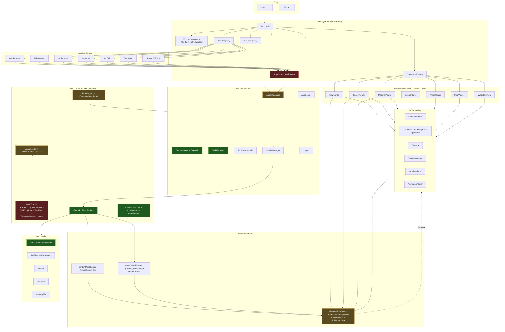

> Vermelho = problemático. Amarelo = funcional mas com débito. Verde = sólido.

---

## 3. Pontos Fracos — Catalogados por Severidade

### 🔴 P0 — Identidade de Tipo Triplicada

Em `ParsedEntry` (`src/core/WadTypes.h:123`) coexistem **três sistemas** para responder "que tipo é esse asset?":

```cpp
struct ParsedEntry {
    std::string  schemaType;   // ← legacy string "GOW2_MDL", "GOW1_TXR"
    GOW::TypeId  typeId;       // ← compile-time enum (TypeId.h)
    WadEntryRole role;         // ← classificação semântica GOWR (WadTypes.h:59)
    WadBlock     block;        // ← classificação de bloco GOWR
    ...
};
```

E mais: `TypeIdToSchemaString()` (linha 150) é uma ponte manual. `IAssetLoader::canHandle(const std::string& schemaType)` (`src/core/loaders/IAssetLoader.h:14`) ainda usa a string. `ViewerRegistry::CanHandle(GameVersion ver, TypeId typeId, const std::string& schemaType)` aceita **os dois**.

**Consequências reais**:
- Adicionar um novo tipo exige editar 4–5 arquivos
- `switch` por string + `switch` por enum + `if (role == ...)` espalhados
- `WadEntryRole` é específico de GOWR mas vive em header compartilhado
- `TypeId::Sentinel`, `TypeId::ShaderContainer` etc. são *GOWR-only* dentro do enum global

> **Fix proposto**: Consolidar em **um único** identificador: `TypeId` + um sub-namespace de "tags" e "roles" *encapsulado no profile*. Detalhe na §6.

---

### 🔴 P0 — `AppContext` é uma God Struct

```cpp
// src/ui/AppContext.h
struct AppContext {
    AssetDatabase&       db;
    ParsedEntry*&        selected;    // ponteiro-para-ponteiro compartilhado
    GOW::DocumentWindow& documentWindow;
    GOW::ViewerRegistry& viewerRegistry;
    AppConfig*           config;
};
```

Passado por **todo** `IPanel::draw(AppContext&)` e até `IDocumentContent::DrawInspector(AppContext&)`. Todo painel ganha acesso a tudo. Adicionar um novo sub-sistema = editar struct + assinatura de toda `draw()`.

A `ToolkitApi` (`src/core/ToolkitApi.h`) **já existe** para isso, mas só expõe `Database()` e `Config()`. Está parada.

> **Fix proposto**: Migrar tudo para `GOW::Api::*` + `EventManager`. Remover `AppContext`. Detalhe na §7.

---

### 🔴 P0 — Inversão de Dependência Violada

`src/core/parsers/shared/MeshData.h:5`:
```cpp
#include "rendering/GpuMesh.h"  // ← Core importa de Rendering
```

`SceneNode.h` (parsers/shared) inclui `MeshData.h` → `GpuMesh.h` → `glm`. Resultado: **core puxa OpenGL transitivamente**. A regra "Core sem dependência de UI/Render" do CLAUDE.md está quebrada.

> **Fix proposto**: `MeshData` deve carregar somente *POD CPU-side* (posições, normais, índices). `GpuMesh` é responsabilidade do renderer, que **importa** `MeshData` — não o contrário. `BoundingBox` pertence ao domínio (Core), não ao Rendering.

---

### 🟠 P1 — Ausência da Abstração *Media Kind*

Hoje o ImageViewer só sabe abrir uma `TexturePair` GOWR ou um `Texture` GOW2 porque o handler resolve dinamicamente. Mas não existe nenhuma classe ou enum que represente "isto é uma **imagem**, independente do jogo".

**Concretamente faltam**:

```cpp
enum class MediaKind : uint8_t {
    Unknown,
    Image,    // GOW1/2 TXR, GOWR TexturePair, .bmp avulso
    Mesh,     // GOW1/2/R modelos 3D
    Material, // wrapping de Image+params
    Skeleton, // ObjectData (rig + bones)
    Animation,
    Audio,    // VAG, SBK, áudio GOWR
    Video,    // VPK, PSS, PSW, .mp4
    Script,   // scp_*, scripts GOWR
    Map,      // contextos de cena
    Shader,
    Container,// Wad, Pak, Iso (navegáveis)
    Raw,      // bytes desconhecidos
};
```

Esse enum permite que **toda a UI seja escrita uma vez**:
- `ImageViewer` aceita qualquer `MediaPayload<MediaKind::Image>` → `TextureData`
- `Viewport3D` aceita `MediaKind::Mesh` → `SceneData`
- `SoundPlayer` aceita `MediaKind::Audio` → `AudioData`
- `WadBrowser` agrupa por `MediaKind` para filtros ("mostrar só imagens")

E o **dispatch fica plano**:

```cpp
auto viewer = MediaRegistry::CreateViewer(entry.mediaKind, payload);
```

Sem `if (game == GOWR && type == TexturePair) ... else if (game == GOW2 && type == Texture) ...`.

> Essa é **a melhoria estrutural mais importante** deste documento. Detalhe completo na §5.

---

### 🟠 P1 — Dois Sistemas de Dispatch: `ITypeHandler` vs `IAssetLoader`

| | `ITypeHandler` (novo) | `IAssetLoader` (legado) |
|---|---|---|
| Localização | `src/core/types/` | `src/core/loaders/` |
| Identidade | `TypeId` enum | `std::string schemaType` |
| Registro | `REGISTER_TYPE` macro auto | Manual |
| Cria viewer? | `CreateViewer()` | `load()` |
| Cria scene? | `BuildSceneData()` | ❌ |
| Quem chama | `TypeRegistry::Resolve()` | `ViewerRegistry`? |

`GOWRLoaders.h` mostra que os "loaders" GOWR foram **renomeados para handlers** (todos derivam de `ITypeHandler`), mas o arquivo `IAssetLoader.h` continua vivo e referenciado.

> **Fix proposto**: Deletar `IAssetLoader.h`, `GOW2Loaders.h`, `GOWRLoaders.h`. Mover handlers GOWR para `src/core/types/handlers/gowr/`. Idem GOW2.

---

### 🟠 P1 — `WadTypes.h` é um God Header

190 LOC contendo:

1. `WadAssetName` (parser de nomes GOWR)
2. `WadEntryRole` enum (35 valores, GOWR-only)
3. `WadBlock` enum (GOWR-only)
4. `ParsedEntry` (estrutura central)
5. `TypeIdToSchemaString()` (bridge legacy)
6. `OpenWad` (raiz de uma WAD aberta)

**Tudo num único header** que **todo .cpp** acaba incluindo. Mudança em qualquer um → rebuild gigantesco.

> **Fix proposto**: Quebrar em `domain/Entry.h`, `domain/Wad.h`, `domain/MediaKind.h`, e mover `WadAssetName` + `WadEntryRole` para `profiles/gowr/GowrTaxonomy.h` (são específicos).

---

### 🟡 P2 — `GameVersion::GOW1` declarado mas sem implementação

```cpp
// GameVersion.h
enum class GameVersion : uint8_t { GOW1, GOW2, GOWR };
```

`REGISTER_TYPE(GOW1, MeshHandler)` registra handlers para um profile que **não existe**. Não há `ProfileGOW1`. Causa: dead branch silencioso + falsa expectativa de cobertura.

> **Fix proposto**: Ou remover `GOW1` até existir um `ProfileGOW1`, ou marcar com `[[deprecated]]` e excluir as `REGISTER_TYPE(GOW1, ...)` chamadas.

---

### 🟡 P2 — `LoadWadAsync` Não Usa o `TaskManager`

`AssetDatabase.h` ainda tem:
```cpp
std::future<void>      m_pendingLoad;
std::atomic<float>     m_loadProgress;
std::atomic<LoadState> m_loadState;
```

O `TaskManager` foi construído para isso (`createTask`, `TaskHolder::getProgress`), mas o database segue com `std::async` ad-hoc. **Sem cancelamento, sem unificação na StatusBar**.

> **Fix proposto**: Substituir `m_pendingLoad` por `TaskHolder`. Remover state machine `LoadState`. StatusBar passa a iterar `TaskManager::getRunningTasks()`.

---

### 🟡 P2 — Singletons Inconsistentes

```cpp
ProfileManager::Get()        // singleton clássico
TypeRegistry::Get()          // singleton clássico
GOW::Api::Database()         // facade-based
GOW::Api::Config()           // facade-based
AppContext::db (ref)         // injected
```

Cinco padrões diferentes para acessar estado global. Cada novo dev escolhe um aleatoriamente.

> **Fix proposto**: Tudo via `GOW::Api::*`. Singletons internos passam a ser **detail**, expostos somente pela facade. Detalhe na §7.

---

### 🟡 P2 — `DocumentWindow` Imperativo, Não Reativo

```cpp
// Em WadBrowser::draw():
ctx.documentWindow.AddTab(viewer);   // chamada direta
```

Deveria ser:
```cpp
EventAssetSelected::post(entry, wad);
// DocumentWindow se inscreve sozinho em EventAssetSelected
// e decide se abre nova aba ou foca existente
```

Já existe `EventAssetSelected` + `EventDocumentOpened` em `Events.h`, **mas ninguém posta**. Eventos órfãos = código morto.

---

### 🟢 P3 — Logger ad-hoc

`fprintf(stderr, "[EventManager] ...")` espalhado. `Logger.h` existe mas não é usado consistentemente.

> **Fix**: `GOW::Log::Info/Warn/Error` macros + um sink que pode escrever em arquivo ou na StatusBar.

---

### 🟢 P3 — `ImageViewer` cresceu além do seu nome

Hoje desenha texturas, mas o `.h` referencia "smooth zoom and pan" (commit recente). Falta separar **estado de visualização** (zoom/pan) de **decodificação** (BC, swizzle, RDNA2). Boa hora para extrair `ImagePresenter` (UI) ↔ `ImageSource` (Core).

---

## 4. Aplicando Padrões Consolidados

### 4.1 Arquitetura em Camadas (Layered / Clean)

A nomenclatura "Core / UI" hoje está difusa. Proposta:

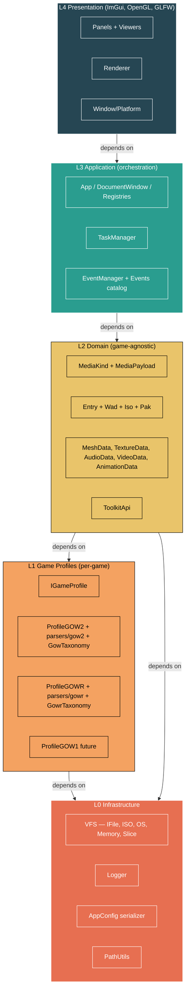

**Regra única**: setas só descem. Lint via `tools/check_layers.py` que falha no CI se um header de L2 incluir `rendering/` ou `imgui.h`.

---

### 4.2 Hexagonal (Ports & Adapters) para Profiles

Cada `IGameProfile` é um **adapter** que converte bytes específicos do jogo em representação canônica (`MediaPayload`). Os viewers são **ports** consumindo essa representação.

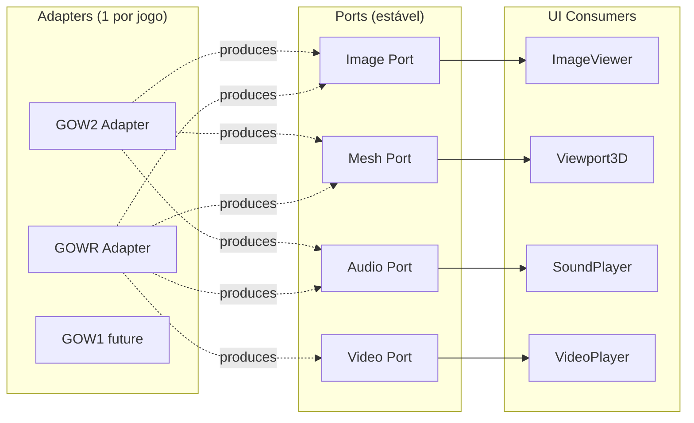

**Resultado**: adicionar GOW1 = um novo adapter, **zero mudanças** nos viewers.

---

### 4.3 Strategy + Registry para Decoding

Hoje `MeshParser` GOW2 e GOWR são classes distintas chamadas em locais distintos. Padronizar:

```cpp
template<MediaKind K>
class IDecoder {
public:
    virtual MediaPayload<K> Decode(std::shared_ptr<IFile>, const DecodeContext&) = 0;
};

class ImageDecoder : public IDecoder<MediaKind::Image> { ... };
class MeshDecoder  : public IDecoder<MediaKind::Mesh>  { ... };
```

E a fábrica:
```cpp
class DecoderRegistry {
    // (GameVersion, TypeId) → unique_ptr<IDecoderBase>
};
```

Cada `Profile.ParseWad()` chama `DecoderRegistry::Decode(ver, typeId, file)`. Sem `switch` espalhado.

---

### 4.4 Observer (já temos — usar!)

`EventManager` é Observer. Eventos definidos mas órfãos:
- `EventAssetSelected` — nada posta, nada escuta
- `EventDocumentOpened` — idem
- `EventAssetLoaded` — idem
- `EventAnimationLoaded` — idem

**Ação**: wire-up. Browsers postam, viewers/inspector inscrevem. Detalhe na §7.

---

### 4.5 Command Pattern para Ações do Usuário

Hoje "abrir arquivo recente", "fechar WAD", "abrir asset em viewer" são chamadas diretas. Para suportar:
- Undo/redo (futuro)
- Command palette estilo VS Code (Ctrl+Shift+P)
- Keyboard shortcuts configuráveis
- Logging de ações

Introduzir `Command` interface + `CommandRegistry`:
```cpp
struct ICommand {
    virtual const char* Id() const = 0;
    virtual const char* Label() const = 0;
    virtual void Execute(const CommandArgs&) = 0;
};
```

ImGui menu + atalhos consultam o registry. Zero acoplamento entre menu e implementação.

---

### 4.6 Result Types (Either / Outcome)

Hoje:
```cpp
bool ParseWad(std::shared_ptr<IFile> file, OpenWad& outWad);
```

Booleano não diz **por que** falhou. Padronizar com `std::expected<T, ParseError>` (C++23) ou um `Result<T>` próprio:

```cpp
struct ParseError {
    enum Code { NotMyFormat, Truncated, BadMagic, UnsupportedVersion } code;
    std::string detail;
    size_t offset = 0;
};

Result<OpenWad> IGameProfile::ParseWad(std::shared_ptr<IFile>) ;
```

Cancela a necessidade de `out` params e dá mensagem útil ao usuário.

---

## 5. Proposta Central: Camada Media-Kind

### 5.1 Por que

Hoje o caminho de um asset até a UI atravessa quatro identificadores:

```
TOC entry name → WadAssetName.parse → WadEntryRole → TypeId → schemaType → viewer
```

Cada um adiciona uma chance de erro silencioso. Pior: **o viewer precisa saber do jogo** (handlers `GOWRTextureHandler`, `GOWRRigHandler`).

A camada `MediaKind` colapsa tudo:

```
TOC entry → Profile.classify(entry) → Asset{kind, payload, sourceId} → ViewerRegistry.byKind(kind)
```

### 5.2 Modelagem

```cpp
// L2 Domain — game-agnostic
enum class MediaKind : uint8_t {
    Unknown=0, Image, Mesh, Material, Skeleton, Animation,
    Audio, Video, Script, Map, Shader, Container, Raw,
};

struct Asset {
    AssetId         id;          // hash estável (path + offset)
    MediaKind       kind;
    std::string     displayName;
    std::string     icon;        // SF Symbol
    Color4f         color;

    // Payload é loaded lazy — uma única função por kind:
    std::function<MediaPayload()> loadPayload;

    // Referência opcional ao Entry original (debug / inspector raw)
    const ParsedEntry* sourceEntry = nullptr;
};

// MediaPayload é variant<TextureData, MeshData, AudioData, ...>
using MediaPayload = std::variant<
    std::monostate,                 // não carregado / erro
    std::shared_ptr<TextureData>,   // Image
    std::shared_ptr<SceneData>,     // Mesh (já agrega skeleton+anim+texturas)
    std::shared_ptr<AudioData>,     // Audio
    std::shared_ptr<VideoSource>,   // Video
    std::shared_ptr<ScriptData>,    // Script
    std::shared_ptr<RawBytes>       // Raw / Unknown
>;
```

### 5.3 Diagrama do Fluxo

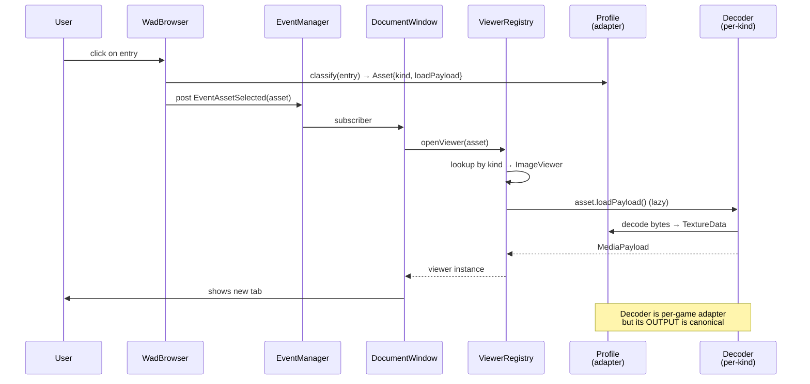

### 5.4 O que muda na prática

| Antes | Depois |
|---|---|
| `ImageViewer(const ParsedEntry&, OpenWad&)` | `ImageViewer(std::shared_ptr<TextureData>)` |
| `if (entry.typeId == TexturePair) ...` na UI | UI nunca toca `TypeId` |
| `ViewerRegistry::CanHandle(ver, typeId, schema)` | `ViewerRegistry::Get(MediaKind)` |
| Adicionar GOW1 = N edits | Adicionar GOW1 = 1 adapter |
| Filtrar tree "só imagens" = impossível | `tree.filter([](a){return a.kind==Image;})` |

### 5.5 Compatibilidade

`MediaKind` **não substitui** `TypeId`. Eles vivem em camadas diferentes:
- `TypeId` = identidade **técnica** (qual magic, qual handler de parsing)
- `MediaKind` = identidade **semântica** (qual *categoria de mídia*)

Mapping é 1:N — múltiplos `TypeId` mapeiam para um `MediaKind`:

```cpp
MediaKind KindOf(TypeId t) {
    switch (t) {
        case TypeId::Texture:
        case TypeId::TexturePair:
        case TypeId::GfxData:        return MediaKind::Image;

        case TypeId::Model:
        case TypeId::Mesh:
        case TypeId::MeshDefn:
        case TypeId::MeshGpu:        return MediaKind::Mesh;

        case TypeId::Sound:
        case TypeId::VagAudio:
        case TypeId::SoundEmitter:   return MediaKind::Audio;

        case TypeId::VpkVideo:
        case TypeId::PssVideo:
        case TypeId::PswVideo:       return MediaKind::Video;

        case TypeId::Material:
        case TypeId::MaterialRef:    return MediaKind::Material;

        case TypeId::Object:
        case TypeId::GameObjectProto:
        case TypeId::GameObjectInst: return MediaKind::Skeleton;

        case TypeId::Animation:
        case TypeId::AnimClip:       return MediaKind::Animation;

        case TypeId::Script:         return MediaKind::Script;

        case TypeId::ShaderContainer:
        case TypeId::ShaderVertex:
        case TypeId::ShaderPixel:
        /* ... */                    return MediaKind::Shader;

        case TypeId::WadFile:        return MediaKind::Container;
        default:                     return MediaKind::Unknown;
    }
}
```

Função pura, em `core/types/MediaKind.cpp`. Inspector continua mostrando `TypeId`; UI principal usa `MediaKind`.

---

## 6. Refatoração da Identidade de Tipo

### 6.1 Estado-alvo

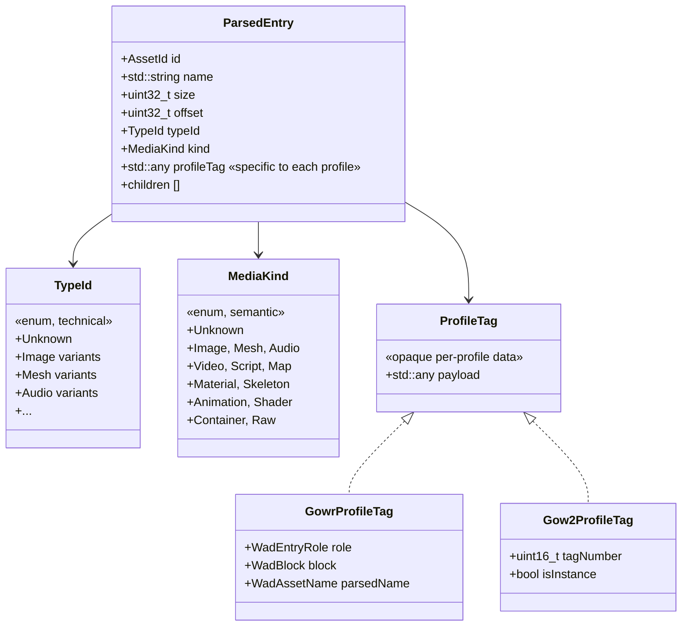

**Pontos-chave**:
- `WadEntryRole` e `WadBlock` saem do header global → entram em `profiles/gowr/GowrTaxonomy.h`
- `ParsedEntry::schemaType` (string) **morre**
- `TypeIdToSchemaString()` **morre**
- `IAssetLoader` + `canHandle(string)` **morrem**
- Inspector que precisa de `WadEntryRole` faz `static_cast<const GowrProfileTag*>(entry.profileTag)`

### 6.2 Migration path (sem big-bang)

1. **Fase A** — Adicionar `MediaKind` + `KindOf()` + campo `MediaKind kind` em `ParsedEntry`. Tudo opcional, default = `Unknown`. Zero impacto.
2. **Fase B** — Cada profile preenche `kind` ao classificar. Browsers começam a filtrar por kind.
3. **Fase C** — Viewers ganham construtor `Viewer(payload)`. Wrapper antigo `(entry, wad)` continua funcionando.
4. **Fase D** — `ViewerRegistry::ByKind(kind)` introduzido. Browser passa a usar. `CanHandle(ver,typeId,schema)` `[[deprecated]]`.
5. **Fase E** — Remoção de `schemaType`, `WadEntryRole` do header global, `IAssetLoader`.

Cada fase compila e roda. Sem flag dia/noite.

---

## 7. Substituição do `AppContext` por Facade + Events

### 7.1 ToolkitApi expandido

```cpp
// src/core/ToolkitApi.h
namespace GOW::Api {
    // Lifecycle
    void Init(InitParams);
    void Shutdown();

    // Subsystems (todos retornam ref ou ptr estável)
    AssetDatabase&   Database();
    AppConfig&       Config();
    ProfileManager&  Profiles();
    TypeRegistry&    Types();
    ViewerRegistry&  Viewers();
    DocumentWindow&  Documents();
    TaskManager&     Tasks();   // já estático mas exposto via facade p/ teste

    // Selection state (era ctx.selected)
    ParsedEntry*     GetSelected();
    void             SetSelected(ParsedEntry*, OpenWad*);  // posta EventAssetSelected
}
```

### 7.2 Reescrita do `IPanel`

```cpp
// Antes
class IPanel {
    virtual void draw(AppContext& ctx) = 0;
};

// Depois
class IPanel {
    virtual void Draw() = 0;     // sem args; acesso via GOW::Api
    virtual const char* GetName() const = 0;
    virtual bool IsVisible() const = 0;
    virtual void SetVisible(bool) = 0;
};
```

### 7.3 Wiring de eventos

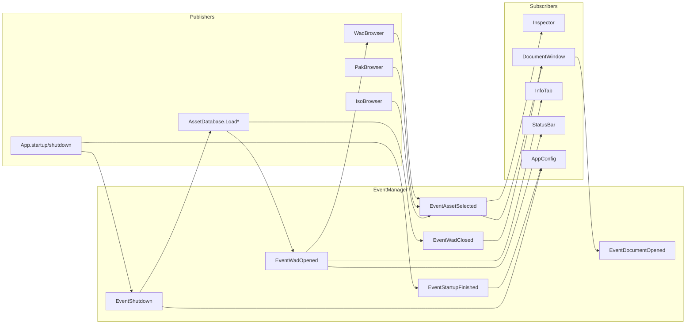

Cada subscriber se inscreve no seu construtor, desinscreve no destrutor (RAII). `AppContext` desnecessário.

---

## 8. Reorganização de Diretórios Proposta

Atual → Proposta:

```
src/
├── main.cpp
├── app/                          # ← era App.* + UI orchestration
│   ├── App.{h,cpp}
│   ├── DockLayout.{h,cpp}
│   ├── MenuBar.{h,cpp}
│   └── CommandRegistry.{h,cpp}   # NEW
│
├── domain/                       # ← L2 — game-agnostic
│   ├── MediaKind.{h,cpp}         # NEW
│   ├── Asset.{h,cpp}             # NEW — substitui ParsedEntry "leve"
│   ├── Entry.{h,cpp}             # ParsedEntry sem WadEntryRole
│   ├── Wad.{h,cpp}               # OpenWad
│   ├── media/                    # POD CPU-side
│   │   ├── TextureData.{h,cpp}
│   │   ├── MeshData.{h,cpp}      # SEM rendering/GpuMesh.h
│   │   ├── AudioData.{h,cpp}
│   │   ├── VideoData.{h,cpp}
│   │   ├── AnimationData.{h,cpp}
│   │   ├── SkeletonData.{h,cpp}  # ex ObjectData
│   │   └── SceneData.{h,cpp}
│   ├── schema/                   # AssetFormat DSL
│   └── BoundingBox.{h,cpp}       # ← migrado de rendering/
│
├── profiles/                     # L1
│   ├── IGameProfile.h
│   ├── ProfileManager.{h,cpp}
│   ├── gow2/
│   │   ├── ProfileGOW2.{h,cpp}
│   │   ├── GowTaxonomy.{h,cpp}
│   │   ├── parsers/...
│   │   └── handlers/...
│   ├── gowr/
│   │   ├── ProfileGOWR.{h,cpp}
│   │   ├── GowrTaxonomy.{h,cpp} # ← WadEntryRole, WadBlock, WadAssetName, WadNodeBuilder
│   │   ├── parsers/...
│   │   └── handlers/...
│   └── gow1/                     # quando existir
│
├── types/                        # dispatch infra
│   ├── TypeId.{h,cpp}
│   ├── TypeRegistry.{h,cpp}
│   └── ITypeHandler.h
│
├── app_services/                 # L3
│   ├── EventManager.h
│   ├── Events.h
│   ├── TaskManager.{h,cpp}
│   ├── ToolkitApi.{h,cpp}
│   ├── AssetDatabase.{h,cpp}
│   ├── AppConfig.{h,cpp}
│   ├── RecentFiles.{h,cpp}
│   └── Logger.{h,cpp}
│
├── ui/                           # L4 — Panels & Viewers
│   ├── IPanel.h
│   ├── PanelRegistry.{h,cpp}
│   ├── ViewerRegistry.{h,cpp}
│   ├── panels/
│   │   ├── WadBrowser.{h,cpp}
│   │   ├── PakBrowser.{h,cpp}
│   │   ├── IsoBrowser.{h,cpp}
│   │   ├── Inspector.{h,cpp}
│   │   ├── InfoTab.{h,cpp}
│   │   ├── StatusBar.{h,cpp}
│   │   └── SettingsWindow.{h,cpp}
│   └── viewers/
│       ├── IDocumentContent.h
│       ├── DocumentWindow.{h,cpp}
│       ├── Viewport3D.{h,cpp}
│       ├── ImageViewer.{h,cpp}
│       ├── MaterialViewer.{h,cpp}
│       ├── SoundPlayer.{h,cpp}
│       ├── VideoPlayer.{h,cpp}
│       ├── MapViewer.{h,cpp}
│       └── WadStatsView.{h,cpp}
│
├── render/                       # L4
│   ├── SceneRenderer.{h,cpp}
│   ├── GpuMesh.{h,cpp}           # importa domain/media/MeshData
│   ├── Camera.{h,cpp}
│   ├── ShaderManager.{h,cpp}
│   ├── GridRenderer.{h,cpp}
│   └── AnimationPlayer.{h,cpp}
│
├── platform/                     # L0
│   ├── Window.{h,cpp}
│   ├── NativeWindow.{h,cpp}
│   ├── platform_{windows,macos,linux}.{cpp,mm}
│   └── PathUtils.{h,cpp}
│
├── vfs/                          # L0
└── cli/                          # L4 alt entry
```

Benefícios:
- `#include` paths refletem arquitetura (`#include "domain/media/MeshData.h"`)
- Cada pasta = unidade de documentação (1 README.md por pasta)
- Tooling (clang-tidy, include-what-you-use) consegue impor regras de camada

---

## 9. Documentação por Módulo

Hoje só temos `CLAUDE.md` (alto nível) + `docs/GoWRknk/Formats/` (formatos GOWR). Proposta:

```
docs/
├── ARCHITECTURE.md              # visão geral + diagrama L0–L4
├── ADR/                         # Architecture Decision Records
│   ├── 0001-eventmanager.md
│   ├── 0002-taskmanager.md
│   ├── 0003-mediakind-layer.md  # NEW
│   ├── 0004-remove-appcontext.md # NEW
│   └── 0005-profile-tag-opaque.md # NEW
├── modules/                     # NEW
│   ├── domain.md
│   ├── profiles.md              # como adicionar um novo jogo
│   ├── types.md                 # registry + handlers
│   ├── ui-panels.md
│   ├── ui-viewers.md
│   └── render.md
├── formats/                     # por jogo + por formato
│   ├── gow2/
│   └── gowr/
├── guides/
│   ├── adding-a-game-profile.md # passo-a-passo
│   ├── adding-a-media-kind.md
│   ├── writing-a-viewer.md
│   └── debugging-a-parser.md
└── screenshots/
```

**ADR template** (1 página fixa):
```markdown
# ADR-0003: MediaKind Layer
- Status: Proposed
- Date: 2026-05-17
- Context: ...
- Decision: ...
- Consequences (positive / negative): ...
- Alternatives considered: ...
```

ADRs **nunca** são editados após aceitos — só **superseded by** ADR posterior. Esse é o "git log" da arquitetura.

---

## 10. Qualidade de Código & Tooling

### 10.1 Lints / CI sugeridos

| Ferramenta | Para que |
|---|---|
| `clang-tidy` perfil `-readability-*,-modernize-*,-bugprone-*` | smells e modernização C++ |
| `include-what-you-use` | reduzir headers transitivos (cura o `WadTypes.h`) |
| `clang-format` (já existe? checar) | format consistente, gate no CI |
| Script `tools/check_layers.py` | falha se header de L2 incluir `imgui.h`/`rendering/` |
| `cppcheck --enable=all` | leaks, dead code |
| Sanitizers (`-fsanitize=address,undefined`) em Debug | encontrar UB |
| `ccache` no CMake | builds locais 5× mais rápidos |

### 10.2 Testes mínimos onde **realmente** valem

Hoje "no test suite". Não precisa de TDD pleno, mas:

- **Parser tests** — cada parser GOW2/GOWR rodando contra um WAD de canto conhecido + checagem de número de entries / hash do MeshData. Detecta regressões em mudanças de classificação.
- **MediaKind mapping test** — `KindOf(TypeId)` exaustivo. Compila uma lista canônica.
- **VFS tests** — IsoFile abrir + ler bytes conhecidos.
- **Round-trip de AppConfig** — serializar + deserializar = identity.

Framework: doctest (single-header, cabe direto no projeto). Não precisa GTest.

### 10.3 Erros estruturados (já mencionado)

Substituir `bool ParseWad(...)` por `Result<OpenWad>` com `enum class ParseError`. Logger pode formatar bonito. Inspector pode mostrar offset do erro.

---

## 11. Roadmap Incremental (sem big-bang)

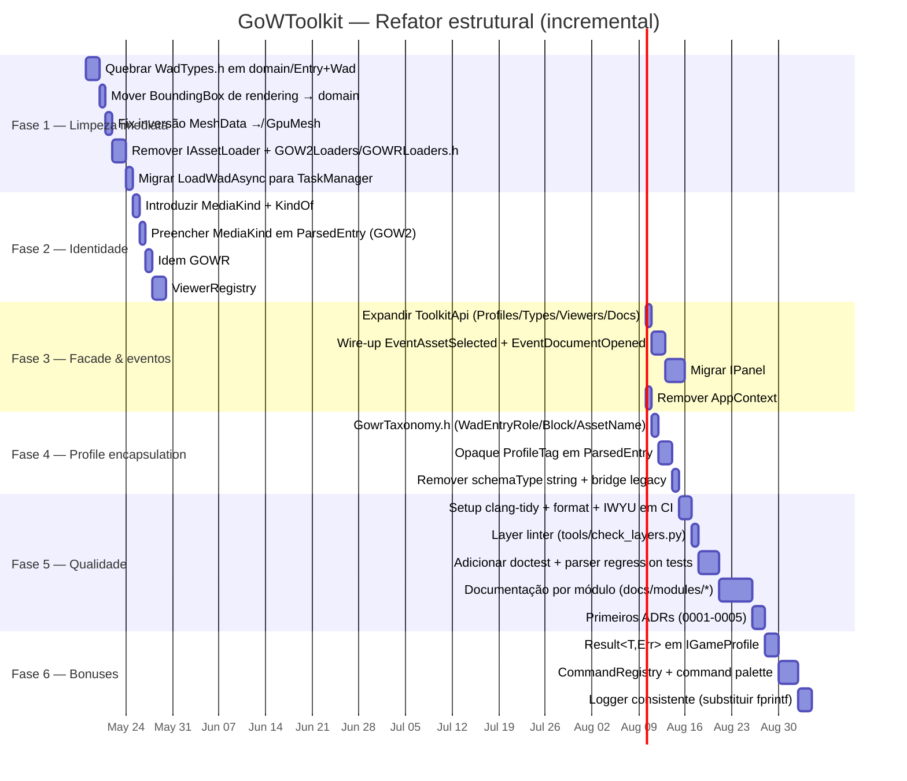

Cada fase **independente, mergeable, sem flag**.

---

## 12. Riscos e Mitigações

| Risco | Probabilidade | Mitigação |
|---|---|---|
| Refator de `WadTypes.h` quebra muita coisa | Alta | Header-only stub `#include "domain/Entry.h"` mantém compat; remover só após zero usos |
| `MediaKind` confunde devs porque `TypeId` continua existindo | Média | Docs claros — ADR explícito; comentário no header |
| Remover `AppContext` força edição de ~15 arquivos UI | Média | Fazer panel-a-panel, não tudo num PR |
| Perf hit do `std::variant` em `MediaPayload` | Baixa | Variant com `shared_ptr` é só dispatch indirecto; insignificante na escala de I/O |
| Profile-specific data em `std::any` perde type-safety | Média | Wrapper `ProfileTag<T>` com `as<T>()` que faz `dynamic_cast` e retorna optional |
| Documentação por módulo vira obrigação chata | Alta | Cada PR de refator **inclui** atualização do módulo afetado; não cria "doc debt" |

---

## 13. Checklist de Definição de Pronto (por módulo refatorado)

- [ ] Header da pasta sem includes "para cima" (L2 não inclui L4)
- [ ] README.md do módulo atualizado
- [ ] Função de entrada documentada com `///`
- [ ] Sem `fprintf(stderr, ...)` — usar `GOW::Log::*`
- [ ] Sem `out` parameters quando der pra retornar `Result<T>`
- [ ] Sem singleton novo — entrar via `GOW::Api::*`
- [ ] Sem `static_cast<int>(enum)` salvo em fronteiras de I/O
- [ ] Nenhum `// TODO` sem issue associado

---

## 14. TL;DR

1. **3 sistemas de tipo** (`TypeId` + `WadEntryRole` + `schemaType`) → consolidar em `TypeId` + opaque `ProfileTag` + `MediaKind` semântico.
2. **`AppContext` god struct** → matar via `ToolkitApi` expandido + `EventManager` (já temos!).
3. **Inversão de dependência quebrada** (`core/parsers/shared/MeshData.h` puxa `rendering/`) → POD limpo, render importa domain.
4. **`MediaKind` layer** = peça nova mais importante: torna viewers e UI **game-agnostic**.
5. **`IAssetLoader` morto-vivo** + **`GameVersion::GOW1` órfão** + **`LoadWadAsync` ad-hoc** = limpezas de baixo risco.
6. **5 padrões de acesso global** → 1 (`GOW::Api::*`).
7. **Eventos definidos mas órfãos** (`EventAssetSelected`, `EventDocumentOpened`, etc.) → wire-up imediato.
8. **Doc por módulo** + **ADRs** + **layer linter no CI** = governança que não depende de memória do dev.
9. **Roadmap incremental** em 6 fases, cada uma mergeable, sem big-bang.
10. **Estado atual é sólido** — a infra (Events/Tasks/TypeRegistry) está boa. O que falta é **modelagem de domínio limpa** e **disciplina de camadas**.

> O projeto tem osso bom. Falta esculpir a forma.

---

# Parte II — Releitura Fria: Gaps, Refinamentos e Referências de Indústria

> Adendo escrito após releitura crítica da Parte I.
> Foco: o que a primeira passada deixou de fora, padrões consolidados que aprofundam
> a proposta, e referências de toolkits reais que tratam formatos proprietários.

---

## 15. Gaps Identificados na Parte I

A Parte I cobriu bem **estrutura e identidade**, mas é cega em seis dimensões importantes:

| # | Dimensão ausente | Por que importa | Onde dói hoje |
|---|---|---|---|
| G1 | **Performance & memória** | Toolkits de asset lidam com files de GBs (uma ISO de GOWR > 30 GB) | `LoadWad` carrega tudo na RAM; sem mmap; sem streaming |
| G2 | **Pipeline de Export/Import** | Razão #1 da existência de toolkits (modders precisam de GLB, PNG, WAV) | Inexistente |
| G3 | **Extensibilidade por scripting** | Comunidade contribui formatos novos sem rebuild | Não há plano |
| G4 | **Cache & deduplicação de assets** | Mesma textura em N WADs = parse N vezes | Cada janela re-parseia |
| G5 | **Disciplina de threading** | Quem toca cada thread? GL context, ImGui, parsers, mmap | Implícito; bugs latentes |
| G6 | **Evolução de schema** | Patches de jogo mudam offsets; toolkit precisa coexistir com versões | `StructDef` é estático |
| G7 | **Observabilidade** | Sem métricas (parse time / asset count / cache hit) não há tuning | Logger ad-hoc |
| G8 | **Determinismo & golden tests** | Como detectar regressão de parser? | Sem snapshot |
| G9 | **Modelo de erros propagados ao usuário** | `bool` + `fprintf` ≠ erro visível na UI | `Result<T,E>` proposto mas sem destino |
| G10 | **Limites entre Editor e Viewer** | Toolkit começa read-only; modders pedem edit. Arquitetura precisa estar pronta | Hoje read-only é implícito; sem barreira |

A seguir cada gap recebe proposta concreta.

---

## 16. Performance & Memória (G1)

### 16.1 Memory-mapped I/O

`std::ifstream::read()` num WAD de 2 GB carrega tudo na RAM. Em ISO de 30 GB com 50 WADs, a app come VRAM/RAM rápido.

**Proposta**: `MemoryMappedFile` em `vfs/` como nova implementação de `IFile`:

```cpp
class MemoryMappedFile : public IFile {
public:
    static Result<std::shared_ptr<MemoryMappedFile>> Open(const std::filesystem::path&);
    std::span<const uint8_t> Bytes() const noexcept;  // zero-copy view
    size_t Size() const noexcept override;
    // Read/Seek herdados → operam sobre o span
private:
    void*  m_base = nullptr;
    size_t m_size = 0;
    int    m_fd   = -1;   // POSIX
    // HANDLE m_handle no Windows
};
```

Benefício:
- Parser pode trabalhar sobre `std::span<const uint8_t>` sem copiar
- SO faz paging por demanda
- Múltiplos parsers compartilham mesma view sem `shared_ptr<vector>`

Mantém `OsFile` para escrita (export). `IsoFile` continua leitura sequencial via slices.

### 16.2 Streaming Parsing (não carregar payload até precisar)

Hoje `EnsureNodeData` faz lazy load. Bom. Mas o **payload completo** entra na RAM. Para vídeos (.PSS chega a 1 GB), só o **header + index** deveria virar `AssetNode`, e o player de vídeo lê chunks via `IFile::Read(offset, len)`.

Convenção:
- `AssetNode` = **metadata + estrutura** (sempre na RAM)
- Bytes brutos = **acessados via `IFile` handle** (lazy, paginado pelo SO)

Isso já é parcialmente feito (`OpenPakEntryAsFile`). Sistematizar: nenhum parser retorna `std::vector<uint8_t>` cheio; sempre `std::span` ou `IFile::Slice`.

### 16.3 GPU Upload Pipeline

`Viewport3D` hoje cria `GpuMesh` no thread da UI (único thread com GL context válido). OK pra meshes pequenos, ruim para `MDL` com 200 partes.

Padrão moderno (Vulkan/D3D12 style mas aplicável a GL):

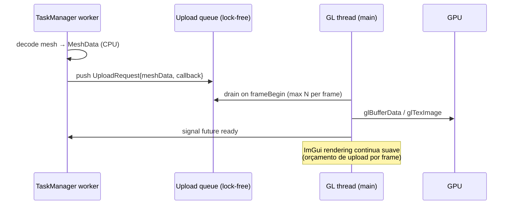

Implementação:
```cpp
class GpuUploadQueue {
    struct Request { std::function<void()> uploadFn; std::promise<void> done; };
    moodycamel::ConcurrentQueue<Request> m_queue;  // ou std::mutex+deque

    void DrainBudget(size_t maxBytes);  // chamado no início de cada frame
};
```

Resultado: clicar num model gigantesco **não congela** a UI.

### 16.4 Cache de assets parseados

LRU keyed por `AssetId` (hash do `IFile path + offset + size`):

```cpp
template<typename T>
class AssetCache {
    struct Entry { std::shared_ptr<T> data; std::chrono::steady_clock::time_point lastUsed; size_t bytes; };
    std::unordered_map<AssetId, Entry> m_map;
    size_t m_budgetBytes;
    std::mutex m_mx;

    std::shared_ptr<T> GetOrLoad(AssetId, std::function<std::shared_ptr<T>()> loader);
    void Evict(size_t target);
};
```

Caches separados por tipo: `AssetCache<TextureData>`, `AssetCache<SceneData>`, `AssetCache<AudioData>`. Inspector mostra "cache: 312 MB / 1 GB" na StatusBar.

### 16.5 Cache locality em `ParsedEntry`

`ParsedEntry` tem **5 strings** (`name`, `wadName`, `parsedName.{prefix,base,variant}`, `schemaType`, `displayName`) + `std::vector<ParsedEntry> children`. Cada entry custa ~200 bytes + heaps. WAD com 50k entries = 10 MB de fragmento. Tree walk = cache miss garantido.

**Otimização**: string-interning via `StringId` (hash → índice em pool global). Field `name` vira `uint32_t`. Tree fica plano:

```cpp
struct Entry {
    uint32_t      nameId;
    uint32_t      displayNameId;
    TypeId        typeId;
    MediaKind     kind;
    uint32_t      size;
    uint64_t      offset;
    uint32_t      firstChild;   // índice em vector<Entry>
    uint32_t      nextSibling;
    uint32_t      parent;
};
// pool: std::vector<Entry> em OpenWad
```

Tree walk = sequential scan = cache friendly. Comparável a ECS / Entt approach.

Trade-off: complexidade. Vale a pena **depois** do refator estrutural — não junto.

---

## 17. Pipeline de Export/Import (G2)

Razão pela qual modders usam Noesis ou umodel. **Toolkit sem export = brinquedo**.

### 17.1 Modelo: Exporter pluggable por MediaKind

```cpp
template<MediaKind K>
struct IExporter {
    virtual std::string FormatName() const = 0;       // "glTF 2.0"
    virtual std::string Extension()  const = 0;       // ".glb"
    virtual Result<void> Export(const MediaPayload<K>&, const std::filesystem::path&) = 0;
};

class ExporterRegistry {
    // MediaKind → list of IExporter*
    std::shared_ptr<IExporter<Image>> AddImage(...);  // PNG, BMP, KTX2
    std::shared_ptr<IExporter<Mesh>>  AddMesh (...);  // OBJ, glTF, FBX
    std::shared_ptr<IExporter<Audio>> AddAudio(...);  // WAV, OGG
};
```

UI: menu **Right-click no asset → Export As → [lista de formatos]**.

Formatos sugeridos por kind:

| Kind | Formato canônico (1ª prioridade) | Secundários |
|---|---|---|
| Image | KTX2 (preserva mip + BCn) | PNG (RGBA8), DDS |
| Mesh | glTF 2.0 binary (.glb) | OBJ + MTL, FBX |
| Skeleton + Animation | glTF (junto com mesh) | BVH, FBX |
| Audio | WAV PCM | OGG Vorbis |
| Video | MP4 (passthrough se já h264) | MKV |
| Material | JSON canônico | — |
| Script | bytecode original (cópia bruta) | desassembly se houver disasm |

### 17.2 Batch export

```cpp
TaskManager::createTask("Export all images", count, [](Task& t) {
    for (auto* asset : selectedImages) {
        if (t.shouldInterrupt()) break;
        ExporterRegistry::Get<Image>("PNG")->Export(asset->payload, dir / (asset->name+".png"));
        t.increment();
    }
});
```

Sai grátis porque `TaskManager` já existe.

### 17.3 Import (Editor mode, futuro)

Mesma simetria: `IImporter<K>` toma arquivo, devolve `MediaPayload<K>`. **Não** mexe na WAD original — gera **patch** que o Profile aplica em export final. Pattern: command + memento.

Deixar `IImporter` declarado mas sem implementação inicial. Sinaliza pra futuro.

---

## 18. Extensibilidade por Scripting (G3)

Toolkits proprietários sobrevivem pela comunidade. Hardcode = morte lenta. Opções:

| Opção | Prós | Contras |
|---|---|---|
| **Lua (sol2 binding)** | Embedável, leve (~200 KB), sandboxado, comunidade gamedev | Sintaxe não-familiar pra muitos modders |
| **Python (pybind11)** | Mais ferramental, NumPy, PIL | Runtime gigante; GIL; deploy chato |
| **JavaScript (QuickJS)** | Familiar; QuickJS é minúsculo | Menos lib gamedev |
| **Plugin nativo (`.dll`/`.dylib`)** | Performance máxima | ABI nightmare (vide ImHex) |
| **Format DSL declarativo (Kaitai Struct, 010 templates)** | Sem code, comunidade contribui só schemas | Limitado a parsing puro |

Recomendação para GoWToolkit:

1. **Curto prazo**: nada — `AssetFormat` DSL nativo já dá flexibilidade.
2. **Médio prazo**: **Lua via sol2**. Casos de uso:
   - "Custom export hook" — modder escreve script que pega `MediaPayload<Mesh>` e gera formato proprietário X
   - "Format probe" — modder escreve sniffer para identificar variantes não-detectadas
3. **Longo prazo**: importar `.ksy` (Kaitai Struct) → gera `AssetFormat` em compile-time via codegen. Isso compartilha **schemas** com outras comunidades de RE.

Plugin API mínima (Lua):
```lua
gow.register_exporter {
  kind = "Mesh",
  format_name = "Custom JSON",
  extension = ".json",
  export = function(mesh, path)
    -- mesh.parts, mesh.bounds, etc.
  end
}
```

---

## 19. Threading Discipline (G5)

Hoje implícito. Documentar **explicitamente** quem toca o quê:

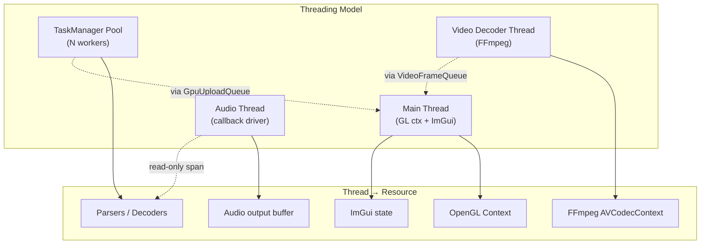

Regras explícitas:
- **GL APIs**: somente main thread. Workers preparam buffers CPU-side; upload via `GpuUploadQueue`.
- **ImGui**: somente main thread (inclui logging visual).
- **EventManager::post**: pode ser chamado de qualquer thread. **Subscribers que tocam GL/ImGui devem usar `TaskManager::doLater`** para diferir pra main.
- **Logger**: thread-safe; main thread drena pra UI.
- **AssetDatabase mutate** (open/close): main thread apenas. Reads concorrentes OK via `shared_mutex`.

Adicionar `#define ASSERT_MAIN_THREAD()` macro que checa thread-id em debug.

---

## 20. Evolução de Schema entre Versões do Jogo (G6)

GOWR teve N patches. Offset de um campo pode mudar. Hoje `StructDef` é hardcoded em código. Patch quebra silenciosamente.

### 20.1 Versionamento explícito

```cpp
struct AssetFormat {
    std::string name;          // "GOWR.Material"
    uint32_t    minVersion;    // primeira build que usa este layout
    uint32_t    maxVersion;    // última (UINT_MAX = ainda válido)
    // ... fields
};

class FormatRegistry {
    // (name, version) → AssetFormat*
    const AssetFormat* Resolve(const std::string& name, uint32_t buildVersion);
};
```

Profile detecta build via heurística (assinatura do executável do jogo / checksum de PAK) → `buildVersion`. Resto do código consulta via `Resolve()`.

### 20.2 Tolerância a campos novos

Parser **nunca** lê além de `format->size`. Se um campo desconhecido aparece, é tratado como `Raw` no inspector. Modders contribuem updates de schema **sem rebuild** (via `.ksy` ou config).

---

## 21. Observabilidade & Telemetria Local (G7)

Não enviar telemetria externa. **Sim** coletar métricas locais para debug:

```cpp
namespace GOW::Metrics {
    void RecordParseTime(TypeId, std::chrono::microseconds);
    void RecordCacheHit (const char* cacheName);
    void RecordCacheMiss(const char* cacheName);

    struct Snapshot {
        std::map<TypeId, std::chrono::microseconds> parseTimeP50;
        std::map<std::string, uint64_t> cacheHits, cacheMisses;
        size_t residentBytes;
    };
    Snapshot CurrentSnapshot();
}
```

Painel debug `MetricsView` (ImGui plots): tempo de parse por tipo, cache hit ratio, RAM residente. **Off por padrão**, liga via menu Debug. Custa ~50 LOC.

Logger estruturado:
```cpp
GOW_LOG_INFO("parser.gowr.mesh", "parsed {} parts in {}ms", parts.size(), elapsed.count());
```
Backend: fmt-lib + sink rotativo (`gowtool.log`) + sink UI (StatusBar/LogPanel).

---

## 22. Determinismo & Golden Testing (G8)

Único jeito de detectar "essa mudança no parser quebrou silenciosamente o WAD X". Padrão da indústria de RE:

```
tests/fixtures/
├── gow2/
│   ├── pak0_truth.bin            # cópia mínima de canto conhecido
│   └── pak0_truth.expected.json  # hash de cada ParsedEntry + key fields
├── gowr/
│   └── ...
```

Test runner:
```cpp
TEST_CASE("GOWR pak0 parsing is deterministic") {
    auto wad = ProfileGOWR().ParseWad(OpenFile("fixtures/gowr/pak0_truth.bin"));
    auto json = SnapshotEntries(wad);
    auto expected = LoadJson("fixtures/gowr/pak0_truth.expected.json");
    REQUIRE(json == expected);
}
```

Quando o parser intencionalmente muda, dev re-gera o snapshot e commita a mudança junto. Code review **vê o diff dos campos**.

Cobertura sugerida: 1 fixture por TypeId crítico (mesh, texture, anim, material). ~10 fixtures totais.

---

## 23. Erros Estruturados Visíveis ao Usuário (G9)

A Parte I propôs `Result<T, ParseError>`. Falta o **caminho até a UI**:

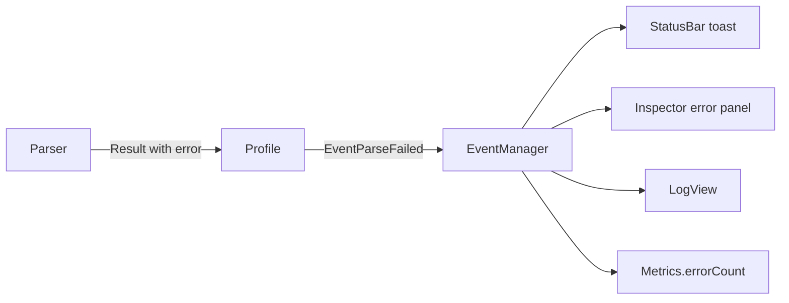

`ParseError`:
```cpp
struct ParseError {
    enum Code { NotMyFormat, Truncated, BadMagic, UnsupportedVersion,
                OffsetOOB, ChecksumMismatch, DecoderUnavailable };
    Code        code;
    std::string what;          // human readable
    uint64_t    offset = 0;
    std::string contextHint;   // "while reading MeshPart[3].materialId"
};

EVENT_DEF(EventParseFailed, ParseError, const ParsedEntry*);
```

Inspector mostra na header do asset um banner vermelho com `what + offset`. Click → abre hex viewer no offset. **Esse é o ciclo de feedback que falta em toolkits ruins.**

---

## 24. Editor vs Viewer (G10)

Toolkit começa read-only. Modders **vão pedir edit**. Preparar a arquitetura sem implementar:

1. **`OpenWad` é imutável**. Edits ficam em **patch overlay**:
   ```cpp
   struct WadPatch {
       std::map<AssetId, std::shared_ptr<MediaPayload>> overrides;  // payload novo
       std::set<AssetId> removed;
       std::vector<AddedAsset> added;
   };
   ```
2. **`AssetReader` always reads from `OpenWad + WadPatch overlay`** — viewer não sabe se está vendo original ou edit.
3. **Save = serializar patch separado** (`.gowedit`) inicialmente. Eventually: rebuild da WAD.
4. **Undo/Redo** = stack de `WadPatch` deltas. Command pattern (já proposto na §4.5).

Hoje: declarar `WadPatch` vazio + interfaces. Implementar quando necessário. Custo de "manter a porta aberta" = baixo.

---

## 25. Padrões e Conceitos Adicionais Vale Aplicar

### 25.1 C4 Model (Brown) para documentação

Padrão de Simon Brown para documentar arquitetura. 4 níveis de zoom:

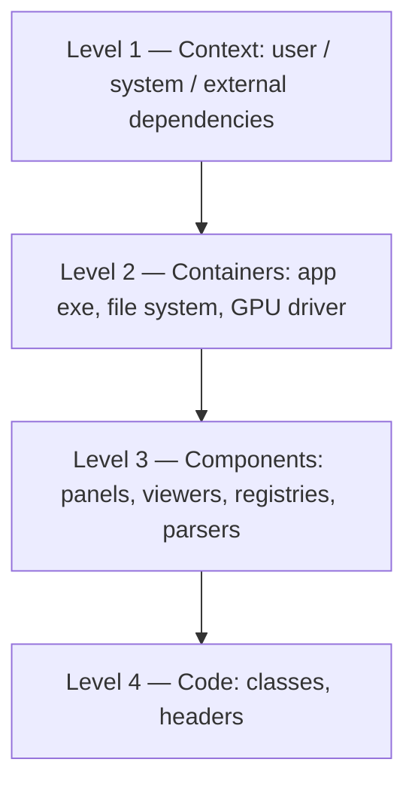

Mantém **um diagrama por nível** em `docs/architecture/c4/`. Cada PR de refator atualiza o nível que mexeu. Plugin com renderer já existe (Structurizr).

### 25.2 Domain-Driven Design — Bounded Contexts

Cada Profile = **bounded context**. Vocabulário específico (`WadEntryRole`, `MeshDefn`, `goProto`) **não escapa** do diretório do profile. Domínio compartilhado (`MediaKind`, `MeshData`, `TextureData`) = **shared kernel**.

Implicação prática: refator pode ser feito **profile por profile** sem coordenação global.

### 25.3 Type-Driven Design (Hickey-style)

Tornar **estados ilegais inrepresentáveis**:

```cpp
// Ruim
struct Asset {
    MediaKind kind;
    void*     payload;       // pode ser qualquer coisa
};

// Bom
template<MediaKind K> struct TypedAsset { MediaPayload<K> payload; };
using AnyAsset = std::variant<TypedAsset<MediaKind::Image>,
                               TypedAsset<MediaKind::Mesh>,
                               /* ... */>;
```

Compiler garante que `ImageViewer` só recebe `TypedAsset<Image>`. Runtime checks viram dead code.

Trade-off: variant é mais verboso. Avaliar caso a caso.

### 25.4 Strong Typedefs

Hoje `uint32_t` é usado para `offset`, `size`, `wadIndex`, `hash`. Aceita misturar sem erro.

```cpp
template<typename Tag>
struct StrongInt { uint32_t v; explicit operator uint32_t() const { return v; } /* +,-, <=> */ };

struct OffsetTag{}; using Offset = StrongInt<OffsetTag>;
struct SizeTag{};   using Size   = StrongInt<SizeTag>;
struct WadIdxTag{}; using WadIdx = StrongInt<WadIdxTag>;
```

`Read(offset)` não aceita `Size` por engano. Custo: zero (otimizador remove tudo). Ganho: bugs de unidade pegos em compile-time.

### 25.5 `[[nodiscard]]` epidemia

Toda função que retorna `Result<T,E>` → `[[nodiscard]]`. Toda função que retorna ponteiro de cache → `[[nodiscard]]`. Compiler vira segundo reviewer.

### 25.6 C++20 modules (talvez)

Headers de `domain/` são candidatos para `export module gow.domain;`. Compile-time cai muito. Mas: suporte ainda inconsistente entre clang/gcc/msvc. **Avaliar em 2027** se o cenário melhorou. Não bloquear refator estrutural.

### 25.7 `constexpr` everything em metadata

`TypeIdName`, `KindOf`, color/icon de handlers — tudo `constexpr`. Tabela de switch vira lookup em compile-time. Inspector grátis.

---

## 26. Referências de Toolkits Reais (Mesma Família)

Para grounding empírico do que funciona em "asset toolkit para formato proprietário":

| Projeto | O que copiar | O que evitar |
|---|---|---|
| **Noesis** (closed) | Plugin system Python; suporte massivo a formatos; export universal | Closed-source; UI estagnada |
| **AssetStudio** (open, Unity) | Tree filter por type; export batch; preview integrado | Tightly coupled a Unity; sem layering |
| **umodel / UE Viewer** (open) | Versionamento por build engine; PAK navigation; mesh export | Code monolítico em C |
| **QuickBMS** (open) | Script declarativo simples para custom formats | Sintaxe própria não reutilizável |
| **Kaitai Struct** (open) | DSL declarativo (`.ksy`) com codegen multi-lang | Limitado a parsing puro |
| **010 Editor** (closed) | Templates binários elegantes | Closed; pago |
| **Ghidra** (open, NSA) | Plugin/script system robusto; bounded contexts por loader | Java; pesado |
| **ImHex** (open) | EventManager (já copiado!); pattern language | Plugin DLL nightmare |
| **glTF-Sample-Viewer** | Como expor material params em UI | Não é toolkit; só viewer |

### 26.1 Lições convergentes

Olhando os 9 projetos, padrões comuns que **GoWToolkit ainda não tem**:

1. **Plugin/script system declarativo** (8/9 têm)
2. **Export pipeline com múltiplos formatos** (9/9 têm)
3. **Versionamento por build do jogo** (umodel, Ghidra, Noesis)
4. **Filter por kind na tree** (AssetStudio, Noesis, umodel)
5. **Hex preview integrado ao asset** (010, Ghidra, ImHex)
6. **Estatísticas de WAD** (AssetStudio) — *já temos `WadStatsView`!*
7. **Crash isolation per-asset** — um asset corrompido não derruba a app

### 26.2 Diferencial competitivo do GoWToolkit

- **Layered architecture** explícita (raríssimo nesse nicho)
- **C++20 moderno** (maioria é C ou C# legado)
- **Cross-platform real** (a maioria é Windows-only)
- **Event-driven** (a maioria é procedural)

Se o refator proposto sair, GoWToolkit é o **toolkit mais bem-arquitetado** desse nicho. Ponto.

---

## 27. Referências Acadêmicas / Engenharia

Padrões citados — fontes canônicas para colocar em `docs/references.md`:

- **Domain-Driven Design** — Eric Evans (2003). Bounded contexts, shared kernel.
- **Clean Architecture** — Robert C. Martin (2017). Layered with dependency inversion.
- **Hexagonal Architecture** — Alistair Cockburn (2005, original blog post). Ports & Adapters.
- **Architecture Decision Records** — Michael Nygard (2011, "Documenting Architecture Decisions").
- **C4 Model** — Simon Brown (c4model.com).
- **A Philosophy of Software Design** — John Ousterhout (2018). Deep modules.
- **"Type Driven Development with Idris"** — Edwin Brady (2017). Aplica em C++ via `std::variant` / templates.
- **"Patterns of Enterprise Application Architecture"** — Fowler (2002). Registry pattern, repository.
- **"Game Engine Architecture"** — Jason Gregory (3rd ed). Asset pipeline, job system, GPU upload.
- **"Designing Data-Intensive Applications"** — Martin Kleppmann. Schema evolution.
- **"Refactoring"** — Martin Fowler. Strangler fig pattern (relevante para o roadmap incremental).

---

## 28. Riscos Adicionais Identificados

| Risco | Severidade | Mitigação |
|---|---|---|
| Refator estrutural sem golden tests = regressão silenciosa | **Alta** | Implementar §22 **antes** das fases do roadmap |
| `std::variant<MediaPayload>` cresce sem controle conforme MediaKind expande | Média | Limitar a 1 variant por kind; novos kinds só com ADR |
| Cache de assets com `shared_ptr` mantém referência viva → memory leak silencioso | Média | LRU com `weak_ptr` no slot; cache cleanup obrigatório no shutdown |
| GPU upload queue com tasks pesadas mata frame budget | Média | Hard cap em bytes/frame; chunked uploads |
| Plugin system Lua introduz superficie de ataque (script malicioso lê filesystem) | Baixa | sol2 sandbox; whitelist de APIs expostas |
| Strong typedefs adicionados antes do refator estrutural geram churn enorme | Média | Aplicar **só** em fronteiras novas (`Asset`, `MediaPayload`), não retrofit |
| C4 + DDD + ADR + módulos = sobrecarga de doc | Alta | Adopt **um por vez**; começa por ADR (lightweight), depois C4-L1 só |

---

## 29. Roadmap Refinado — Inserções na Timeline Original

A timeline da §11 cobre estrutura. Adicionar:

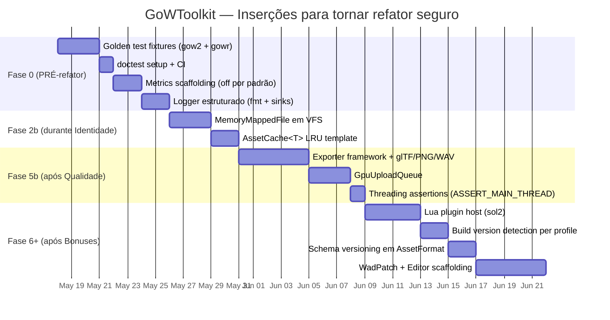

**Ordem importa**: golden tests **antes** de mexer em parser. Metrics e Logger **antes** de ter performance bug. Exporter **depois** de MediaKind sair (depende dele).

---

## 30. TL;DR da Parte II

1. **G1 Memória**: mmap + cache LRU + GPU upload queue + streaming payload. Toolkit pra files de GB precisa disso.
2. **G2 Export**: glTF/PNG/WAV — razão #1 de uso. Sem isso é brinquedo.
3. **G3 Scripting**: Lua via sol2 no médio prazo. Curto prazo: nada. Longo: Kaitai `.ksy` codegen.
4. **G5 Threading**: documentar explicitamente quem toca cada thread; `ASSERT_MAIN_THREAD` em debug.
5. **G6 Schema versioning**: AssetFormat com `minVersion/maxVersion`; tolerar campos novos.
6. **G7 Observability**: metrics opt-in + logger estruturado + LogPanel.
7. **G8 Golden tests**: snapshot por fixture; **pré-requisito** do refator.
8. **G9 Erros**: `ParseError` → `EventParseFailed` → banner no Inspector com link pro offset.
9. **G10 Editor**: `WadPatch` overlay + `AssetReader` lê union; scaffold agora, implementa quando precisar.
10. **C4 + DDD + Type-driven + Strong typedefs + `[[nodiscard]]`**: ferramentas, não burocracia.
11. **Referências reais**: Noesis, AssetStudio, umodel, Kaitai, Ghidra — GoWToolkit pode ser o mais bem-arquitetado do nicho.
12. **Fase 0 nova**: golden tests + metrics + logger **antes** das fases da Parte I.

> Parte I: o esqueleto. Parte II: o sistema imunológico, os músculos e os sentidos.

---

## 31. Checklist Final de Refinamento

Itens a marcar antes de considerar "arquitetura pronta para escala":

**Estrutura (Parte I)**
- [ ] `MediaKind` introduzido e populado por todos profiles
- [ ] `AppContext` deletado, tudo via `GOW::Api::*`
- [ ] `WadTypes.h` quebrado em `domain/Entry|Wad|MediaKind`
- [ ] `IAssetLoader` + `GOW2Loaders.h` + `GOWRLoaders.h` deletados
- [ ] Eventos órfãos wired-up
- [ ] `WadEntryRole`/`WadBlock` movidos para `profiles/gowr/GowrTaxonomy.h`
- [ ] Layer linter no CI

**Robustez (Parte II)**
- [ ] Golden test fixtures (>= 5)
- [ ] `Result<T, ParseError>` + `EventParseFailed` + UI integration
- [ ] `AssetCache<T>` template + LRU
- [ ] `MemoryMappedFile` em VFS
- [ ] `GpuUploadQueue` com budget por frame
- [ ] `ASSERT_MAIN_THREAD` macro em todas GL/ImGui calls
- [ ] Logger estruturado (fmt + sinks)
- [ ] Metrics opt-in com MetricsView

**Pipeline (Parte II)**
- [ ] Exporter framework
- [ ] glTF 2.0 exporter para Mesh
- [ ] PNG/KTX2 exporter para Image
- [ ] WAV exporter para Audio
- [ ] Batch export via TaskManager

**Documentação**
- [ ] ADRs 0001-0010 escritos
- [ ] C4 nível 1 (Context) + nível 2 (Containers)
- [ ] `docs/modules/*.md` para cada pasta de `src/`
- [ ] `docs/guides/adding-a-game-profile.md`
- [ ] `docs/references.md` com bibliografia
- [ ] README do projeto aponta para `docs/ARCHITECTURE.md`

**Futuro (não bloqueante)**
- [ ] Lua plugin host
- [ ] WadPatch overlay + EditorMode
- [ ] Kaitai `.ksy` codegen
- [ ] C++20 modules (avaliar em 2027)
- [ ] Crash isolation per-asset (sandboxing parser)

---

> Parte I tornou o projeto **coerente**.
> Parte II torna o projeto **escalável, performático e amado pela comunidade**.
