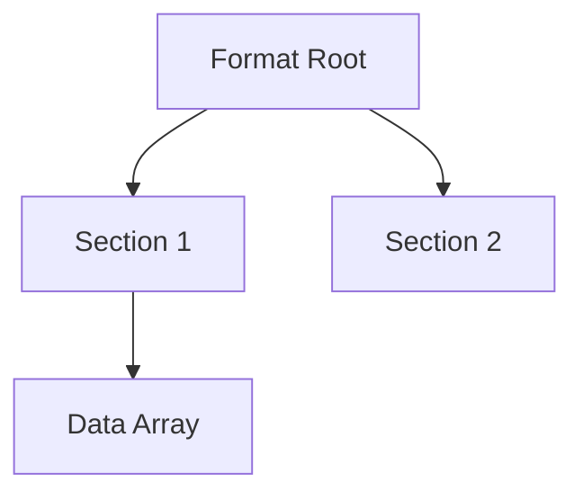

# [Format Name] Format Specification

## Overview
Brief description of the format, its purpose, and which game versions (GOW1, GOW2, etc.) use it. 
Include the file extension if applicable.

## Architecture & Hierarchy
*We recommend using `mermaid` diagrams here to represent complex hierarchies or flows.*

## Header Structure
A tabular representation of the main header.

| Offset | Size | Type | Name | Description |
|--------|------|------|------|-------------|
| 0x00   | 4    | u32  | Magic| Identifier (e.g. 0x0001000F)|

## Sub-Structures
Detailed breakdowns of nested structures (e.g., Parts, Groups, Objects in a Mesh).

### [Structure Name]
Description of the structure and how it is referenced.

| Offset | Size | Type | Name | Description |
|--------|------|------|------|-------------|
| ...    | ...  | ...  | ...  | ...         |

## Data Payloads (e.g., DMA / VIF Packets)
Explanation of how the raw data payloads work, like the VIF unpack streams and DMA tags.

## Notes & Idiosyncrasies
- Alignment/Padding rules.
- Any quirks found in `god_of_war_browser` that we must respect.
