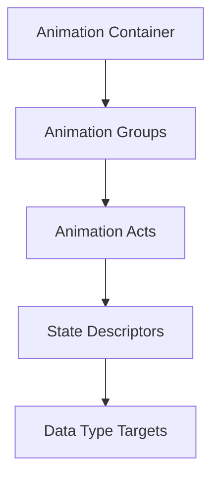

# ANM Format Specification (GOW1)

## Overview
The ANM (Animation) format manages all keyframes, state machines, and blending descriptors for character rigs and textures.

## Architecture & Hierarchy
The GOW1 animation logic is identical to GOW2.

## Structure
The format (`0x00000003`) parses an array of Data Types at offset `0x14`.
These types define the targets for the payload (e.g., `Type 1` = Skinning Matrix, `Type 4` = Texture/UV).

Keyframes use exactly the same compression patterns and delta structures defined in the GOW2 specification. Parsing logic from GOW2 can safely be reused for GOW1 without modifications.
