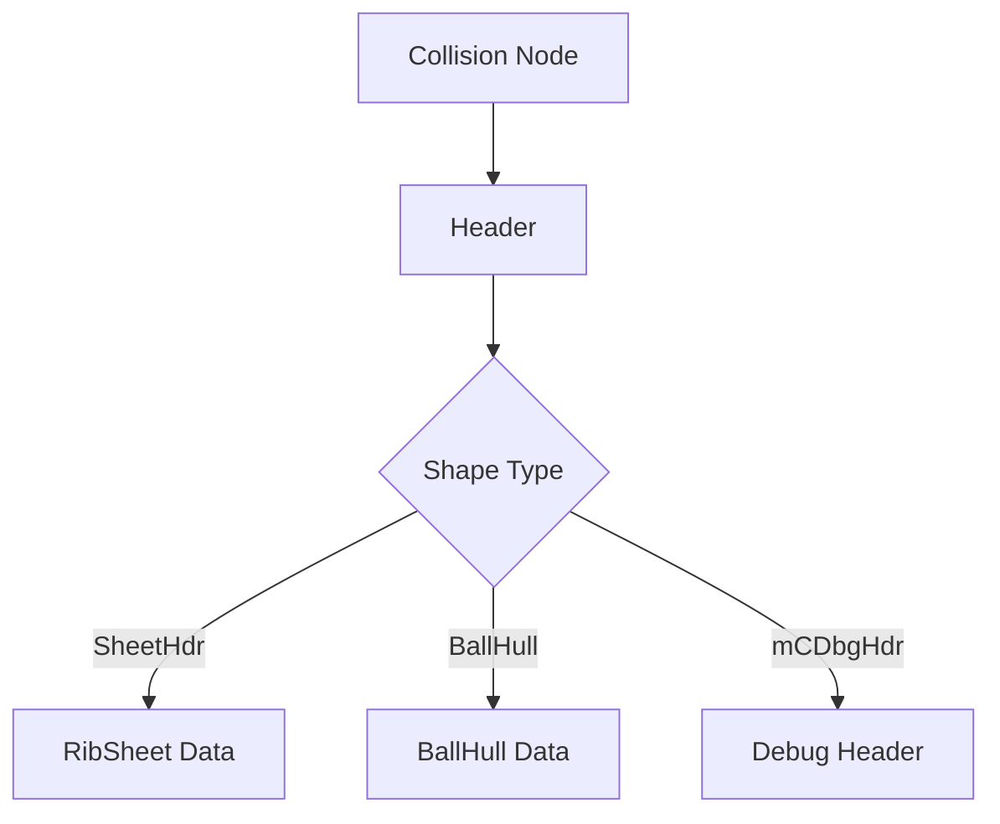

# COLLISION Format Specification (GOW1)

## Overview
The COLLISION format (`0x00000011`) stores physical bounding volumes, navigation meshes, and interactive trigger boundaries for the game world.

## Architecture & Hierarchy
The structural definition is identical to GOW2.

## Header Structure
- Magic: `0x00000011`
- Parses strings at `0x04` or `0x08` to determine if it is a `BallHull` or a `SheetHdr`.
