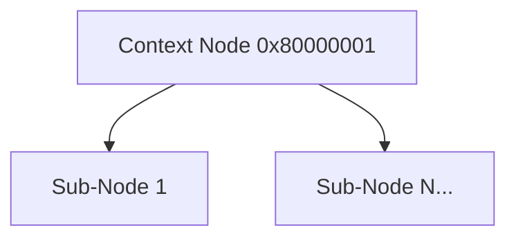

# CXT Format Specification (GOW1)

## Overview
The CXT (Context) format acts as a structural grouping tag within the WAD hierarchy. 

## Architecture & Hierarchy
The logic is completely identical to GOW2.

## Structure
The CXT file is essentially an empty header container of `0x34` (52) bytes.
- Magic: `0x80000001`
- Upon encountering a CXT node, the game loops through its sub-groups recursively.
