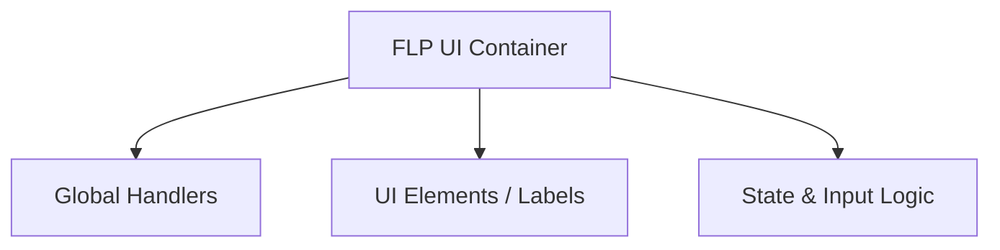

# FLP Format Specification (GOW1)

## Overview
The FLP (Flash Player / UI Screen) format governs the game's 2D user interfaces, HUD elements, menus, and on-screen fonts. 

## Architecture & Hierarchy
While the array structures (Handlers, Labels, Screens, Transformations) are largely identical to GOW2, the magic identifier and header sizes differ significantly.

## Header Structure (GOW1 vs GOW2)

> [!WARNING]  
> The magic identifier and base header sizes are different for GOW1. Ensure your parsers account for this to prevent reading misaligned pointers.

| Field | GOW1 | GOW2 |
|-------|------|------|
| **Magic** | `0x21` | `0x1B` |
| **Header Size** | `0x60` bytes | `0x5C` bytes |
| **Data4 Element Size** | `0x24` bytes | `0x1C` bytes |

The rest of the parsing loops mapping out `MeshPartReference` (pointers to `MDL`/`TXR`), `Font` arrays, and `GlobalHandlerIndex` mapping are structurally identical and rely on the same `1:15:16` fixed-point transformation matrix algorithms.
