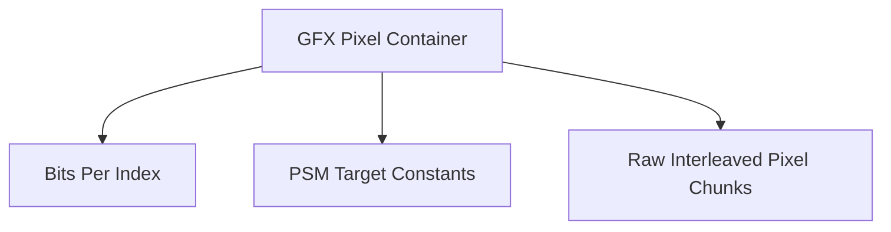

# GFX Format Specification (GOW1)

## Overview
The GFX format stores raw uncompressed pixel data tailored to the PlayStation 2 Graphic Synthesizer architecture.

## Architecture & Hierarchy
The logic is entirely identical to GOW2.

## Structure
- Magic: `0x0000000C`
- Parses chunk iterations using standard Sony `PSM` targets (`PSMCT32`, `PSMT8`). Uses identical chunk calculation logic (width/height blocks per iteration) as GOW2.
