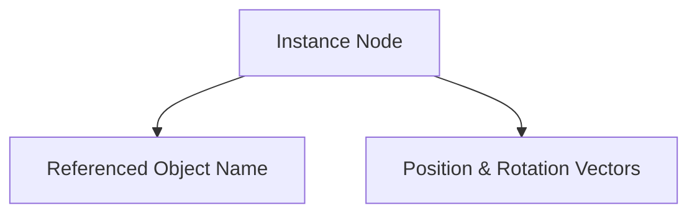

# INST Format Specification (GOW1)

## Overview
The INST (Instance) format describes an instance of a game object placed in the world. 

## Architecture & Hierarchy
Structurally identical to GOW2.

## Structure
The INST file is exactly `0x5C` (92) bytes.
- Magic: `0x00020001`
- `0x04`: Object string name (24 bytes)
- `0x20`: Position1 (Vec4)
- `0x30`: Rotation (Vec4, euler rads, last element scale)
- `0x40`: Position2 (Vec4)
