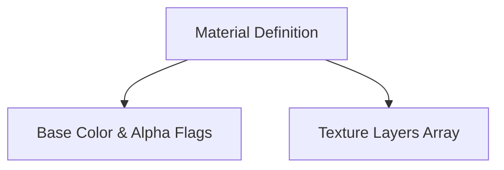

# MAT Format Specification (GOW1)

## Overview
The MAT (Material) format dictates how 3D surfaces are rendered.

## Architecture & Hierarchy
The logic is entirely identical to GOW2.

## Structure
- Magic: `0x00000008`
- Each Material Layer defines blending operations, UV animations, and references to `TXR` nodes using an array where each layer occupies `0x40` bytes. The structure holds 1:1 parity with the GOW2 parser.
