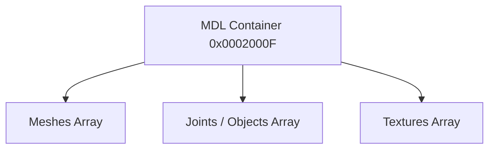

# MDL Format Specification (GOW1)

## Overview
The MDL (Model) format in GOW1 is a high-level grouping container that links 3D `MESH` files, textures, and `OBJ` joints together.

## Architecture & Hierarchy
The logic is completely identical to GOW2, but the base header is slightly larger.

## Header Structure
In GOW1, the MDL header is **`0x48` bytes** long (compared to `0x40` in GOW2). The extra 8 bytes are typically padding or reserved fields placed at the end of the header.

| Offset | Size | Type | Name | Description |
|--------|------|------|------|-------------|
| 0x00   | 4    | u32  | Magic| Identifier (`0x0002000F`) |
| 0x04   | 4    | u32  | Textures Count | Number of TXR references |
| 0x08   | 4    | u32  | Meshes Count | Number of MESH references |
| 0x0C   | 4    | u32  | Objects Count | Number of OBJ references |
| 0x10   | 4    | u32  | Total Count | Total dependencies |
| 0x14   | 4    | u32  | Unk14| Unknown |
| 0x18   | 16   | f32[4]| Floats| Bounding sphere floats `(x, y, z, r)` |
| 0x28   | 4    | u32  | Unk28| Unknown |
| 0x2C   | 4    | u32  | Flags| Bitmask. (e.g. `2` = Animated, `16` = Breakable) |
| ...    | ...  | ...  | ...  | Padding / Offsets |

> [!NOTE]
> The arrays mapping the dependencies start immediately after `0x48`. Parsing logic must offset the byte reader to `0x48` before starting the dependency extraction loops.
