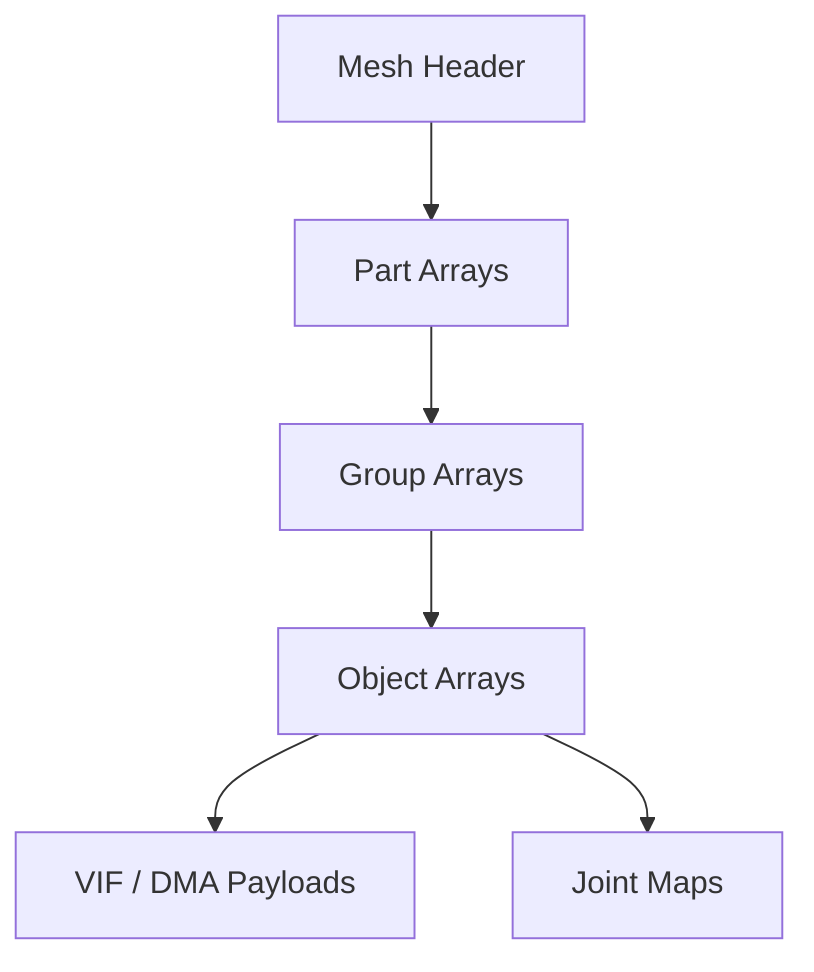

# MESH Format Specification (GOW1)

## Overview
The MESH format in GOW1 is fundamentally similar to GOW2 in its hierarchical geometry structure (`Mesh -> Part -> Group -> Object`), but the underlying header structures and offsets are significantly different.

## Architecture & Hierarchy

## Structure Headers (GOW1 vs GOW2)

> [!WARNING]  
> The internal structure sizes for GOW1 are entirely different from GOW2. A parser strictly designed for GOW2 will crash or misread GOW1 models if these header sizes are not accounted for.

### Sizes Comparison
| Structure | GOW1 Size | GOW2 Size |
|-----------|-----------|-----------|
| **Mesh Header** | `0x50` bytes | `0x40` bytes |
| **Mesh Vector** | `0x14` bytes | `0x20` bytes |
| **Part Header** | `0x04` bytes | `0x14` bytes |
| **Group Header**| `0x0C` bytes | `0x20` bytes |
| **Object Header**| `0x20` bytes | `0x30` bytes |

## Hierarchy Breakdown

### 1. Mesh Header (`0x50` bytes)
- `0x00`: Magic (`0x0001000F`)
- Starts with standard pointers to the parts array. The `Parts` array offsets start immediately after the `0x50` byte header.
- The `Vectors` array is read starting from `PartsCnt * 4 + 0x50`, with each vector block taking exactly `0x14` bytes.

### 2. Part Header (`0x04` bytes)
- Extremely compacted in GOW1 compared to GOW2.
- Contains the pointer array to `Groups`.
- The `JointId` is typically read at the end of the `Groups` array `(GroupsCnt * 4 + 0x04)`.

### 3. Group Header (`0x0C` bytes)
- Offset array mapping to `Objects`.
- Size is 12 bytes.

### 4. Object Header (`0x20` bytes)
- `0x00`: Type (usually `0x01000000`)
- `0x04`: Unk04
- `0x08`: Texture/Material Reference
- `0x0A`: Material Identifier
- `0x0C`: Unk0C
- `0x0E`: Next Object Offset (or similar linked list mechanic)
- Data stream offsets are calculated from `0x20`.

### Object Payloads (VIF & Joints)
- The DMA Tags loop starts exactly at `Object Offset + 0x20`.
- The Joint Maps array is located at `0x20 + (dmaCalls * 0x10 * DmaTagsCountPerPacket)`.
