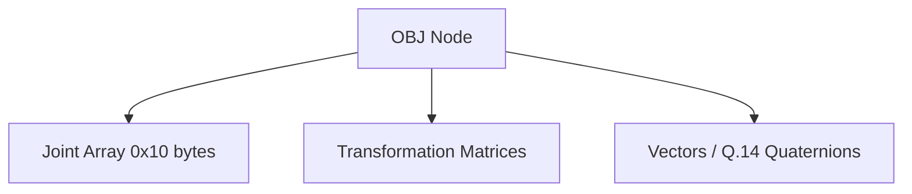

# OBJ Format Specification (GOW1)

## Overview
The OBJ format defines the Scene Graph and skeletal rigging for God of War 1. It operates with exactly the same specification as GOW2.

## Architecture & Hierarchy
It constructs the skeleton using arrays of Transformation Matrices, Vectors, and a Joint hierarchy mapping.

## Header Structure
| Offset | Size | Type | Name | Description |
|--------|------|------|------|-------------|
| 0x00   | 4    | u32  | Magic| Identifier (`0x00040001`) |
| ...    | ...  | ...  | ...  | Follows identical GOW2 layout |

## Joint Structure
Each Joint occupies exactly `0x10` bytes and maps IDs to their hierarchical parent, linking meshes together.

> [!TIP]
> Just like in GOW2, rotations are stored in `Vectors5` using the highly compressed `Q.14` fixed-point quaternion format. Multiply by `(1.0 / 16384.0)` to normalize into floats.
