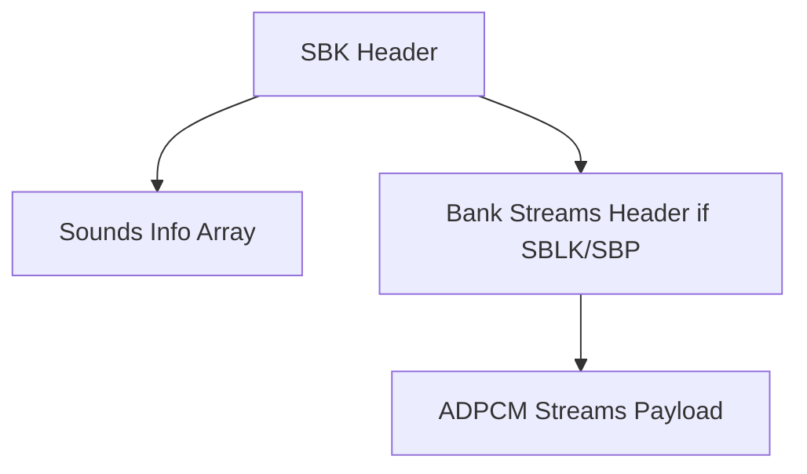

# SBK Format Specification (GOW1)

## Overview
The SBK (Sound Bank) format is an aggregate container that stores multiple audio streams (VAG) alongside sequencing/playing commands.

## Architecture & Hierarchy

## Structure
The overarching format varies based on the Magic:
- **`0x18`**: SBLK (Standard GOW1 sound bank embedding streams and sequencing commands).
- **`0x40018`**: VAG wrapper (GOW1 VAG arrays without explicit sequencing banks).

*Note: GOW2 introduced the `0x00000015` (SBP) magic which effectively replaced the GOW1 SBLK format.*
