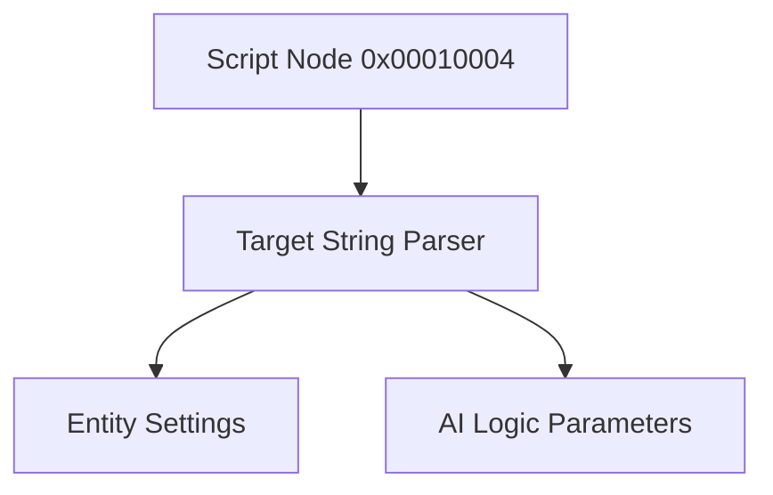

# SCR Format Specification (GOW1)

## Overview
The SCR (Script) format stores specific entity configurations, gameplay variables, trigger zones, and entity states.

## Architecture & Hierarchy
The overarching logic is identical to GOW2.

## Structure
- Magic: `0x00010004`
- Reads the "Target Name" string starting at offset `0x04`. This string acts as a delegated type identifier (e.g. `Enemy_Cyclops_Spawn`).
- The parser extracts specific values based on the target class.
- *Note:* Minor variations exist within specific entity parsers between GOW1 and GOW2, but the overarching header wrapper `SCR` remains structurally 1:1.
