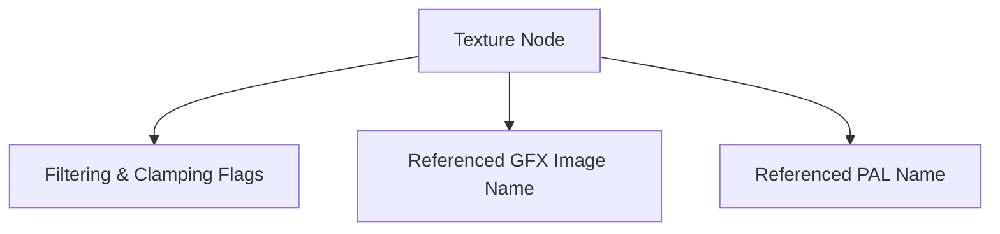

# TXR Format Specification (GOW1)

## Overview
The TXR (Texture) format provides linkage between `MAT` definitions and raw pixel/palette files (`GFX` and `PAL`).

## Architecture & Hierarchy
The logic is entirely identical to GOW2.

## Structure
The payload is `0x58` bytes long and parses strings defining the target nodes. Flags for bi-linear filtering, Mip-Mapping, and UV clamping operate via the exact same bitmasks as the GOW2 implementation.
