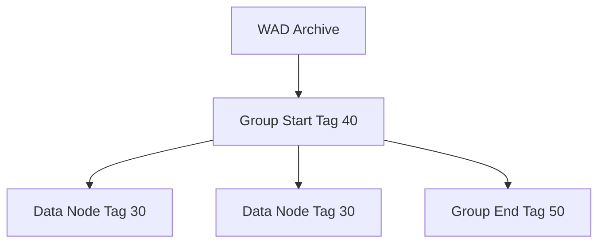

# WAD Format Specification (GOW1)

## Overview
The WAD file is the core container for God of War 1. It acts as an archive holding all binary payloads (meshes, animations, scripts) required by a level or specific entity. 

Unlike GOW2 which uses tags `1`, `2`, and `3` for groups, GOW1 uses its own specific set of tags (`30`, `40`, `50`) for file structuring and server streaming.

## Architecture & Hierarchy

## Node Tag Header
Every node in the WAD file begins with a 32-byte header.

| Offset | Size | Type | Name | Description |
|--------|------|------|------|-------------|
| 0x00   | 2    | u16  | Id   | Unique Node Identifier |
| 0x02   | 2    | u16  | Tag  | Magic/Type identifier (e.g. `30` for generic instance, `0x21` for FLP) |
| 0x04   | 4    | u32  | Size | Size of the payload following this header |
| 0x08   | 24   | char | Name | Node Name (Null-terminated string) |

*The payload immediately follows the header and must be padded/aligned to 16 bytes.*

## Important GOW1 Structural Tags
The WAD relies on control tags to build a tree hierarchy in memory:

1. **Tag `40` (`FILE_GROUP_START`)**: Begins a new parent group. All subsequent nodes will be children of this group until a Group End tag is found.
2. **Tag `50` (`FILE_GROUP_END`)**: Pops the current group from the stack.
3. **Tag `30` (`SERVER_INSTANCE`)**: Denotes a file data packet loaded into a specific file server namespace. (Replaces GOW2's Tag `1`).

### Loading / Memory Tags
GOW1 also features unique engine hooks that influence the WAD loader:
- **`888` (`HEADER_START`)**: Creates a new memory namespace and pushes it to the memory stack.
- **`999` (`HEADER_POP`)**: Pops the memory heap and cleans up loading structures.
- **`666`, `80`, `777` (`DATA_START`)**: Pops the batch server stack.
- **`24` (`ENTITY_COUNT`)**: Instructs the game to reserve node directory space.
