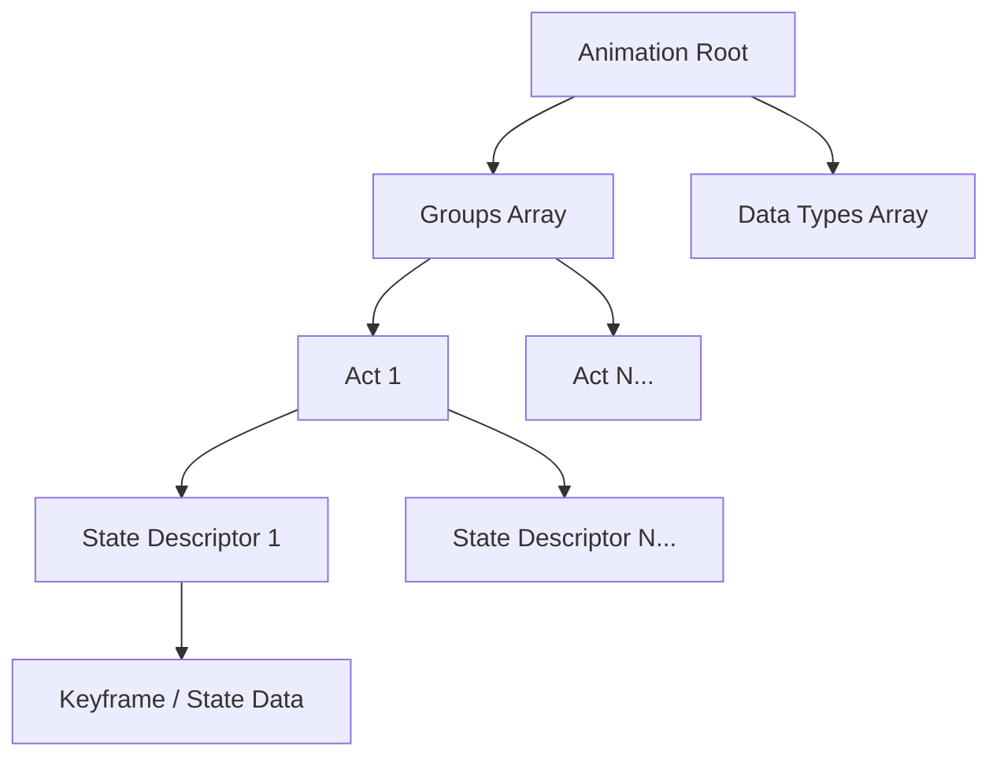

# ANM Format Specification (GOW2)

## Overview
The ANM (Animations) format dictates object, skeletal, and material animations over time. It can animate a wide variety of properties including skinning matrices (bones), material colors, UV coordinates, and particle emitters.

## Architecture & Hierarchy
The file starts with a header defining flags, data type counts, and group counts. This is followed by arrays for group offsets and data type definitions. Groups contain Acts, which contain State Descriptors, which finally point to the actual keyframe/state data.

## Header Structure

| Offset | Size | Type | Name | Description |
|--------|------|------|------|-------------|
| 0x00   | 4    | u32  | Magic| Identifier (`0x00000003`) |
| 0x04   | 4    | u32  | Unk04| Unknown/Padding |
| 0x08   | 4    | u32  | Flags| Bitmask defining global animation settings |
| 0x0C   | 4    | u32  | Unk0C| Unknown |
| 0x10   | 2    | u16  | DataTypes Cnt| Number of Data Type definitions |
| 0x12   | 2    | u16  | Groups Cnt| Number of Animation Groups |

## Arrays
Following the header (`0x18`), two primary arrays define the structure:

1. **Groups Pointers Array**: Starts at `0x18`. An array of `u32` absolute offsets pointing to each Group definition. Length is `Groups Cnt * 4` bytes.
2. **Data Types Array**: Starts immediately after the Groups Pointers array (`0x18 + Groups Cnt * 4`). Each entry is 4 bytes:
   - `u16 TypeId`: Determines the animation target (e.g., Skinning, UV, Color).
   - `u8 Param1`, `u8 Param2`: Sub-parameters.

## Sub-Structures

### Group
Located at the offsets defined in the Groups Pointers array.

| Offset | Size | Type | Name | Description |
|--------|------|------|------|-------------|
| 0x00   | ...  | ...  | ...  | Group-specific internal header |
| 0x08   | 4    | u32  | Group Flags | `Flags & 0x20000` indicates it is "External" (no acts in this file) |
| 0x0C   | 4    | u32  | Acts Count | Number of Acts |
| 0x14   | 24   | char | Name | Null-terminated string name |
| 0x30   | 4*N  | u32[]| Act Offsets | Array of relative or absolute offsets to the Acts |

### Act
An Act defines an animation sequence.

| Offset | Size | Type | Name | Description |
|--------|------|------|------|-------------|
| 0x04   | 4    | f32  | UnkFloat 0x4 | Unknown float |
| 0x0C   | 4    | f32  | UnkFloat 0xC | Unknown float |
| 0x1C   | 4    | f32  | Duration | Animation duration |
| 0x24   | 24   | char | Name | Null-terminated act name |
| 0x64   | 20*N | bytes| State Descrs | Array of State Descriptors. Count equals `DataTypes Cnt` |

### State Descriptor (0x14 bytes each)
Located at `0x64` within the Act.

| Offset | Size | Type | Name | Description |
|--------|------|------|------|-------------|
| 0x00   | 2    | u16  | Unk00 | Unknown |
| 0x02   | 2    | u16  | Item Count | Count of items/keyframes |
| 0x04   | 4    | u32  | Unk04 | Unknown |
| 0x08   | 4    | u32  | Data Offset | Offset to the actual keyframe data payload |
| 0x0C   | 4    | f32  | Frame Time | Time parameter for the state |

## Data Types
The `TypeId` dictates how the payload at `Data Offset` is parsed:
- `0`: Skinning (Object matrices/bones)
- `3`: Material (Color/Light)
- `5`: Object properties (Show/hide meshes/cameras)
- `8`: Texture Position (Material UV animation)
- `9`: Texture Sheet (Material palette/GIF frame swapping)
- `10`: Particles (Emitters/physics)

## Flags & Idiosyncrasies
The global `Flags` at `0x08` define the scope of the skeletal animations:
- `Flags & 0x1`: Autoplay flag.
- `Flags & 0x1000`: Joint rotations are animated.
- `Flags & 0x2000`: Joint positions are animated.
- `Flags & 0x4000`: Joint scales are animated.
