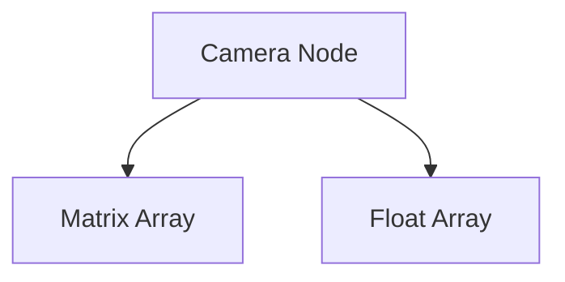

# CAM Format Specification (GOW2)

## Overview
The CAM (Camera) format describes cinematic or in-game camera paths, rails, and behaviors. It is primarily used for defining fixed or smoothly moving camera angles during gameplay or cutscenes.

## Architecture & Hierarchy
The standard `CAM` node typically encapsulates a "Rail" system, representing the camera's path through space.

## Header Structure

| Offset | Size | Type | Name | Description |
|--------|------|------|------|-------------|
| 0x00   | 4    | u32  | Count| Number of points/matrices in the camera rail |
| 0x04   | 4    | u32  | Unk04| Unknown (Usually `0`) |
| 0x08   | 4    | u32  | Unk08| Unknown (Usually `0xFFFFFFFF`) |
| 0x0C   | 4    | u32  | Unk0C| Unknown (Usually `0xFFFFFFFF`) |

## Data Arrays
If `Count > 0`, the matrices and float parameters begin immediately.

### Matrices Array
Starts at `0x08` (yes, it overlaps the `Unk08` and `Unk0C` bytes if the count > 0, depending on parser behavior, or begins at `0x08` if the initial header check confirms format validity).
- Size: `Count * 0x40` bytes.
- Contains an array of standard `Mat4` (16 floats) representing the camera's position, rotation, and potentially projection at each rail node.

### Floats Array
Starts immediately after the matrices array (`0x08 + Count * 0x40`).
- Size: `Count * 4` bytes.
- Contains an array of `float32` representing timing, field-of-view (FOV), or interpolation speed coefficients between each point on the rail.
