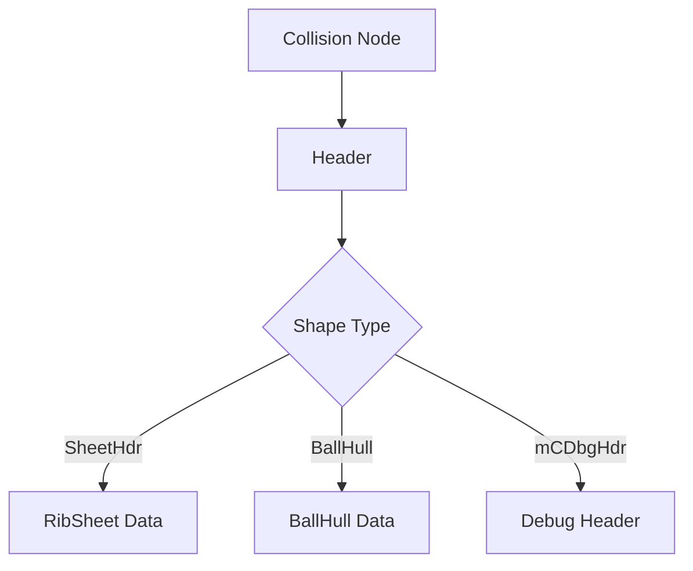

# COLLISION Format Specification (GOW2)

## Overview
The COLLISION format (`0x00000011`) stores physical bounding volumes, navigation meshes, and interactive trigger boundaries for the game world. 

## Architecture & Hierarchy
The collision node starts with a magic number and immediately identifies the type of shape it encapsulates (e.g., `BallHull`, `SheetHdr`, `mCDbgHdr`).

## Header Structure

| Offset | Size | Type | Name | Description |
|--------|------|------|------|-------------|
| 0x00   | 4    | u32  | Magic| Identifier (`0x00000011`) |

The shape name is embedded directly after the magic, but its offset depends on the shape type:
- If the string at `0x04` is `"SheetHdr"` or `"mCDbgHdr"`, it is parsed as a Sheet or Debug header.
- If the string at `0x08` is `"BallHull"`, it is parsed as a BallHull.

## Sub-Structures
1. **SheetHdr (RibSheet)**: Describes complex, multi-polygon terrain meshes. It maps physical material properties (like `MAT_Stone`, `MAT_Wood`) to rendering materials for appropriate footstep sounds and particle effects.
2. **BallHull**: Typically defines simplified capsule or spherical bounding volumes for dynamic objects or specific triggers.
3. **mCDbgHdr**: Contains debug mesh representations of the collision, typically following a `BallHull` node.
