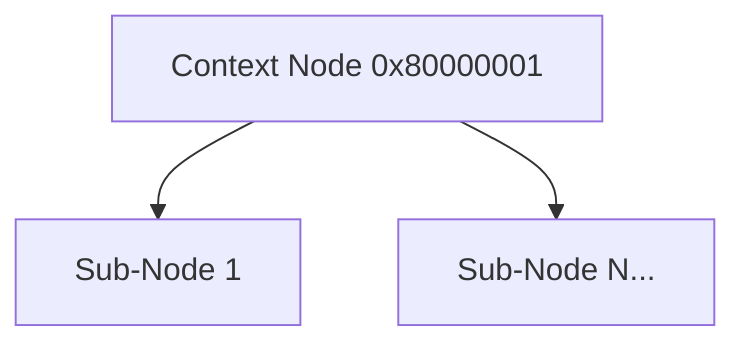

# CXT Format Specification (GOW2)

## Overview
The CXT (Context) format acts as a structural grouping tag within the WAD hierarchy. It does not contain game data or payloads itself, but rather establishes a logical scope or "context" for the sub-nodes that belong to it.

## Architecture & Hierarchy

## Header Structure
The CXT file is essentially just an empty header container of `0x34` (52) bytes.

| Offset | Size | Type | Name | Description |
|--------|------|------|------|-------------|
| 0x00   | 4    | u32  | Magic| Identifier (`0x80000001`) |
| 0x04   | 48   | bytes| Padding| Empty/Padding block to reach `0x34` |

When the engine encounters a CXT node, it immediately iterates through all of its WAD `SubGroupNodes` and parses them within the defined context.
