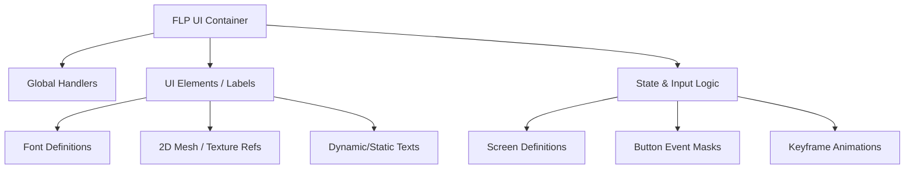

# FLP Format Specification (GOW2)

## Overview
The FLP (Flash Player / UI Screen) format governs the game's 2D user interfaces, HUD elements, menus, and on-screen fonts. It is a highly complex format that stores elements, animations, logic states, input event mappings, and font configurations.

## Architecture & Hierarchy
The FLP file contains a master header pointing to numerous sub-arrays that construct the UI.

## Header Structure
In GOW2, the FLP header is `0x5C` bytes long. (In GOW1, it is `0x60`).

| Offset | Size | Type | Name | Description |
|--------|------|------|------|-------------|
| 0x00   | 4    | u32  | Magic| Identifier (`0x1B` for GOW2, `0x21` for GOW1) |
| 0x04   | 4    | u32  | Unk04| Unknown |
| 0x08   | 4    | u32  | Unk08| Unknown |
| ...    | ...  | ...  | ...  | Pointers and counts to various sub-arrays |

## Arrays & Elements
The FLP format is an amalgamation of data arrays:

1. **Global Handlers**: Maps internal IDs to specific instances of fonts, labels, or textures.
2. **Mesh Part References**: Maps 2D UI elements to actual `TXR` (Texture) and `MDL` (Model) nodes for rendering buttons or HUD bars.
3. **Fonts**: Defines glyph sizes, symbol mappings, and links to texture atlases.
4. **Labels**: 
   - *Static Labels*: Fixed text or sprites.
   - *Dynamic Labels*: Text that can change at runtime (e.g., Combo counters, health numbers). They reference placeholders and `FontHandler` instances.
5. **Screens & Scripts (Data6/7/8)**: Controls UI logic. 
   - Includes arrays of `ElementAnimation` and `KeyFrame` to animate UI components.
   - Includes `EventKeysMask` to map PS2 controller inputs to script triggers (e.g., `16` for Back/O, `64` for Select/X).
6. **Transformations**: `1:15:16` fixed-point 2D matrices for scaling and translating UI elements.
7. **Blend Colors**: 16-bit RGBA arrays for UI tinting and opacity.

## Idiosyncrasies
- FLP relies heavily on its `GlobalHandlersIndexes` to cross-reference data. You cannot parse an element in isolation; you must resolve its handler index against the global array.
- FLP nodes usually have an associated `MDL` node in the WAD (e.g., `FLP_PauseMenu` correlates with `MDL_PauseMenu`) which contains the actual 2D geometric meshes that the UI uses to draw the textures.
