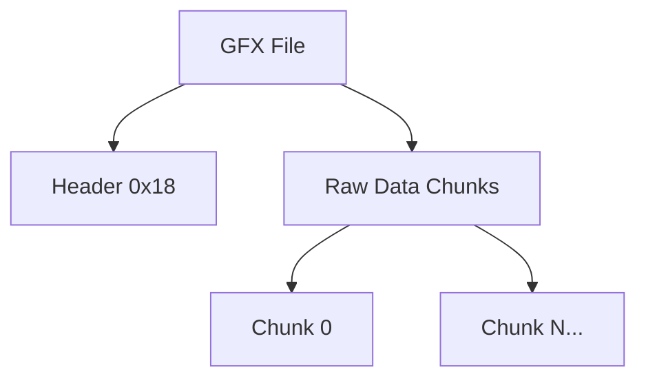

# GFX Format Specification (GOW2)

## Overview
The GFX (Graphics) format contains raw image pixel data, texture payloads, or color palettes. It is heavily tied to the PlayStation 2's Graphic Synthesizer (GS) and its internal memory formats. A GFX node is typically referenced by a `TXR` node.

## Architecture & Hierarchy
The GFX format is a flat file containing a single header followed by the raw image/palette chunks.



## Header Structure
The header is exactly `0x18` (24) bytes.

| Offset | Size | Type | Name | Description |
|--------|------|------|------|-------------|
| 0x00   | 4    | u32  | Magic| Identifier (`0x0000000C`) |
| 0x04   | 4    | u32  | Width| Image width in pixels |
| 0x08   | 4    | u32  | Height| Total image height in pixels (may include all chunks combined) |
| 0x0C   | 4    | u32  | Encoding| Swizzle/Encoding flag |
| 0x10   | 4    | u32  | Bpi| Bits per pixel (e.g., 32, 24, 16, 8, 4) |
| 0x14   | 4    | u32  | Chunks Count| Number of data chunks contained in the file |

## Data Payloads
Immediately following the header (`0x18`) are the raw pixel or palette chunks.

For PS2 versions, the size of each chunk (`DataSize`) is calculated as:
```c
DataSize = (Width * RealHeight * Bpi) / 8;
```
*(Where `RealHeight` is `Height / Chunks Count`)*

The raw data continues linearly for `DataSize * Chunks Count` bytes.

## Flags & Idiosyncrasies
The `Bpi` (Bits per index/pixel) and `Encoding` map directly to PS2 GS PSM constants:
- **32 Bpi**: `GS_PSM_PSMCT32`
- **24 Bpi**: `GS_PSM_PSMCT24`
- **16 Bpi**: `GS_PSM_PSMCT16`
- **8 Bpi**:
  - If `Encoding & 2 == 0`: `GS_PSM_PSMT8`
  - Else: `GS_PSM_PSMT8H`
- **4 Bpi**: `GS_PSM_PSMT4`

### Palette Swizzling
When reading 8-bit or 4-bit indexed textures, the palette array (usually `Height = 2`, `16`, or `32` for palettes) must be unswizzled according to the standard PS2 palette swizzle algorithm.

If interpreting the GFX as a **Palette**:
```c
int IndexSwizzlePalette(int i) {
    int remap[] = {0, 2, 1, 3};
    int blockid = i / 8;
    int blockpos = i % 8;
    return blockpos + (remap[blockid % 4] + (blockid / 4) * 4) * 8;
}
```

If interpreting as an **Indexed Image** (`PSMT8` / `PSMT4`), standard VRAM unswizzling must be applied if `Encoding & 2 == 0`.
