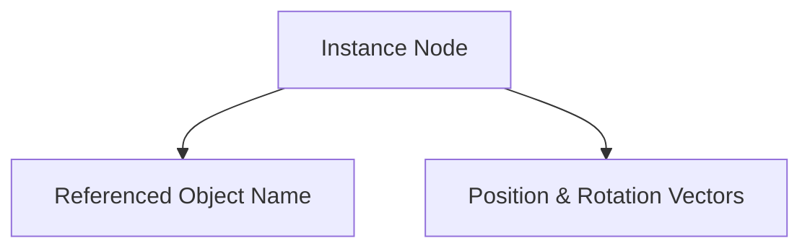

# INST Format Specification (GOW2)

## Overview
The INST (Instance) format describes an instance of a game object placed in the world. It maps an entity to a 3D position and rotation, passing runtime parameters to it.

## Architecture & Hierarchy
The INST file relies entirely on external `OBJ` or `MDL` nodes (identified by a string).

## Header Structure
The INST file is exactly `0x5C` (92) bytes.

| Offset | Size | Type | Name | Description |
|--------|------|------|------|-------------|
| 0x00   | 4    | u32  | Magic| Identifier (`0x00020001`) |
| 0x04   | 24   | char | Object | Target object name string (e.g. `Kratos`) |
| 0x1C   | 2    | u16  | Id | Instance ID |
| 0x1E   | 2    | u16  | Params | Bitmask/ID for spawning parameters |
| 0x20   | 16   | f32[4]| Position1 | Object translation vector |
| 0x30   | 16   | f32[4]| Rotation | Euler rotation vector (rads). 4th element is scale. |
| 0x40   | 16   | f32[4]| Position2 | World-relative center position |
| 0x50   | 12   | u32[3]| Unk | Unknown padding or flags |

## Flags & Idiosyncrasies
- Sub-nodes under an INST definition in the WAD hierarchy are typically Script parameters (`SCR`) that customize this specific instance (e.g., enemy health overrides, trigger bounds).
