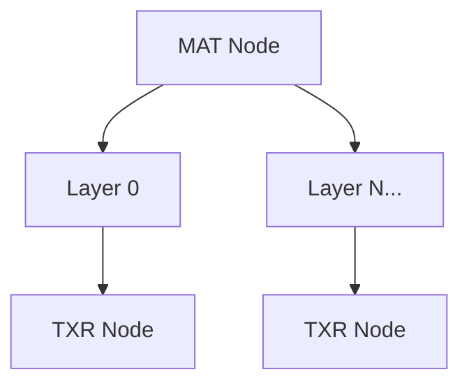

# MAT Format Specification (GOW2)

## Overview
The MAT (Material) format specifies how meshes should be rendered. It defines base colors, blending configurations, and references to one or more textures (`TXR` nodes) organized in layers.

## Architecture & Hierarchy
A MAT node has a base header defining a fallback color and the number of layers. The array of layer structures follows immediately after. Each layer points to a `TXR` node.

## Header Structure
The material header is `0x38` (56) bytes long.

| Offset | Size | Type | Name | Description |
|--------|------|------|------|-------------|
| 0x00   | 4    | u32  | Magic| Identifier (`0x00000008`) |
| 0x04   | 4    | u32  | Unk04| Unknown/Padding |
| 0x08   | 4    | f32  | Color R | Base color Red channel (float) |
| 0x0C   | 4    | f32  | Color G | Base color Green channel (float) |
| 0x10   | 4    | f32  | Color B | Base color Blue channel (float) |
| 0x14   | 32   | bytes| Padding | Unused padding to reach `0x34` |
| 0x34   | 4    | u32  | Layers Count | Number of texture layers in this material |

## Sub-Structures

### Layer
Immediately following the header (`0x38`), an array of `Layers Count` layer structs begins. Each layer is exactly `0x40` (64) bytes long.

| Offset | Size | Type | Name | Description |
|--------|------|------|------|-------------|
| 0x00   | 16   | u32[4]| Flags | 4 32-bit bitmasks controlling rendering states |
| 0x10   | 24   | char | Texture Name | Null-terminated string pointing to the associated `TXR` node |
| 0x28   | 16   | f32[4]| Blend Color | Blend color RGBA (4 floats) for this specific layer |
| 0x38   | 4    | f32  | Float Unk | Often `1.0`. Specifies layer transparency or weight |
| 0x3C   | 4    | u32  | Game Flags | Secondary flags (e.g., UV animation toggle) |

## Flags & Idiosyncrasies
The `Flags[0]` parameter controls standard material rendering.
- `HaveTexture`: `(Flags[0] >> 7) & 1`
- `FilterLinear`: `(Flags[0] >> 16) & 1`
- `DisableDepthWrite`: `(Flags[0] >> 19) & 1`
- `RenderingStrangeBlended`: `(Flags[0] >> 24) & 1`
- `RenderingSubstract`: `(Flags[0] >> 25) & 1`
- `RenderingUsual`: `(Flags[0] >> 26) & 1`
- `RenderingAdditive`: `(Flags[0] >> 27) & 1`

*Note: The system ensures that only ONE of the rendering types (Bits 24-27) is active at a time.*

The `GameFlags` field (`0x3C`) enables animation extensions:
- `AnimationUVEnabled`: `GameFlags & 1 != 0`
- `AnimationColorEnabled`: `GameFlags & 2 != 0`
