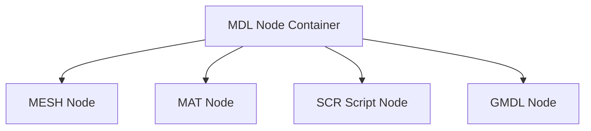

# MDL Format Specification (GOW2)

## Overview
The MDL (Model) format acts as a higher-level container that encapsulates rendering data. It doesn't contain the raw geometry itself, but rather stores overarching metadata (like total texture/mesh/joint counts, bounding/LOD ranges, and flags). The actual components (Meshes, Materials, Scripts) follow the MDL tag as sub-group nodes within the WAD hierarchy.

## Architecture & Hierarchy
The MDL node itself is relatively small, functioning primarily as a header. The actual content is stored in child tags inside the WAD file.

## Header Structure
The MDL header is generally `0x48` bytes long.

| Offset | Size | Type | Name | Description |
|--------|------|------|------|-------------|
| 0x00   | 4    | u32  | Magic| Identifier (`0x0002000F`) |
| 0x04   | 4    | u32  | Unk04| Always zero |
| 0x08   | 4    | f32  | UnkFloat0 | Used in LOD-related meshes. Possibly rendering range `min` |
| 0x0C   | 4    | f32  | UnkFloat1 | Used in LOD-related meshes. Possibly rendering range `max` |
| 0x10   | 4    | f32  | UnkFloat2 | Third LOD float parameter |
| 0x14   | 4    | u32  | Texture Count| Total textures count |
| 0x18   | 4    | u32  | Mesh Count   | Total meshes count |
| 0x1C   | 4    | u32  | Joints Count | Total joints count |
| 0x20   | 4    | u32  | Flags| Bitmask defining model properties |
| 0x24   | 4    | u32  | Unk24| Unused |
| 0x28   | 16   | i32[4]| Ints28 | 4 32-bit signed integers |
| 0x38   | 4    | u32  | Unk38| Unused |
| 0x3C   | 4    | u32  | Unk3C| Unknown |
| 0x40   | 4    | u32  | Unk40| Suspected animated texture layers count for separating anims |
| 0x44   | 4    | u32  | Unk44| Unknown |

## Flags & Idiosyncrasies
The `Flags` field (`0x20`) reveals important structural behavior about the model:
- `Flags & 0x08`: The model is animated or GUI-based.
- `Flags & 0x10`: The model is "simple animated".
- `Flags & 0x40`: The model is breakable (or belongs to certain enemy types).
- `Flags & 0x80`: The model utilizes joint weight double-blending (typically used for hero/Kratos models or highly complex meshes).

## Sub-Group Evaluation
When an MDL node is parsed, the game engine traverses its sub-group nodes (via the WAD hierarchy). If it encounters `0x0001000F` (MESH), `0x00000008` (MAT), or script parameters, it attaches them to the model context.
