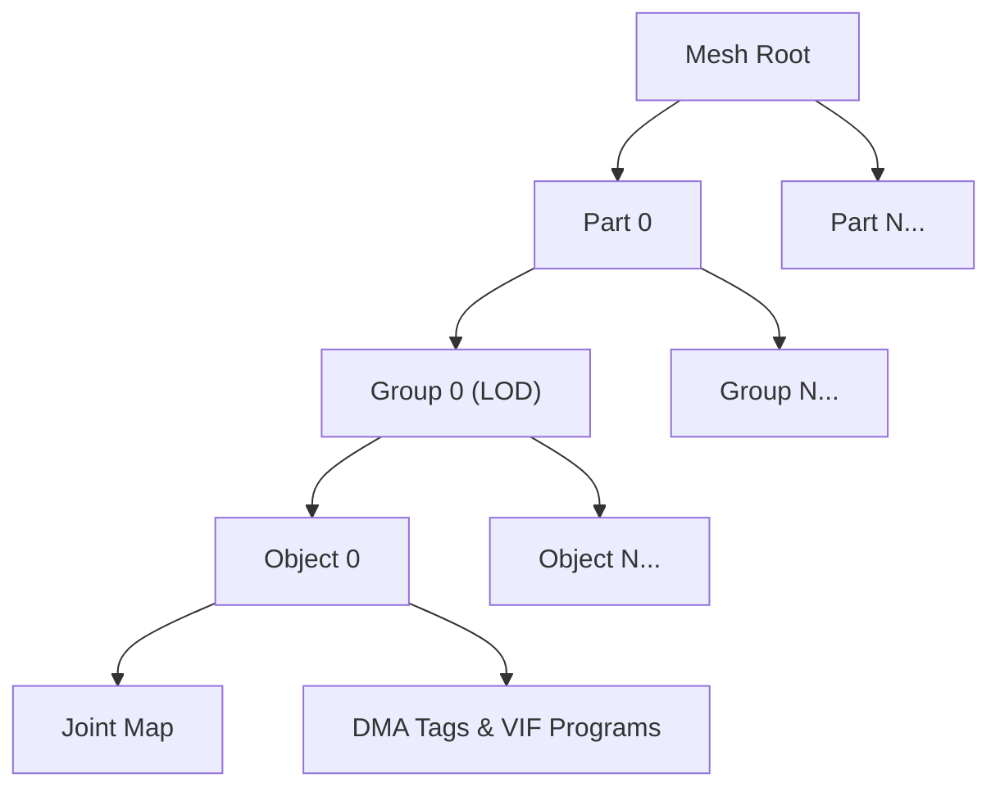

# Mesh Format Specification (GOW2)

## Overview
The MESH format is used to store 3D models and their associated material identifiers, bone mappings, and DMA/VIF programs for the PlayStation 2 Vector Unit. This specification applies to **God of War II**.

## Architecture & Hierarchy
The MESH format uses a hierarchical structure where the main Mesh contains a list of Parts (LOD clusters), which contain Groups (LOD levels), which in turn contain Objects (the actual drawable meshes).

## Header Structure
The main mesh header provides the magic number and offset information for the child parts.

| Offset | Size | Type | Name | Description |
|--------|------|------|------|-------------|
| 0x00   | 4    | u32  | Magic| Identifier (0x0001000F)|
| 0x04   | 4    | u32  | Mdl Comment Start | Offset to the end of the mesh data / start of comments |
| 0x08   | 2    | u16  | Parts Count | Number of `Part` structures in this mesh |
| 0x0A   | 14   | bytes| Padding | Unused/padding (Header size is 0x18) |
| 0x18   | 4*N  | u32[]| Part Offsets | Array of offsets for each `Part` relative to the file start |

## Sub-Structures

### Part
A Part defines a collection of LOD groups.

| Offset | Size | Type | Name | Description |
|--------|------|------|------|-------------|
| 0x00   | 2    | u16  | Unk00 | Unknown / Flags |
| 0x02   | 2    | u16  | Groups Count | Number of `Group` structures in this part |
| 0x04   | 4*N  | u32[]| Group Offsets | Array of offsets for each `Group` **relative to the Part offset** |
| 0x04+4N| 2    | u16  | Joint Id | The parent joint ID. Appears immediately after the group offsets array. |

### Group (LOD Level)
A Group defines the objects that should be rendered for a specific level of detail (LOD) and the hide distance.

| Offset | Size | Type | Name | Description |
|--------|------|------|------|-------------|
| 0x00   | 4    | f32  | Hide Distance | Distance at which this LOD is hidden |
| 0x04   | 2    | u16  | Objects Count | Number of `Object` structures in this group |
| 0x06   | 2    | u16  | Padding | Padding (Group header size is 0x08) |
| 0x08   | 4*N  | u32[]| Object Offsets | Array of offsets for each `Object` **relative to the Group offset** |

*Note: In some diagnostic tools (like `god_of_war_browser`), offset `0x08` is erroneously printed as `HasBbox` due to a logging artifact, but it is actually the start of the Object Offsets array.*

### Object
The Object contains the material configuration, DMA programs, and joint mapping info.

| Offset | Size | Type | Name | Description |
|--------|------|------|------|-------------|
| 0x00   | 2    | u16  | Type | `0x1D` = static, `0x0E` = dynamic/transparent, else lines |
| 0x02   | 2    | u16  | Unk02 | Always zero |
| 0x04   | 4    | u32  | DMA Tags / Pkt| Number of DMA tags per instance packet |
| 0x08   | 2    | u16  | Material ID | Index of the material to use |
| 0x0A   | 2    | u16  | Joint Map Cnt | Number of elements in the joint map per instance |
| 0x0C   | 4    | u32  | Instances Cnt | Number of instances |
| 0x10   | 4    | u32  | Flags | e.g. `0x40` = UseInvertedMatrix, `0x10` = 3D (not GUI) |
| 0x14   | 4    | u32  | Flags Mask | Filter mask for flags |
| 0x18   | 1    | u8   | Texture Layers| Number of texture layers |
| 0x19   | 1    | u8   | Total DMA Prog| Total DMA programs count |
| 0x1A   | 2    | u16  | Next VU Buff Id| Next free VU Buffer ID |
| 0x1C   | 2    | u16  | Source Faces | Source faces count |
| 0x1E   | 2    | u16  | Source Verts | Unique vertices count |
| 0x20   | ...  | bytes| DMA Packets | The VIF/DMA packets immediately follow the header |

## Data Payloads (DMA / VIF Packets)
After the Object Header (`0x20`), the DMA tags and VIF unpacking instructions reside.

1. **DMA Chains**: The total number of DMA calls is `Instances Count * Texture Layers Count`.
2. **Joint Map**: The joint map (`u32` array of length `Joint Map Cnt * Instances Cnt`) is appended **immediately after** all DMA chains in the Object payload.

Each DMA packet is prefixed with a standard 128-bit DMA tag (containing `qwc`, `id`, `addr` for `REF` and `RET` chains), and unloads data to the PS2 Vector Unit.
