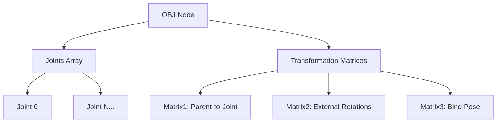

# OBJ Format Specification (GOW2)

## Overview
The OBJ (Object / Scene Graph Object) format defines instances within the game world. It includes the skeletal structure (joints), binding matrices, and transform definitions for meshes and animations to latch onto.

## Architecture & Hierarchy
An Object node contains a list of Joints representing the skeleton or attachment points, followed by multiple arrays of transformation matrices and vectors.

## Header Structure
The base header is `0x2C` (44) bytes long, followed immediately by the Joints Array.

| Offset | Size | Type | Name | Description |
|--------|------|------|------|-------------|
| 0x1C   | 4    | u32  | Joints Count | Number of Joint structures |
| 0x20   | 4    | u32  | File0x20 | Index of the root joint (always 0) |
| 0x24   | 4    | u32  | Flags / File0x24| Miscellaneous flags |
| 0x28   | 4    | u32  | Data Offset | Offset to the Data Header (`DATA_HEADER_SIZE` = 0x30) |

*Note: The OBJ magic (`0x00040001`) and other preceding bytes seem contextual, but parsing starts effectively reading joint counts at `0x1C`.*

## Sub-Structures

### Joint
Starts immediately after `0x2C`. Each Joint is `0x10` (16) bytes, followed later by a separate string table for names.

| Offset | Size | Type | Name | Description |
|--------|------|------|------|-------------|
| 0x00   | 4    | u32  | Flags| Bitmask defining joint behavior |
| 0x04   | 2    | i16  | Childs Start| First child index (`-1` for none) |
| 0x06   | 2    | i16  | Childs End| Last child index (`-1` for none) |
| 0x08   | 2    | i16  | Parent| Parent joint index (`-1` for none) |
| 0x0A   | 2    | i16  | External Id| `mat2` index (for external rotation) |
| 0x0C   | 4    | f32  | Coefficient| Unknown coefficient/float |

**Joint Names Table**:
Starts at `0x2C + (Joints Count * 0x10)`. Each name is exactly `0x18` (24) bytes, null-terminated.

## Data Arrays Header
Located at `Data Offset`. This header is `0x30` bytes long and defines the counts and offsets for the matrix/vector arrays.

| Offset | Size | Type | Name | Description |
|--------|------|------|------|-------------|
| 0x00   | 4    | u32  | Mat1 Count | Count of Matrix1 elements |
| 0x04   | 4    | u32  | Mat2 Offset| Offset (from Data Offset) to Matrix2 array |
| 0x08   | 4    | u32  | Mat2 Count | Count of Matrix2 elements |
| 0x0C   | 4    | u32  | Mat3 Offset| Offset to Matrix3 array |
| 0x10   | 4    | u32  | Mat3 Count | Count of Matrix3 elements |
| ...    | ...  | ...  | ...| ... |
| 0x20   | 4    | u32  | Vec4 Offset| Offset to Vector4 array |
| 0x24   | 4    | u32  | Vec5 Offset| Offset to Vector5 array |
| 0x28   | 4    | u32  | Vec6 Offset| Offset to Vector6 array |
| 0x2C   | 4    | u32  | Vec7 Offset| Offset to Vector7 array |

## Matrices and Vectors
- **Matrixes1**: Idle Parent Local Joint => Local Joint (`Mat4`)
- **Matrixes2**: External Rotation matrices (for joints with flag `0x8`) (`Mat4`)
- **Matrixes3**: Inverse Bind Pose Matrix (World Joint => Local Joint) (`Mat4`)
- **Vectors4**: Idle Local Joint Pos XYZ (`Vec4`)
- **Vectors5**: Idle Local Joint Rotation (Quaternion / Euler) (`4 * i32`)
- **Vectors6**: Idle Local Joint Scale (`Vec4`)
- **Vectors7**: Unknown (`Vec4`, usually zero)

## Flags & Idiosyncrasies
### Joint Flags
- `0x0008`: External matrix rotation. Multiplies matrix by Mat2 index `External Id`.
- `0x0020`: Is a joint.
- `0x0080`: Is Skinned (Has inverse bind pose matrix).
- `0x8000`: Orientation is stored as a Quaternion. If absent, it's stored as Euler angles.

*Note: Quaternions in `Vectors5` are stored as `Q.14` fixed-point integers (meaning you must divide by `(1 << 14)` to convert back to float).*
