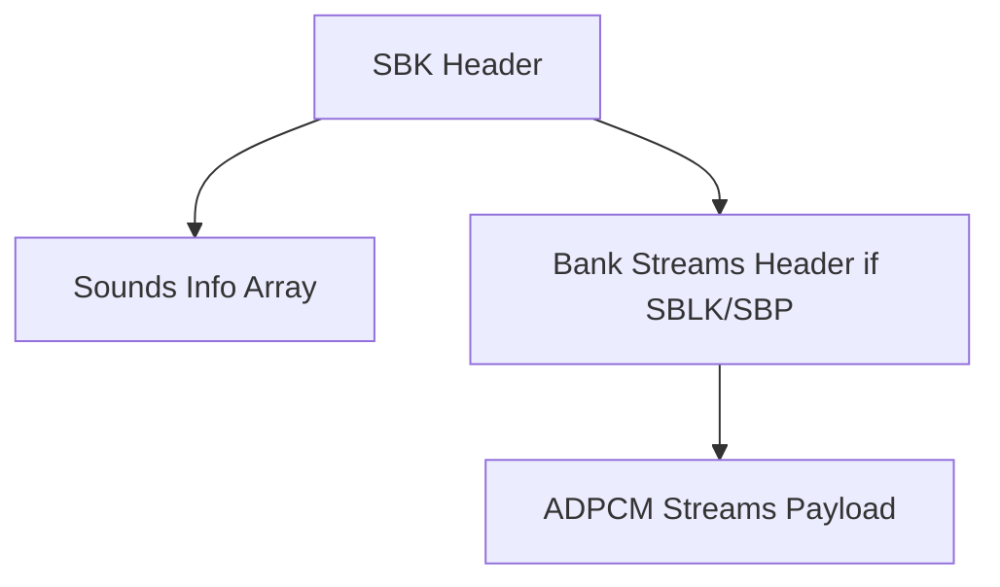

# SBK Format Specification (GOW2)

## Overview
The SBK (Sound Bank) format is an aggregate container that stores multiple audio streams (VAG) alongside sequencing/playing commands. It can function as an isolated audio package (`SBLK`/`SBP`) or as a wrapper pointing to external `VAG` streams.

## Architecture & Hierarchy

## Header Structure
The overarching format varies based on the Magic:
- `0x18`: SBLK (GOW1)
- `0x00000015`: SBP (GOW2)
- `0x40018`: VAG wrapper (GOW1/2)

| Offset | Size | Type | Name | Description |
|--------|------|------|------|-------------|
| 0x00   | 4    | u32  | Magic| Identifier |
| 0x04   | 4    | u32  | Unk04| Unknown/Padding |
| 0x08   | 4    | u32  | Sounds Cnt | Number of sounds defined |

**Sounds Info Array** (Starts at `0x0C`):
Contains `Sounds Cnt` elements of 28 bytes each.
- `24 bytes`: String name.
- `4 bytes`: Stream ID or file offset for the VAG data.

## Bank Payloads (SBLK/SBP)
If the file embeds streams, a bank payload follows the Sounds array.
The bank defines `BankSounds` with parsed commands mapping ID calls to sample ranges, pitches, delays, and random selection states (for varying impact sounds, for example).
