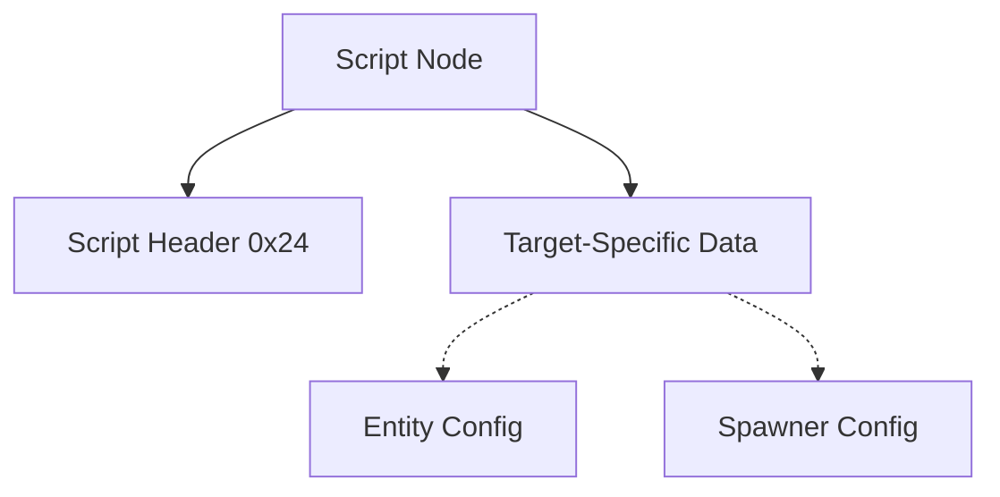

# SCR Format Specification (GOW2)

## Overview
The SCR (Script) format stores parameters and configurations for specific entities, triggers, or subsystems. It does not store raw executable code but instead defines attributes that the game engine applies to named targets (like entities, spawn points, or logic gates).

## Architecture & Hierarchy
The SCR node contains a standard `0x24` byte header that specifies the target name, followed by payload data. The payload structure depends entirely on what the target requires.

## Header Structure
The script header is `0x24` (36) bytes long.

| Offset | Size | Type | Name | Description |
|--------|------|------|------|-------------|
| 0x00   | 4    | u32  | Magic| Identifier (`0x00010004`) |
| 0x04   | 16   | char | Target Name| Null-terminated string indicating the script target (e.g. "Kratos", "Chest") |
| 0x14   | 8    | bytes| Padding | Unused padding |
| 0x1C   | 2    | u16  | Unk_0x1C | Unknown |
| 0x1E   | 2    | u16  | Unk_0x1E | Unknown |
| 0x20   | 2    | u16  | Unk_0x20 | Unknown |
| 0x22   | 2    | u16  | Unk_0x22 | Unknown |

## Data Payloads
The data immediately following `0x24` is passed to the specific loader registered for `Target Name`. 
In the `GOWToolkit` and `god_of_war_browser`, we map the `TargetName` string to a specific struct definition.

## Flags & Idiosyncrasies
- **Delegated Loading**: You cannot generically parse a script's data. You must read the `Target Name` and route the remaining buffer to a specific handler.
- **Offsets 0x1C to 0x22**: These four 16-bit integers appear to contain generic configuration flags or IDs but their exact purpose is dependent on the target type.
