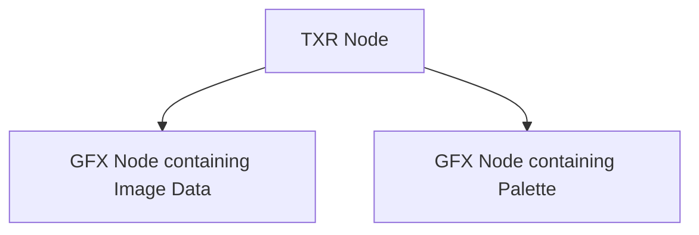

# TXR Format Specification (GOW2)

## Overview
The TXR (Texture) format defines texture metadata, linking it to its underlying graphical data (`GFX` payloads) and palettes (`PAL`). It does not store the pixel data itself, but rather references the GFX payload node names within the WAD.

## Architecture & Hierarchy
The TXR node specifies strings that correspond to other nodes in the WAD file where the actual image data and palette are stored.

## Header Structure
The TXR file is a flat structure of exactly `0x58` (88) bytes.

| Offset | Size | Type | Name | Description |
|--------|------|------|------|-------------|
| 0x00   | 4    | u32  | Magic| Identifier (`0x00000007` for standard, `0x00070007` for Remaster/Vita) |
| 0x04   | 24   | char | GFX Name | Null-terminated string pointing to the associated GFX node (image data) |
| 0x1C   | 24   | char | PAL Name | Null-terminated string pointing to the associated GFX node (palette) |
| 0x34   | 24   | char | SubTxr Name | Null-terminated string referencing a sub-texture if applicable |
| 0x4C   | 4    | i32  | LOD Param K | Level of Detail parameter K |
| 0x50   | 4    | f32  | LOD Multiplier | Level of Detail multiplier |
| 0x54   | 4    | u32  | Flags | Bitmask defining rendering behavior and filtering |

## Flags & Idiosyncrasies
The `Flags` field is heavily bit-packed to define rendering states:
- `Flags & 0xFFFF` (Flags1): Must typically be `0` or `0x8000`.
- `Flags >> 16` (Flags2): Determines material blending mode. Common values:
  - `0x01`: 3D usual / additive / alpha
  - `0x41`: 2D non-transparent (except for fonts)
  - `0x5D`: 2D transparent
  - `0x51`: 3D additive / billboard
  - `0x11`: Alternate 2D rendering

Filtering and clamping are also stored within the Flags:
- `FilterReducedNearest`: `(Flags >> 15) & 1`
- `FilterExpandedNearest`: `(Flags >> 16) & 1`
- `ClampHorizontal`: `(Flags >> 20) & 3 == 1`
- `ClampVertical`: `(Flags >> 22) & 3 == 1`
