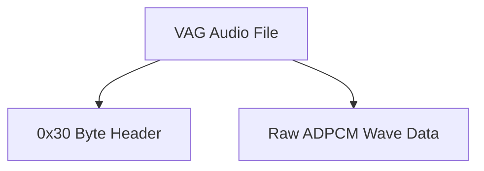

# VAG Format Specification (GOW2)

## Overview
The VAG format (sometimes `.VA1`, `.VA2`, etc.) is Sony's proprietary ADPCM (Adaptive Differential Pulse Code Modulation) audio format used heavily across PlayStation 2 titles. It stores compressed wave audio data for sound effects and some music streams.

## Architecture & Hierarchy
The file is extremely simple, containing a fixed header followed by raw ADPCM blocks.

## Header Structure
Unlike most GOW formats which use Little-Endian, the standard VAG header uses **Big-Endian** for its numerical values. The header is exactly `0x30` (48) bytes long.

| Offset | Size | Type | Name | Description |
|--------|------|------|------|-------------|
| 0x00   | 4    | char | Magic| Identifier (`"VAGp"` / `0x56414770`) |
| 0x04   | 8    | bytes| Version | Internal VAG format version (usually ignored) |
| 0x0C   | 4    | u32  | Data Size| Size of the WaveData array in bytes (**Big-Endian**) |
| 0x10   | 4    | u32  | Sample Rate| Playback sample rate, e.g., 44100 (**Big-Endian**) |
| 0x14   | 10   | bytes| Padding | Unused |
| 0x1E   | 1    | u8   | Channels | Number of channels (typically `1` for mono) |
| 0x1F   | 1    | u8   | Flags | Often unused or alignment |
| 0x20   | 16   | char | Name | Optional internal string name |

## Data Payloads
Immediately following the `0x30` header is the `WaveData` block, which spans exactly `Data Size` bytes.

## Flags & Idiosyncrasies
- **Endianness**: You must read `Data Size` and `Sample Rate` as Big-Endian (`binary.BigEndian.Uint32` in Go, or `__builtin_bswap32` in C++).
- **ADPCM Decoding**: The data is encoded in standard Sony PS-ADPCM blocks. Each block is 16 bytes, decoding to 28 samples (each 16-bit PCM).
- **Channels**: Most VAG files in GOW are Mono. Stereo audio is typically handled by interleaving separate VAG channels or using a different streaming container (`.SBK` or `.INT`).
