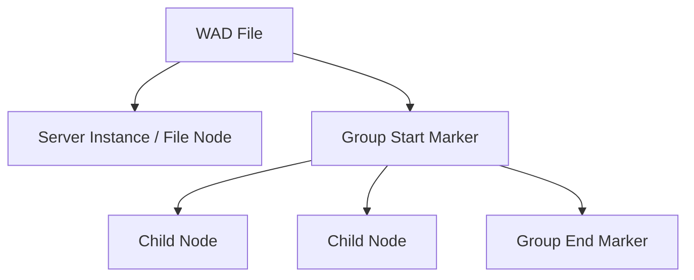

# WAD Format Specification (GOW2)

## Overview
The WAD format is the primary archive format used in God of War II to store assets (meshes, animations, textures, scripts, etc.). It is a sequential container of chunks called "Tags". Each Tag has a 32-byte header followed by its data payload, and forms a hierarchical tree structure using grouping tags.

## Architecture & Hierarchy
The WAD file is read sequentially. Tags can represent actual file data or act as directory/group markers, forming a tree of Nodes.



## Tag Header Structure (0x20 bytes)
Every item in the WAD begins with this 32-byte header.

| Offset | Size | Type | Name | Description |
|--------|------|------|------|-------------|
| 0x00   | 2    | u16  | Tag Type | Specifies the content type (e.g. `0x0001` for Server Instance, `0x0002` for Group Start) |
| 0x02   | 2    | u16  | Flags | Tag flags |
| 0x04   | 4    | u32  | Size | Size of the payload data immediately following this header. If 0, there is no payload. |
| 0x08   | 24   | char | Name | Null-terminated string name of the tag/file |

## Data Payloads and Alignment
If `Size > 0`, the tag's payload immediately follows the 32-byte header.
After reading the payload, the file cursor must be **aligned to the next 16-byte boundary** before reading the next Tag header.

Formula for alignment:
```c
next_tag_offset = (current_offset + 15) / 16 * 16;
```

## Structural Tags
The hierarchy is maintained by specific `Tag Type` values:

| Tag Type | Name | Behavior |
|----------|------|----------|
| `0x0001` | Server Instance | Indicates a new file/instance. The payload typically contains a `u32` Server ID determining the handler. |
| `0x0002` | Group Start | Marks the beginning of a child group. All subsequent tags will be children of the current node until `Group End` is reached. |
| `0x0003` | Group End | Marks the end of a child group, returning the context to the parent node. |

## Notes & Idiosyncrasies
- **Zero-Sized Tags / Entity Counts**: Certain tags (like Entity Count tags) have `Size = 0` but their *Name* might be used to map to a pre-defined heap size. 
- **Alignment**: The 16-byte alignment applies to the **absolute file offset**, meaning `(header_offset + 32 + payload_size)` must be rounded up to the nearest multiple of 16.
