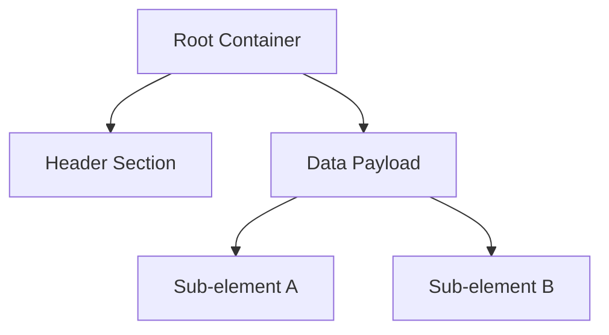

# Format Name Specification (GoWR PC)

## Overview
A concise, professional description of the format's purpose within the God of War Ragnarök PC engine. Do not include comparisons to legacy engines (e.g., PS2, GOW1/2). Do not include C++ implementation bugs or parser-specific workarounds. Focus strictly on the structural and functional role of the asset.

## Architecture & Hierarchy

## Binary Layout

Define the structs sequentially. Use Offset Tables to provide a strict definition.

### Main Header

| Offset | Size | Type | Name | Description |
|--------|------|------|------|-------------|
| 0x00   | 4    | u32  | Magic| File magic identifier |
| 0x04   | 4    | u32  | Version| Format version |
| 0x08   | 4    | u32  | Size | Total file size |
| 0x0C   | 4    | pad  | Padding| Zero padding |

## Runtime Pipelines & Specifics

(Optional) Detail any specific algorithms, hash functions, or runtime behaviors discovered via Ghidra analysis.

- Include decompiled C pseudo-code if it clarifies the format parsing logic.
- Do not include toolkit-specific bug reports or refactoring to-dos here.
