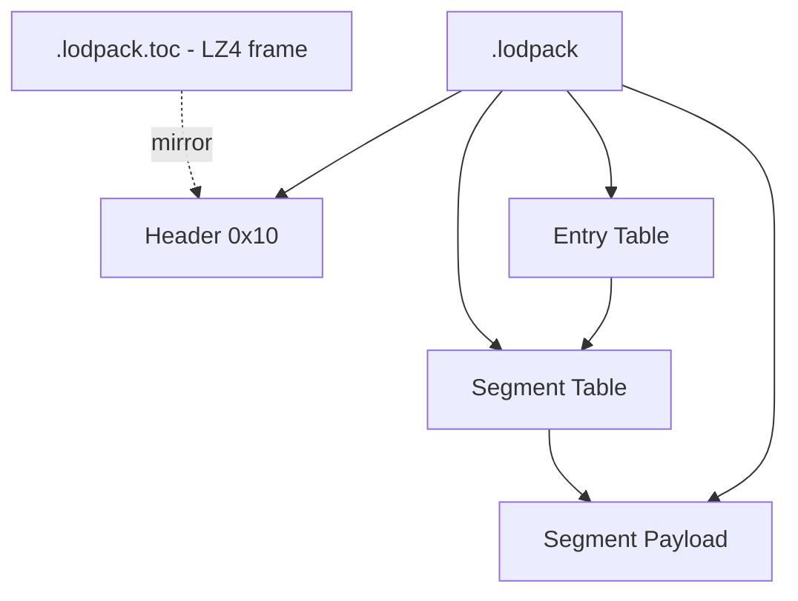

# Lodpack Format Specification (GoWR PC)

## Overview
`.lodpack` is a streaming container that serves geometry blobs on demand. A
submesh whose `LodKey` is non-zero does not carry its vertex and index data
inline; it names a blob in a lodpack, which the engine fetches through its
streaming job.

The container is addressed in two levels: a small table of contents maps a
64-bit key to a byte range, and the payload is divided into fixed segments that
are the unit of residency — the engine tracks a load pointer and a status byte
per segment, not per blob.

A `.lodpack.toc` sibling holds the same table of contents as a standalone LZ4
frame (magic `04 22 4D 18`). The `.lodpack` itself carries an uncompressed copy
at its head, so a reader that opens the pack directly needs no decompression to
resolve a key.

Offsets are verified against `GoWR.exe` (PC retail, image base `0x140000000`).

## Architecture & Hierarchy



## Asset Resolution

`FUN_140425510` builds asset paths from a format enum. All pack families resolve
under the same directory:

| Enum | Extension | Directory |
|------|-----------|-----------|
| 1 | `.wad` | `exec\wad\PC_LE\` |
| 3 | `.texpack` | `exec\wad\PC_LE\` |
| 4 | `.texpack.toc` | `exec\wad\PC_LE\` |
| 6 | `.lodpack` | `exec\wad\PC_LE\` |
| 7 | `.lodpack.toc` | `exec\wad\PC_LE\` |

## Binary Layout

`FUN_14043a710` reads a 16-byte header, then reads the whole table of contents
as a single block sized `0x10 + (SegmentCount + EntryCount) * 0x18`.

### Header

| Offset | Size | Type | Name | Description |
|--------|------|------|------|-------------|
| 0x00   | 4    | u32  | SegmentCount | Number of payload segments |
| 0x04   | 4    | u32  | EntryCount | Number of key-addressable blobs |
| 0x08   | 4    | u32  | Reserved | Observed `0` |
| 0x0C   | 4    | u32  | Version | Observed `1` |

`FUN_140688110` allocates `SegmentCount` pointers and `SegmentCount` status
bytes, which establishes the first field as the segment count.

### Segment Table

At `0x10`, `SegmentCount` entries, stride **0x18**:

| Offset | Size | Type | Name | Description |
|--------|------|------|------|-------------|
| 0x00   | 8    | i64  | Offset | Absolute offset into the `.lodpack` |
| 0x08   | 8    | u64  | Hash | Segment content hash |
| 0x10   | 8    | i64  | Size | Segment length in bytes |

Segments are contiguous and cover the payload in order:
`Offset[i] + Size[i] == Offset[i+1]`.

### Entry Table

At `0x10 + SegmentCount * 0x18`, `EntryCount` entries, stride **0x18**:

| Offset | Size | Type | Name | Description |
|--------|------|------|------|-------------|
| 0x00   | 4    | u32  | SegmentIndex | Owning segment |
| 0x04   | 4    | u32  | RelOffset | Byte offset within the segment |
| 0x08   | 8    | u64  | Key | Lookup key; matches a submesh `LodKey` |
| 0x10   | 4    | u32  | Size | Blob length in bytes |
| 0x14   | 4    | u32  | Reserved | Observed `0` |

A blob's absolute position is `Segment[SegmentIndex].Offset + RelOffset`.

## Runtime Pipelines & Specifics

### Key lookup is a binary search

The entry table is sorted ascending by `Key`. Both `FUN_140688290` and
`FUN_1406884a0` run a `lower_bound` over stride `0x18`, comparing the 64-bit
value at `entry + 0x08`:

```c
entries = base + 0x10 + SegmentCount * 0x18;
n       = EntryCount;

while (n > 0) {
    half = n >> 1;
    if (*(u64 *)(entries + half * 0x18 + 8) < wanted) {
        entries += (half + 1) * 0x18;
        n = n - half - 1;
    } else {
        n = half;
    }
}
```

`FUN_1406884a0` recovers an entry's ordinal as
`(entryPtr - (base + 0x10 + SegmentCount * 0x18)) / 0x18`, which pins the table
origin and the stride independently of the search itself.

### Residency tracking

Lookup results are recorded per segment, not per entry. On a match,
`FUN_140688290` sets a bit in the byte array indexed by the entry's
`SegmentIndex`, marking that segment as required. The streaming job registered
as `LodStreamUpdate` (`FUN_140406870`) drives the fetch.

### Verification

Measured on `010_midgard1a.lodpack` — `SegmentCount = 150`, `EntryCount = 2600`:

- `0x10 + (150 + 2600) * 0x18 = 0x101E0`, matching `Segment[0].Offset` exactly.
  The table of contents occupies the head of the file and the payload begins
  immediately after it.
- All 150 segments contiguous.
- All 2600 keys strictly ascending, no duplicates.
- Every entry satisfies `RelOffset + Size <= Segment.Size`.

## Related

- `Mesh.md` — submesh `LodKey` at offset `0x68` is the key looked up here.
