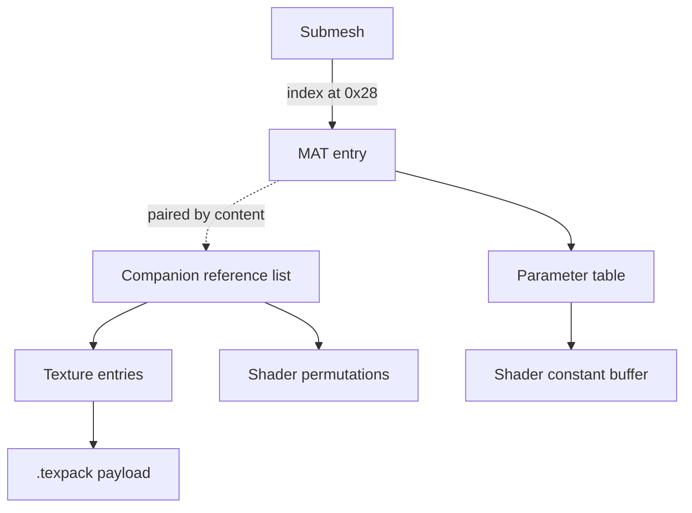

# Material Format Specification (GoWR PC)

## Overview
A material binds a submesh to the textures it samples, the parameters it feeds
its shader's constant buffer, and the shader permutations compiled for it.

It occupies **two** WAD entries. The `MAT_<hash>` entry holds the parameter
table. A companion entry of type 0, laid down immediately after it in
descriptor order, holds the reference list: every asset the material pulls in.
The companion carries no name of its own — the WAD names it after its first
reference, which makes it look unrelated in a browser.

Offsets below were established by decoding `r_athena00`.

## Architecture & Hierarchy



## Binary Layout

### MAT entry

| Offset | Size | Type | Name | Description |
|--------|------|------|------|-------------|
| 0x00   | 4    | u32  | Version | `0x0A` observed |
| 0x0C   | 4    | u32  | PipelineFlags | Same field the shader header carries |
| 0x10   | 8    | u64  | Hash | The material's own hash; its shaders are named after it |
| 0xC0   | 28   | u32[7] | SectionOffsets | From the start of the entry |
| 0xE0   | 12   | u16[6] | SectionCounts | Element count per section |

Section 0 is the parameter table. The remaining sections are unidentified;
their offsets repeat when a section is empty.

### Parameter entry

24 bytes each, at `SectionOffsets[0]`:

| Offset | Size | Type | Name | Description |
|--------|------|------|------|-------------|
| 0x00   | 8    | u64  | NameHash | Hashed parameter name; the string is not in the file |
| 0x08   | 8    | u64  | TypeHash | Shared by parameters of the same type |
| 0x10   | 2    | u16  | TypeCode | |
| 0x12   | 2    | u16  | CBufferOffset | Byte offset within the shader constant buffer |
| 0x14   | 4    | f32  | Value | |

`CBufferOffset` runs cumulatively across the table, so the entries describe a
packed constant buffer laid out in declaration order.

### Companion reference list

| Offset | Size | Type | Name | Description |
|--------|------|------|------|-------------|
| 0x00   | 4    | u32  | Count | Number of references |
| 0x04   | 4    | u32  | (0) | |
| 0x08   | 76×N | — | Entries | |

Each entry is 76 bytes:

| Offset | Size | Type | Name | Description |
|--------|------|------|------|-------------|
| 0x00   | 16   | u8[16] | GUID | The referenced asset's WAD GUID |
| 0x10   | 60   | char | Name | Null-terminated |

The final entry's name field is truncated where the payload ends, so a reader
that insists on a full 76-byte stride drops the last reference.

### Recognising a texture reference

A GUID is four u32 words. A texture's GUID is built as the string `TEXTURE\0`
in its first two words followed by the 8-byte texture hash:

```
54 58 45 54 00 45 52 55  <lo32> <hi32>
```

The words are stored little-endian, so the bytes on disk are **not** the ASCII
string — they only spell `TEXT` `URE\0` when each word is read big-endian.
Compare the byte pattern, not the string.

The last two words are the texture hash in the order the asset name prints it,
which is the key the `.texpack` index is searched by.

Everything else in the list is a shader permutation, named
`<materialhash>_<stage>_<permutation>`.

## Runtime Pipelines & Specifics

### Submesh to material

A submesh names its material by index, as a `u32` at submesh offset `0x28`. The
index is constant across every level of a part, which is what identifies it:
measured on `r_athena00`, all 18 parts resolve to exactly one of the three
values 0, 1, 2, matching the WAD's three MAT entries.

### Pairing a material with its companion

The companion follows the MAT in descriptor order, but a reader working from
the browser's entry tree no longer has that order. The pairing can be made by
content instead: the companion lists the material's shader permutations, and
those are named after the material's own hash. Matching on that proves the
pairing rather than assuming it.

### Texture roles

The channel a texture contributes is encoded in its name, as the suffix before
the trailing hash:

| Suffix | Role | Count across four shipped character WADs |
|--------|------|---:|
| `_0d_`  | Diffuse | 106 |
| `_0n_`  | Normal | 97 |
| `_0g_`  | Gloss / roughness | 91 |
| `_0ao_` | Ambient occlusion | 69 |
| `_0sc_` | Subsurface scatter | 39 |
| `_0sd_` | Detail | 23 |
| `_0h_`  | Height | 14 |
| `_0e_`  | Emissive | 1 |

Note that `sc` and `sd` are two characters where every other suffix is one, so
a reader that assumes a single letter files 62 textures as unknown.

A material commonly references textures belonging to other subjects — the
athena materials all share one `teethtongue` height map, and one references a
test checkerboard — so the subject in a texture name does not identify the
material's purpose.

### Where the pixels live

A texture is declared by a descriptor entry (type `0x0022`) holding its name,
its dimensions as `u16` at `0x48` and `0x4A`, and its full streamed byte size
at `0x5C`. A payload entry (type `0x80A2`) carries a small resident slice.

The full texture streams from a `.texpack`, keyed by the same hash the asset
name ends in. Character textures sit in `root.texpack`. Measured on
`r_heroa00`, 26 of 2798 textures resolve nowhere in a texpack, and every one of
them declares a streamed size of zero - they are resident-only, from 4 up to
512 pixels.

A resident texture keeps its own format: the descriptor embeds a GNF block at
`0x68`, the same structure the texpack blocks carry, so the AGC `T#` sits at
`0x78` and the format and swizzle words at `0x7C` and `0x84`. Mip 0 starts at
the beginning of the payload - `TX_regionidmap` pins that, its data extent
being exactly `200 * 200 * 4`.

Entry size is no guide on its own: payloads are padded well past their data (a
16x16 diffuse occupies 2304 bytes of which 184 are non-zero) and the format
genuinely varies. Among r_heroa00's resident textures there are BC1, BC4, BC7
and uncompressed RGBA8, the last carrying AGC data_format `0x38`.

`TX_texture_white` is a useful oracle for this path: 4x4, BC1, and its payload
opens `ff ff ff ff 00 00 00 00` - two white endpoints and zero indices, which
must decode to solid white.

A descriptor whose size at `0x5C` is **zero** has nothing to stream: the
resident payload is the whole texture. `r_athena00` is like this for its
diffuse maps, which are genuinely 16x16 - so a viewer that only binds diffuse
shows that character untextured no matter how much of the pipeline is correct.

## Unresolved

- **Parameter names.** Only hashes are stored. Ten per material on the athena
  assets, with the strings presumably in the executable.
- **Sections 1 to 5** of the MAT entry. Section 1 holds 16-byte entries whose
  first field increments by 8 and whose last is a float; the rest were empty in
  every sample.
- **Resident payload layout.** The `0x80A2` entry holds block-compressed data
  but the format is not yet located in the descriptor; it can be inferred from
  the ratio of `0x5C` to the pixel count. Only relevant for the 2% of textures
  that never stream, all of which are tiny stubs.
- **Index-to-material ordering.** That `0x28` is the material index is
  established; that index 0 means the first MAT entry in descriptor order is
  the working assumption, not a proven fact.

## Related

- `Mesh.md` — the submesh field that names the material.
- `Texture.md` — decoding the referenced texture payloads.
- `Shader.md` — the permutations the reference list names.
