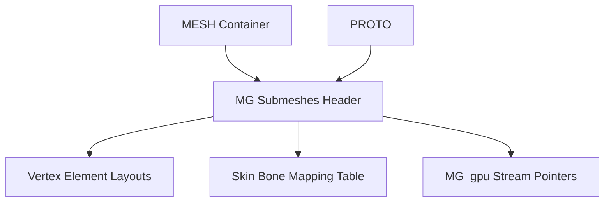

# Mesh Format Specification (GoWR PC)

## Overview
Geometry handling in God of War Ragnarök relies on decoupled, PC-centric vertex and index buffers.

A single 3D model is typically described across four distinct sub-files:
1. **PROTO**: Skeleton hierarchy and local/world transformation matrices.
2. **MESH**: High-level mesh container pointing to submeshes.
3. **MG (Mesh Group)**: Submesh definitions, bounding boxes, skinning tables, and vertex layout declarations.
4. **MG_gpu**: The raw, uncompressed GPU vertex and index streams.

## Architecture & Hierarchy

## MG (Mesh Group) Structure
The `MG` block dictates how the GPU stream should be parsed.

### Header
- `0x30`: Submesh Count (`u16`)
- `0x32`: Padding/Unknowns

### Submesh Declaration
An array of absolute offsets resolving each submesh block. Each block contains:
- **Bone Ref (`u16`)**: Root bone attachment.
- **Skin Table Offset**: Pointer to global bone indices affecting this submesh.
- **BBox (`f32[6]`)**: Bounding box scale and offset.
- **Vertices (`u32`)**: Vertex Count.
- **Faces (`u32`)**: Face Count.
- **LOD Key (`u64`)**: Hash pointing to external `.lodpack` stream data (if `0`, the data is internal).

### Vertex Layout
The MG file dictates how `MG_gpu` streams are read.
- **Stream Count (`u8`)**: `1` = Interleaved buffer, `>1` = Split streams.
- **Index Size (`u8`)**: `2` = `uint16`, `4` = `uint32`.
- **Element Count (`u8`)**: Number of semantic attributes (Position, Normal, Tangent, UVs, BoneIdx, BoneWgt).

#### Semantics
Extracted from `GoWRknk.cs`:
- `0`: POSITION
- `1`: NORMAL
- `2`: TANGENT
- `3-6`: UV Channels
- `9`: BONE_IDX
- `10`: BONE_WGT

#### Formats
- `0`: `float32x3` (Standard Floats)
- `6`: `unorm16x3` (Quantized shorts, requires bounds un-scaling)

## Skinning Architecture
Unlike the strict `0x10` byte joint descriptors of GOW1/GOW2, GoWR dynamically packs bone weights based on the layout descriptor.
- Mode 3: 10 influences packed into 3x `uint32`.
- Mode 2: 6 influences packed into `uint32`.
- Mode 1: 4 influences (`uint16`/`byte` format).
