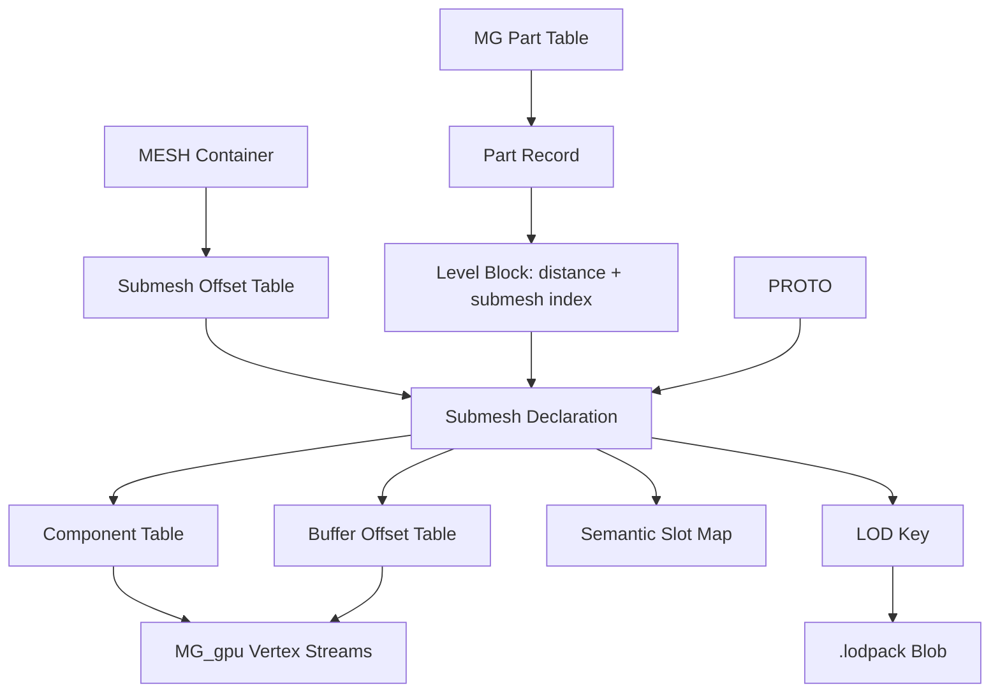

# Mesh Format Specification (GoWR PC)

## Overview
Geometry handling in God of War Ragnarök relies on decoupled, PC-centric vertex and index buffers.

A single 3D model is typically described across four distinct sub-files:
1. **PROTO**: Skeleton hierarchy and local/world transformation matrices.
2. **MESH**: High-level mesh container pointing to submeshes.
3. **MG (Mesh Group)**: Submesh definitions, bounding boxes, skinning tables, and vertex layout declarations.
4. **MG_gpu**: The raw, uncompressed GPU vertex and index streams.

Offsets in this document are verified against `GoWR.exe` (PC retail, image base
`0x140000000`). Function addresses cite the routine that establishes each fact;
they are valid for one build and move between patches, while the field offsets
are stable.

## Architecture & Hierarchy


```mermaid
graph TD
    MESH[MESH Container] --> Table[Submesh Offset Table]
    Table --> SM[Submesh Declaration]
    SM --> Comp[Component Table]
    SM --> BufOff[Buffer Offset Table]
    SM --> Slots[Semantic Slot Map]
    Comp --> Streams[MG_gpu Vertex Streams]
    BufOff --> Streams
    SM --> LodKey[LOD Key] --> Pack[.lodpack Blob]
    MG[MG Part Table] --> Part[Part Record]
    Part --> Level[Level Block: distance + submesh index]
    Level --> SM
    PROTO[PROTO] --> SM
```

## Binary Layout

### Container Header

The submesh offset table is located by a self-relative pointer, not by a fixed
address. Established by `FUN_14068ddb0`:

| Offset | Size | Type | Name | Description |
|--------|------|------|------|-------------|
| 0x0C   | 4    | i32  | TableRel | Self-relative offset; `table = 0x0C + TableRel` |
| 0x10   | 4    | u32  | SubmeshCount | Number of submesh slots |

```c
table = (M + 0x0C) + i32_at(M + 0x0C);
count =  u32_at(M + 0x10);
```

A `TableRel` of `0x34` places the table at `0x40`, which is the common case but
not a rule. The count is a full `u32`.

### Submesh Offset Table

An array of `SubmeshCount` `i32` slots. Each slot is **self-relative**, not
absolute:

```c
submesh[i] = &table[i] + i32_at(&table[i]);
```

A slot holding `0` resolves to itself and marks the end of meaningful data.

### Submesh Declaration

Offsets are from the submesh base. The runtime object mirrors the file image —
`FUN_1406921a0` reads the LOD key from `obj + 0x68`, the same offset the file
uses — so these offsets apply equally to a parsed file and to engine memory.

| Offset | Size | Type | Name | Description | Source |
|--------|------|------|------|-------------|--------|
| 0x00   | 4    | f32  | Radius | Bounding radius of this level | measured |
| 0x10   | 12   | f32[3] | Extent | Dequantisation scale | — |
| 0x1C   | 12   | f32[3] | Origin | Dequantisation bias | — |
| 0x30   | 4    | u32  | IndexOffset | Index buffer offset into the GPU blob | `FUN_14067d290` |
| 0x34   | 4    | u32  | ClusterOffset | Cluster block offset into the GPU blob | `FUN_14067d290` |
| 0x3C   | 4    | u32  | ResidentOffset | Offset into `MG_gpu`, used when `LodKey == 0` | measured |
| 0x44   | 4    | u32  | VertexCount | Vertex count | `FUN_14067d290` |
| 0x48   | 4    | u32  | PrimitiveCount | Primitive count | `FUN_14067d290` |
| 0x4C   | 4    | u32  | Flags | Bit 2 set once buffers are bound | `FUN_14067c4b0` |
| 0x50   | 2    | u16  | SubmeshIndex | Index of this submesh within the mesh | `FUN_14067c0e0` |
| 0x52   | 2    | u16  | ClusterCount | Non-zero allocates 3 extra buffer views | `FUN_14067bd20` |
| 0x5C   | 4    | u32  | IndexCount | Equals `PrimitiveCount * indicesPerPrimitive` | measured |
| 0x58   | 1    | u8   | ClusterStride | Cluster element stride | `FUN_14067d290` |
| 0x59   | 1    | u8   | ClusterStride2 | Second cluster element stride | `FUN_14067d290` |
| 0x60   | 4    | u32  | ComponentTableRel | Component table offset, relative to submesh base | `FUN_14067d290` |
| 0x64   | 4    | u32  | BufferOffsetTableRel | Buffer offset table, relative to submesh base | `FUN_14067d290` |
| 0x68   | 8    | u64  | LodKey | `.lodpack` blob key; `0` = data is internal | `FUN_1406921a0` |
| 0x70   | 8    | u64  | SlotMapLo | Semantic slot map, nibbles 0–15 | `FUN_14067cc20` |
| 0x78   | 8    | u64  | SlotMapHi | Semantic slot map, nibbles 16–17 | `FUN_14067cc20` |
| 0x80   | 1    | u8   | BufferCount | Number of vertex buffers | `FUN_14067bd20` |
| 0x81   | 1    | u8   | IndexStride | Bytes per index (2 or 4) | `FUN_14067d290` |
| 0x82   | 1    | u8   | *(unread)* | Never referenced by the engine | — |
| 0x83   | 1    | u8   | Topology | Primitive topology, low 3 bits | `FUN_14067d290` |
| 0x84   | 1    | u8   | ComponentCount | Number of vertex components | `FUN_14067d290` |

`0x82` and `0x83` are two independent bytes. The engine reads `0x83` alone,
masks it with `7` and uses it as a topology enum; it never reads `0x82`. Vertex
strides are not stored — they are derived from the component table.

### Component Table

At `submesh + ComponentTableRel`, `ComponentCount` entries, stride **8**:

| Offset | Size | Type | Name | Description |
|--------|------|------|------|-------------|
| 0x00   | 1    | u8   | Semantic | Attribute semantic |
| 0x01   | 1    | u8   | Format | Element format |
| 0x02   | 1    | u8   | Count | Element count |
| 0x03   | 1    | u8   | ByteOffset | Offset within its buffer's stride |
| 0x04   | 1    | u8   | BufferIndex | Logical buffer, 0–14 |
| 0x05   | 3    | pad  | Padding | Unread |

#### Semantics
- `0`: POSITION
- `1`: NORMAL
- `2`: TANGENT
- `3-6`: UV Channels
- `9`: BONE_IDX
- `10`: BONE_WGT

#### Formats
Bytes per element, from the format switch in `FUN_14067d290`. A component's
total size is always `bytesPerElement * Count`:

| Format | Bytes / element |
|--------|-----------------|
| 0, 2, 3 | 4 |
| 1, 4, 5, 6, 7 | 2 |
| 8, 9, 10, 11 | 1 |

Known interpretations: `0` = `float32`, `3` = packed 10/10/10, `6` = `unorm16`
(requires bounds un-scaling via Extent/Origin), `7` = `snorm16`, `8` = `uint8`.

### Buffer Offset Table

At `submesh + BufferOffsetTableRel`, `u32` each, into the GPU blob.

The table is **packed**: the engine walks logical buffers `0..14` in order and
consumes one offset per buffer that has a non-zero derived stride. A logical
buffer index is therefore not directly an index into this table. In shipped
assets the logical indices are dense, so packed and logical coincide —
`FUN_14067cc20` relies on that by using `BufferIndex` directly as a view index.

### Semantic Slot Map

`SlotMapLo` and `SlotMapHi` together hold **18 nibbles**. Each nibble is a
*component index* bound to a fixed semantic channel; `0xF` means the channel is
absent (`FUN_14067cc20`):

```c
slot = nibble(n);
if (slot != 0xF)
    component = submesh + ComponentTableRel + slot * 8;
```

A component's channel is determined by which slot points at it. Slot 11
(`SlotMapLo` bits 44–47) is the only channel that receives the per-level
parameter from `FUN_14067c4b0`.

## Vertex Addressing

Every buffer is interleaved. Per-buffer stride is the sum of the sizes of the
components that name it:

```c
for each component c:
    stride[c.BufferIndex] += elementSize(c.Format) * c.Count;
```

A vertex `v` of component `c` is located at:

```c
bufferOffset[packedSlot(c.BufferIndex)]
    + v * stride[c.BufferIndex]
    + c.ByteOffset
```

Buffers holding more than one component are common, so treating a component as
its own tightly packed stream is not valid in the general case.

## Index Buffers

`FUN_14067d290` computes `IndexCount = indicesPerPrimitive * PrimitiveCount`,
where `indicesPerPrimitive` is a nibble of the constant `0x00FC3333` selected by
Topology. Topologies 2 and 3 carry a **second index block** immediately after
the primary one, sized by a nibble of `0x9600`:

| Topology | Indices / primitive | Second block | Notes |
|----------|--------------------|--------------|-------|
| 0 | 3 | — | Triangle list |
| 1 | 3 | — | |
| 2 | 3 | 6 | Adjacency block follows |
| 3 | 3 | 9 | Adjacency block follows |
| 4 | 12 | — | |
| 5 | 15 | — | |

The second block starts at `IndexOffset + primaryIndexBytes`, with one element
of alignment padding when the primary index count is odd.

## Runtime Pipelines & Specifics

### Draw resource budget

`FUN_14068ddb0` sizes the buffer-view pool per submesh, and `FUN_14067bd20`
allocates exactly that amount. The agreement between the two independently
confirms `BufferCount`, `Topology` and `ClusterCount`:

```c
views = BufferCount
      + (Topology == 2 || Topology == 3 ? 1 : 0)
      + (ClusterCount != 0 ? 3 : 0);
```

### Runtime mesh object

| Offset | Description |
|--------|-------------|
| 0x10   | Per-submesh view blocks, 0x40 bytes each, indexed by `SubmeshIndex` |
| 0x18   | Submesh count; row stride of the level table |
| 0x20   | Buffer-view pool, 0x28 bytes per view |
| 0x28   | View pool high-water mark |
| 0x30   | Draw-state blocks, 0x3C0 bytes each |
| 0x50   | Level table |
| 0x58   | Level table total entry count |
| 0xC0, 0xD0, 0xE0 | Per-submesh handle / bitmask / blob-pointer arrays |
| 0x110  | Pointer to the loaded MESH file image |

Per-submesh view block at `mesh + 0x10 + SubmeshIndex * 0x40`:

```
+0x00  primary index buffer view
+0x28  pointer to the vertex-buffer view array
+0x30  pointer to the second index buffer   (topology 2/3)
+0x38  pointer to the 3 cluster views       (ClusterCount != 0)
```

### Level table

`FUN_14067c4b0` iterates a two-dimensional table with the submesh count as its
row stride:

```c
levels = u32_at(mesh + 0x58) / i32_at(mesh + 0x18);
entry  = mesh_0x50 + (i32_at(mesh + 0x18) * level + submeshIndex) * 8;
target = u16_at(entry + 4);

FUN_14067cc20(mesh_0x30 + target * 0x3C0, submesh, u32_at(entry),
              mesh_0x10 + submeshIndex * 0x40, Topology, ...);
```

Level `-1` is the base case and uses the submesh index directly.

Across every level the geometry view block passed in is identical
(`mesh_0x10 + submeshIndex * 0x40`); only the 0x3C0-byte draw-state block
varies. The table therefore selects render-state variants, not geometry detail
levels.

## Level of Detail

Detail levels are **not** a property of the MESH file, and they are not derivable
from the submesh order or from repeated LOD keys. The MG file owns an explicit
part table; each part names its own chain of submeshes together with the camera
distance at which each level stops being used.

### Part table

| Offset | Size | Type | Name | Description |
|--------|------|------|------|-------------|
| 0x30   | 2    | u16  | PartCount | Number of parts |
| 0x32   | 2    | u16  | Unk32 | |
| 0x34   | 4    | u32  | Unk34 | |
| 0x44   | 4*n  | u32[] | PartOffsets | Offsets to each part record, from MG base |

### Part record

| Offset | Size | Type | Name | Description |
|--------|------|------|------|-------------|
| 0x00   | 2    | u16  | BoneRef | Root bone attachment (0 for skinned parts) |
| 0x02   | 1    | u8   | LevelCount | Level blocks that follow, **including the terminator** |
| 0x03   | 1    | u8   | Kind | `2` = skinned, `0` = rigid |
| 0x04   | 0x34 | ...  | Bounds | Bounding volume and dequantisation data |
| 0x38   | 4*k  | u32[]| LevelOffsets | Offsets to each level block, from the part record base |

### Level block

Sixteen bytes, `LevelCount` of them per part:

| Offset | Size | Type | Name | Description |
|--------|------|------|------|-------------|
| 0x00   | 4    | u32  | Kind | Number of submeshes this level draws; `0` draws nothing |
| 0x04   | 4    | f32  | MaxDistance | Level is used while camera distance is below this |
| 0x08   | 2    | u16  | Reserved | Observed `0` |
| 0x0A   | 2*Kind | u16[] | Submeshes | Consecutive indices into the MESH submesh table |

**A level is not always one submesh.** A level splits across as many submeshes
as `Kind` names, drawn together, and halves of one level share a `LodKey` - so
consecutive submeshes repeating a key are parts of one detail level, not two
levels.

Counts of 3, 4, 6 and 10 all occur: `r_heroa00` alone has 36 such levels across
23 parts. A reader that assumes at most two drops them, and those parts lose
whole detail levels.

The block grows with the count and is padded to eight bytes - 16 bytes up to
three submeshes, 24 for four. That size never has to be computed, since every
block's offset comes from the record's pointer array.

The final block of every chain carries `MaxDistance = 32767.0`. Its `Kind`
decides what happens past the last real range:

- `Kind == 0` — the part is **culled** beyond its last level. Only the first
  `LevelCount - 1` blocks are levels.
- `Kind >= 1` — the lowest level keeps drawing at any distance, and all
  `LevelCount` blocks are levels.

The last block of a record is truncated: it overlaps the following part record
by its final bytes, so only the first 12 bytes are meaningful there.

### Worked example

`MG_athena10_0` declares 18 parts over a 77-submesh MESH. Every submesh is
reached exactly once, and total vertex count falls monotonically along all 18
chains:

```
part  0  sm0(1520)  sm1(906)   sm2(556)                     culled past 60
part  3  sm9(543)   sm10(279)  sm11(147)  sm12(77)          culled past 20
part  7  sm22+sm23(4332)  sm24+sm25(2900)  sm26(1112)  sm27(495)  sm28(193)
part  8  sm29+sm30(33062) sm31(7993)       sm32(3468)  sm33(1221)
part 13  sm59(2438) sm60(1249) sm61(526)                    culled past 30
part 15  sm68(81)   sm69(45)   sm70(23)
```

Switch distances rise monotonically while vertex counts fall — the independent
check that the mapping is being read correctly.

### Streamed versus resident levels

A level's geometry comes from one of two places, selected by the submesh
`LodKey` at `0x68`:

- `LodKey != 0` — the level streams from a `.lodpack` blob. Submesh flags at
  `0x4C` have bit 1 set (observed `0x1402`, `0x1C02`, `0x0802`).
- `LodKey == 0` — the level is resident, and its geometry sits in the `MG_gpu`
  file at the offset held in submesh field `0x3C`. Flags observed `0x1428`,
  `0x1C00`, `0x1400`.

The last level of a chain is normally the resident one, so a model always has
something to draw before any streaming completes.

## Skinning Architecture

GoWR dynamically packs bone weights based on the layout descriptor.
- Mode 3: 10 influences packed into 3x `uint32`.
- Mode 2: 6 influences packed into `uint32`.
- Mode 1: 4 influences (`uint16`/`byte` format).

Bone indices stored per vertex are **local palette** indices. The palette is
per-part, and the MG file carries it.

### Palette range table

Immediately after the part-offset table, at `0x44 + PartCount * 4`, sits one
`(start, count)` pair per part:

| Offset | Size | Type | Name | Description |
|--------|------|------|------|-------------|
| 0x00   | 2    | u16  | Start | First palette entry for this part |
| 0x02   | 2    | u16  | Count | Number of bones the part uses |

`Start` runs cumulatively from zero, so the table is contiguous and its final
`Start + Count` is the total palette length.

### Palette entries

The entries follow the range table, 20 bytes each:

| Offset | Size | Type | Name | Description |
|--------|------|------|------|-------------|
| 0x00   | 2    | u16  | BoneIndex | Global index into the PROTO skeleton |
| 0x02   | 2    | u16  | Reserved | Always `0` |
| 0x04   | 16   | f32[4] | Unk04 | Purpose not yet established |

Resolving a vertex is therefore:

```c
global = palette[part.Start + localIndex].BoneIndex;
```

### Verification

`MG_athena10_0`: 18 parts, 152 palette entries, every `BoneIndex` below the
PROTO's 318 bones (highest observed 309), every `Reserved` zero, and the table
ending exactly where the part records begin. The shape matches the geometry —
the five rigid parts (`Kind == 0`) carry exactly one bone each, while part 8,
the body, carries 58.

## Unresolved

Structural questions that remain open in the format itself:

- **Submesh flag bits at `0x4C`.** Observed values are `0x1402`, `0x1428`,
  `0x1C02`, `0x1C00`, `0x1400` and `0x0802`. Bit 1 tracks whether the geometry
  streams, and bits 3/5 appear on resident levels, but bits 10–12 have not been
  pinned down. They are not needed to resolve levels — the MG part table is
  authoritative.
- **Semantic slot assignment.** Which of the 18 channels each slot in the
  Semantic Slot Map denotes requires the shader-side binding.
- **Palette entry payload.** The 16 bytes at `0x04` of each palette entry
  decode as four floats but their role is unknown.

## Related

- `Lodpack.md` — the `.lodpack` container that serves blobs keyed by `LodKey`.
- `Skeleton.md` — PROTO hierarchy and bone matrices.
