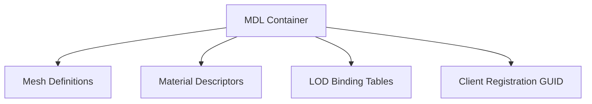

# Model Format Specification (GoWR PC)

## Overview
The MDL (Model) format in Ragnarök acts as the highest-level grouping descriptor. It defines the root container linking animations, physical meshes, materials, and runtime logic components together.

## Architecture & Hierarchy

## Structure
Unlike the classic GOW engines where `MDL` was a standalone binary structure with fixed arrays, GoWR relies on the WAD's lateral `SharedWadRef` and LOD Binding systems.

An `MDL_name` entry in the WAD serves as the root. It inherently groups:
- **LOD Binding Table slots (`N_0_M`)**: Maps `MAT_HASH` to specific Mesh GPU buffers (`MG_name_0_gpu`).
- **Game Object Prototypes (`goProto*`)**: Binds the static 3D model to a dynamic entity class capable of receiving animation events and logic scripts.

> [!NOTE]
> The exact binary layout of the `MDL` descriptor itself has been aggressively minimized in GoWR, shifting the heavy lifting of dependency mapping to the WAD's `FileDesc` string matching algorithm and lateral shared WAD files (`MDLX_Shared_*`).
