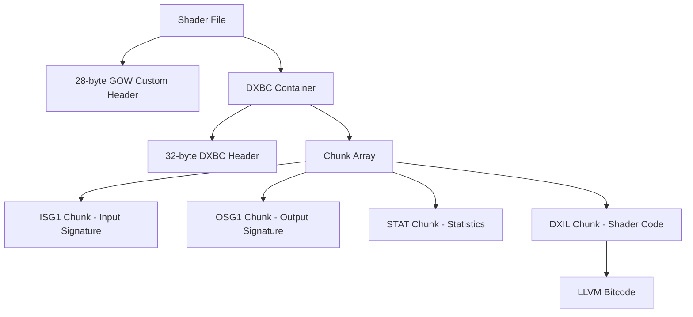

# Shader Format Specification (GoWR PC)

## Overview

Shader files contain GPU programs compiled for DirectX 12. They follow a two-layer structure: a **GOW-specific 28-byte header** prepended to a completely standard **DXBC (DirectX Bytecode) container**.
2. [Real Shader Analysis](#2-real-shader-analysis)
   - [depth_vs — Depth Pre-Pass](#21-depth_vs--depth-pre-pass-vertex-shader)
   - [opaque_vs_ls — Opaque Geometry](#22-opaque_vs_ls--opaque-geometry-vertex-shader)
   - [opaque_ps — Opaque Pixel Shader](#23-opaque_ps--opaque-pixel-shader)
   - [particles_vs — Particle Vertex Shader](#24-particles_vs--particle-vertex-shader)
   - [depvl_hs — Hull Shader (Tessellation Control)](#25-depvl_hs--hull-shader-tessellation-control)
   - [depth_ds_vs — Domain Shader (Tessellation Evaluation)](#26-depth_ds_vs--domain-shader-tessellation-evaluation)
3. [GOWR_UNKNOWN_33 — Scene / Script Bundle](#3-gowr_unknown_33--scene--script-bundle)
4. [Reading Shaders — Implementation Guide](#4-reading-shaders--implementation-guide)
5. [PSO Serializer — Decompiled Reference](#5-pso-serializer--decompiled-reference)

---

## Architecture & Hierarchy



### 1.1 GOW Custom Header (28 bytes)

Every shader file begins with this proprietary header before the standard DXBC magic:

| Offset | Size | Type | Name | Description |
|--------|------|------|------|-------------|
| 0x00   | 2    | u16  | FormatVersion | Always `0x000A` (10) |
| 0x02   | 2    | u16  | SubVersion    | Always `0x0001` |
| 0x04   | 8    | pad  | Padding       | Zero padding |
| 0x0C   | 4    | u32  | DXBCPayloadSize | Bytes (equals TotalSize in DXBC header) |
| 0x10   | 4    | u32  | PSOFlags      | PSO flags / compilation flags bitmask |
| 0x14   | 2    | str  | StageTag      | `vs`, `ps`, `hs`, `ds`, `cs`, `ls` |
| 0x16   | 2    | pad  | Padding       | Alignment padding |
| 0x18   | 4    | u32  | VariantID     | Permutation ID (relates to filename suffix) |
| 0x1C   | -    | DXBC | DXBC_Start    | Standard DXBC container begins |

**Example (hex dump of `depth_vs_00000206`):**

```
0000: 0a 00 01 00  00 00 00 00  00 00 00 00  04 31 00 00   .............1..
0010: 06 02 00 00  76 73 00 00  00 00 02 00  44 58 42 43   ....vs......DXBC
```

- `0x0C` → `0x00003104` = 12548 bytes (exact DXBC size)
- `0x14` → `76 73 00 00` = `"vs\0\0"` (vertex shader)
- `0x1C` → `44 58 42 43` = `"DXBC"` magic begins

To skip the GOW header and reach standard DXBC, simply seek to **offset 0x1C**.

---

### 1.2 DXBC Container

Starting at offset `0x1C`, the remainder of the file is a standard DXBC container as defined by Microsoft. Its layout:

| Offset | Size | Type | Name | Description |
|--------|------|------|------|-------------|
| +0x00  | 4    | char[4]| Magic | `"DXBC"` (`0x43425844`) |
| +0x04  | 16   | u8[]   | MD5Hash | MD5 hash of container contents |
| +0x14  | 4    | u32    | Version | Always 1 |
| +0x18  | 4    | u32    | TotalSize | Total container size |
| +0x1C  | 4    | u32    | ChunkCount | Number of chunks |
| +0x20  | 4*N  | u32[]  | ChunkOffsets | Relative to DXBC start |

Each chunk follows this structure:

| Offset | Size | Type | Name | Description |
|--------|------|------|------|-------------|
| +0x00  | 4    | char[4]| FourCC | Tag (e.g. `DXIL`, `ISG1`) |
| +0x04  | 4    | u32    | ChunkSize | Data size (excluding header) |
| +0x08  | N    | u8[]   | ChunkData | Chunk payload |

---

### 1.3 DXIL Chunk

The `DXIL` chunk contains the actual shader program as **LLVM bitcode** wrapped in a small sub-header:

| Offset | Size | Type | Name | Description |
|--------|------|------|------|-------------|
| +0x00  | 4    | char[4]| InnerMagic | `"DXIL"` (confirms DXIL vs DXBC) |
| +0x04  | 1    | u8     | MajorVersion| Shader model major |
| +0x05  | 1    | u8     | MinorVersion| Shader model minor |
| +0x06  | 2    | u16    | BitcodeOffset| Offset to LLVM bitcode within chunk |
| +0x08  | 4    | u32    | BitcodeSize | Size of LLVM bitcode in bytes |
| +0x0C  | N    | u8[]   | LLVMPayload | LLVM bitcode (starts with `0xBC0DC5`) |

To disassemble the LLVM bitcode, extract bytes from `+0x0C` onward and pass them to `dxc -dumpbin` or any LLVM bitcode reader.

---

### 1.4 Chunk Reference

| FourCC | Full Name | Description |
|--------|-----------|-------------|
| `SFI0` | Shader Feature Info | Bitmask of D3D12 optional features used by the shader. |
| `ISG1` | Input Signature v1 | Describes all vertex/pixel inputs (semantics, registers, formats). |
| `OSG1` | Output Signature v1 | Describes all outputs (e.g. `SV_Position`, `SV_Target`, clip/cull). |
| `PSG1` | Patch Signature v1 | Hull/Domain shader patch constant outputs (`SV_TessFactor`). |
| `PSV0` | Pipeline State Validation | Used by the D3D12 runtime to validate PSO linkage. |
| `STAT` | Statistics | Instruction counts, temp register counts, float/int op counts. |
| `ILDN` | IL Debug Name | Null-terminated path to the `.cso.pdb` debug file on the build machine. |
| `HASH` | Shader Hash | 20-byte SHA-1 or custom hash of the DXIL payload. |
| `DXIL` | DXIL Payload | LLVM bitcode of the compiled HLSL shader. |

---

### 1.5 Naming Convention

Shader files follow a consistent naming scheme:

```
<hash>_<stage>_<flags>
  │       │       └─ 32-bit hex PSO permutation flags
  │       └─ Shader stage (vs, ps, hs, ds, cs, ls)
  └─ 64-bit hex content hash (FNV or xxHash of shader source + defines)
```

Named shaders (not hash-prefixed) are "base" permutations:

```
<name>_<stage>_<flags>
  │       │       └─ 32-bit permutation flags
  │       └─ Shader stage
  └─ Human-readable material/pass name (e.g. "opaque", "depth", "particles")
```

**Examples:**

| Filename | Stage | Pass |
|----------|-------|------|
| `depth_vs_00000206` | VS | Depth pre-pass |
| `opaque_vs_ls_10040a27` | VS | Opaque geometry (layered surfaces) |
| `002c298d8482fc38_ps_10002207` | PS | Opaque material pixel shader |
| `0a700c0a87bf06bd_vs_41e17653` | VS | Particle system |
| `206b55b7180faa21_hs_10040207` | HS | Tessellation control |
| `206b55b7180faa21_ds_vs_10040207` | DS | Tessellation evaluation |

Note that the `HS` and `DS` sharing the same 64-bit prefix (`206b55b7180faa21`) indicates they are **paired shaders** compiled from the same source, just different entry points.

---

### 1.6 Known Shader Types

| Suffix | Stage | Role in the GOW pipeline |
|--------|-------|--------------------------|
| `vs` | Vertex Shader | Geometry transform, skinning, motion vectors |
| `ps` | Pixel Shader | Material evaluation, G-buffer write, lighting |
| `hs` | Hull Shader | Tessellation factor computation |
| `ds` | Domain Shader | Tessellated vertex position evaluation |
| `cs` | Compute Shader | Post-process, particles, occlusion, shadows |
| `ls` | Library Shader | Reusable shader code (DXR or linked library) |

---

## 2. Real Shader Analysis

All findings below were extracted from the ILDN chunk (build machine debug paths), ISG1/OSG1 input/output signatures, and string scanning of the DXIL LLVM bitcode.

### 2.1 `depth_vs` — Depth Pre-Pass Vertex Shader

**File:** `depth_vs_00000206`  
**Source:** `z:\...\shaders_bin\de\pt\depth_vs_00000206_026031df_9e8c80ac.cso.pdb`  
**Entry point:** `mainVS`

**Purpose:** First pass of the rendering pipeline. Renders all geometry to the depth buffer only, outputting no color. This allows subsequent passes to skip invisible pixels entirely (early-Z rejection), which is a major performance optimization.

**Input Signature:**
| Semantic | Type | Description |
|----------|------|-------------|
| `SV_VertexID` | uint | Vertex index from the draw call |
| `SV_InstanceID` | uint | Instance index for instanced rendering |

**Output Signature:**
| Semantic | Type | Description |
|----------|------|-------------|
| `SV_Position` | float4 | Clip-space position written to the depth buffer |

The minimal I/O (no color, no UV, no normals) confirms this is a pure depth-only pass. The game uses this to build the depth pre-pass before opaque shading.

---

### 2.2 `opaque_vs_ls` — Opaque Geometry Vertex Shader

**File:** `opaque_vs_ls_10040a27`  
**Source:** `z:\...\shaders_bin\op\aq\opaque_vs_ls_10040a27_a3efaff2_0126617f.cso.pdb`  
**Entry point:** `mainVS_LS`

**Purpose:** Main vertex shader for opaque geometry (characters, props, environment). The `_ls` suffix denotes a **layered surface** variant, used for materials with multiple texture layers. Notably outputs motion vectors (`PREV_POSITION_WS`, `PREV_NORMAL`) required for temporal anti-aliasing (TAA) and motion blur.

**Input Signature:**
| Semantic | Description |
|----------|-------------|
| `SV_VertexID` | Vertex index |
| `SV_InstanceID` | Instance index |

**Output Signature:**
| Semantic | Description |
|----------|-------------|
| `SV_Position` | Clip-space position |
| `TEXCOORD` | UV coordinates for material textures |
| `NORMAL` | World-space vertex normal |
| `TANGENT` | Tangent vector for normal mapping |
| `POSITION_WS` | Current world-space position |
| `PREV_POSITION_WS` | Previous frame world-space position (motion vectors) |
| `PREV_NORMAL` | Previous frame normal (motion blur for skinned meshes) |

The presence of `PREV_POSITION_WS` and `PREV_NORMAL` confirms that the engine implements **per-object motion blur** and feeds TAA with sub-pixel reprojection data.

---

### 2.3 `opaque_ps` — Opaque Pixel Shader

**File:** `002c298d8482fc38_ps_10002207`  
**Source:** `z:\...\shaders_bin\00\2c\002c298d8482fc38_opaque_ps_10002207_a1241277_609f36d1.cso.pdb`  
**Entry point:** `mainPS`

**Purpose:** Evaluates the surface material and writes the results to the G-buffer or forward render target. Reads PBR texture data (`materialTextureDescriptorOffset`, `heightFieldOffsetTexture`), indicating support for **height-field / parallax occlusion mapping**.

**Input Signature:**
| Semantic | Description |
|----------|-------------|
| `SV_Position` | Screen-space position |
| `TEXCOORD` | UV coordinates |
| `NORMAL` | Interpolated world-space normal |
| `TANGENT` | Interpolated tangent |
| `PREV_POSITION_PS` | Previous frame clip-space position (reprojection) |

**Output Signature:**
| Semantic | Description |
|----------|-------------|
| `SV_Target[0]` | Primary color / G-buffer channel 0 |
| `SV_Target[1]` | G-buffer channel 1 (normals, roughness, metalness) |
| `PREV_POSITION_PS` | Previous-frame position passthrough for TAA |

Notable strings found in DXIL:
- `materialTextureDescriptorOffset` — bindless texture indexing
- `heightFieldOffsetTexture` — parallax / displacement mapping

This confirms the engine uses a **bindless resource model** (Shader Model 6.6 style) rather than traditional descriptor tables.

---

### 2.4 `particles_vs` — Particle Vertex Shader

**File:** `0a700c0a87bf06bd_vs_41e17653`  
**Source:** `z:\...\shaders_bin\0a\70\0a700c0a87bf06bd_particles_vs_41e17653_0035d373_63e7e18e.cso.pdb`  
**Entry point:** `mainVS`

**Purpose:** Transforms particle geometry. Uses `COLOR` semantic (per-particle tint/alpha) and `fmainCameraToTransmittance` (a camera-space transmittance function, likely for volumetric/translucent particles). Also references `giIndSampler` which suggests **indirect lighting / GI** is applied to particles.

**Input Signature:**
| Semantic | Description |
|----------|-------------|
| `SV_VertexID` | Particle vertex index |
| `SV_InstanceID` | Particle instance index |

**Output Signature:**
| Semantic | Description |
|----------|-------------|
| `SV_Position` | Clip-space position |
| `COLOR` | Per-particle RGBA tint |
| `NORMAL` | Billboard/orientation normal |
| `TEXCOORD` | Sprite UV |
| `SV_ClipDistance` | Clip plane for water surface clipping |
| `SV_CullDistance` | Distance-based culling |

---

### 2.5 `depvl_hs` — Hull Shader (Tessellation Control)

**File:** `206b55b7180faa21_hs_10040207`  
**Source:** `z:\...\shaders_bin\20\6b\206b55b7180faa21_depvl_hs_10040207_6d781c17_95cc4262.cso.pdb`  
**Entry point:** `mainHS` / `mainHS_process`

**Purpose:** First stage of the tessellation pipeline. Computes tessellation factors that determine how finely a patch is subdivided. The name `depvl` likely stands for **displacement+velocity**, indicating this tessellation is used for displaced geometry (terrain, water, cloth) that also needs motion vectors.

**Input Signature (per control point):**
| Semantic | Description |
|----------|-------------|
| `POSITION_WS` | World-space control point position |
| `POSITION_PS` | Previous clip-space position (motion) |
| `PREV_POSITION_WS` | Previous world-space position |
| `NORMAL` | Control point normal |
| `PREV_NORMAL` | Previous frame normal |
| `SMOOTH_NORMAL` | Smoothed normal for curved surface approximation |
| `SMOOTH_EDGE_NORMALS` | Edge-averaged smooth normals |
| `TEXCOORD` | UV coordinates |
| `TANGENT` | Tangent vector |
| `INSTANCE_ID` | Per-instance identifier |

**Patch Constant Output:**
| Semantic | Description |
|----------|-------------|
| `SV_TessFactor[0..3]` | Outer tessellation factors per edge |
| `SV_InsideTessFactor[0..1]` | Inner tessellation factors |

The `SMOOTH_NORMAL` and `SMOOTH_EDGE_NORMALS` semantics indicate the engine implements **Phong Tessellation** or **PN-Triangles** — a technique where smooth normals are used to curve the subdivided surface, avoiding the blocky look of flat tessellation.

---

### 2.6 `depth_ds_vs` — Domain Shader (Tessellation Evaluation)

**File:** `206b55b7180faa21_ds_vs_10040207`  
**Source:** `z:\...\shaders_bin\20\6b\206b55b7180faa21_depth_ds_vs_10040207_e76e03c3_95cc4262.cso.pdb`  
**Entry point:** `mainDS_VS`

**Purpose:** Second stage of the tessellation pipeline (paired with the Hull Shader above — they share the same 64-bit hash prefix). Runs once per generated vertex. Uses the smooth normals from the Hull Shader to compute a curved position for each tessellated vertex, implementing the surface smoothing. The `_vs` suffix in the filename indicates this domain shader output is fed directly into a vertex-shader-style pipeline (no geometry shader in between).

**Input Signature:**
| Semantic | Description |
|----------|-------------|
| `SV_DomainLocation` | Barycentric coordinates within the patch |
| `SV_TessFactor` | Tessellation factors from Hull Shader |
| `SV_InsideTessFactor` | Inner tessellation factors |
| `POSITION_WS` | Interpolated world position |
| `SMOOTH_NORMAL` | Smooth normal for curved position computation |
| `SMOOTH_EDGE_NORMALS` | Edge normals for boundary handling |
| `TEXCOORD` | Interpolated UV |
| `TANGENT` | Interpolated tangent |

**Output Signature:**
| Semantic | Description |
|----------|-------------|
| `SV_Position` | Final clip-space position of tessellated vertex |

---

## 3. GOWR_UNKNOWN_33 — Scene / Script Bundle

This format is entirely separate from shaders. It is the asset type reported as `GOWR_UNKNOWN_33` in the toolkit's ViewerRegistry because no handler has been registered for it yet.

**Identified magic:** `0x5A7ADA7A` at offset `0x10` (after 16 bytes of GOW container header).

### Header Structure

```
Offset  Size  Type      Description
------  ----  --------  -------------------------------------------
0x00    4     uint32    Entry count in this bundle (observed: 22).
0x04    8     uint8[]   Zero padding.
0x0C    4     uint32    Sentinel: always 0xABABABAB (GOW fill pattern).
0x10    4     uint32    Format magic: 0x5A7ADA7A.
0x14    4     uint32    Flags / version.
0x18    →     varies    Bundle payload (entries, string table, data).
```

### Contents

The payload contains a mix of asset references, behavioral data, and level scripts. Identified content from string analysis:

**Asset paths (build machine paths, stripped at runtime):**
- Maya Binary scene files (`.mb`) for level geometry
- Visual scripts (`.visualscript`) for cutscene/cinematic logic
- Behavior trees (`.btree`) for NPC AI

**Gameplay / scripting data:**
- Behavior tree node state variables (timers, flags, cooldowns)
- NPC banter/dialogue trigger conditions (`BanterHasFired`, `CriticalBanterCooldown`, etc.)
- Combat encounter flags (`RiftEncounterDone`, `SpawnedCreature`)
- Camera/aim control state (`AimControlWasAlreadyModified`, `AimToggleWasOn`)
- Cinematic state flags (`Is Cinematic State Enabled`, `IsHotReload`)

**Example asset path found in file:**
```
gameart\visualscripts\levels\svartalfheim\forge\sva_frg300_main\sva_frg300_companions.visualscript
```

This specific file corresponds to the **Svartalfheim — The Forge** level area (`sva_frg300_main`), and the bundle appears to be a runtime-serialized snapshot of scene state including NPC companion behavior scripts.

### Relation to the WAD Browser

In the WAD browser screenshot, this file is listed as:
```
27bfdee06270d570_hs_10040a27
```
...and its inspector shows `Type: GOWR_UNKNOWN_33`, `WAD: sva_frg300_main.wad`. The toolkit correctly identifies it has no viewer registered, hence the log message:
```
[ViewerRegistry] No handler or fallback for typeId 0 (schema: GOWR_UNKNOWN_33)
```

---

## 4. Reading Shaders — Implementation Guide

To add shader support to the toolkit:

### Step 1 — Detect and skip the GOW header

```csharp
using var reader = new BinaryReader(stream);
ushort formatVersion = reader.ReadUInt16(); // 0x000A
ushort subVersion    = reader.ReadUInt16(); // 0x0001
reader.BaseStream.Seek(8, SeekOrigin.Current); // skip padding
uint dxbcSize        = reader.ReadUInt32();
uint psoFlags        = reader.ReadUInt32();
string stageTag      = Encoding.ASCII.GetString(reader.ReadBytes(4)).TrimEnd('\0');
uint variantId       = reader.ReadUInt32();
// Now at offset 0x1C — standard DXBC starts here
byte[] dxbcPayload   = reader.ReadBytes((int)dxbcSize);
```

### Step 2 — Validate DXBC magic

```csharp
if (dxbcPayload[0] != 'D' || dxbcPayload[1] != 'X' ||
    dxbcPayload[2] != 'B' || dxbcPayload[3] != 'C')
    throw new InvalidDataException("Expected DXBC magic");
```

### Step 3 — Parse chunks

```csharp
uint chunkCount = BitConverter.ToUInt32(dxbcPayload, 28);
for (int i = 0; i < chunkCount; i++)
{
    uint chunkOffset = BitConverter.ToUInt32(dxbcPayload, 32 + i * 4);
    string tag       = Encoding.ASCII.GetString(dxbcPayload, (int)chunkOffset, 4);
    uint chunkSize   = BitConverter.ToUInt32(dxbcPayload, (int)chunkOffset + 4);
    byte[] chunkData = dxbcPayload[((int)chunkOffset + 8)..((int)chunkOffset + 8 + (int)chunkSize)];

    switch (tag)
    {
        case "ILDN": HandleDebugName(chunkData); break;
        case "ISG1": HandleInputSignature(chunkData); break;
        case "OSG1": HandleOutputSignature(chunkData); break;
        case "STAT": HandleStats(chunkData); break;
        case "DXIL": HandleDxilPayload(chunkData); break;
    }
}
```

### Step 4 — Disassemble DXIL (optional)

To show human-readable HLSL assembly in the viewer, extract the LLVM bitcode from the `DXIL` chunk and invoke `dxc.exe`:

```csharp
// Extract LLVM bitcode from DXIL chunk
// First 8 bytes are the DXIL sub-header; bitcode starts at byte 12
int bitcodeOffset = 12;
byte[] bitcode = dxilChunkData[bitcodeOffset..];

// Write to temp file and disassemble
File.WriteAllBytes("temp.dxil", bitcode);
var result = Process.Start(new ProcessStartInfo
{
    FileName = "dxc.exe",
    Arguments = "-dumpbin temp.dxil",
    RedirectStandardOutput = true
});
string disasm = result.StandardOutput.ReadToEnd();
```

Alternatively, the `STAT` chunk can be used to display shader statistics (instruction counts, register pressure) without needing `dxc`.

---

## 5. PSO Serializer — Decompiled Reference

The function `FUN_140effc80` (located at `0x140EFFC80` in the game binary) is the **Pipeline State Object serializer**. It dumps the full D3D12 PSO description to a human-readable text file, and optionally a binary `.bin` sidecar with the raw shader bytecode.

The serialized fields map directly to `D3D12_GRAPHICS_PIPELINE_STATE_DESC`:

| Field written | D3D12 struct member | Offset in param_1 |
|---------------|--------------------|--------------------|
| `Flags` | `Flags` | `+0x04` |
| `NodeMask` | `NodeMask` | `+0x0C` |
| `IBStripCutValue` | `IBStripCutValue` | `+0x3C` |
| `PrimitiveTopologyType` | `PrimitiveTopologyType` | `+0x44` |
| `DSVFormat` | `DSVFormat` | `+0x2C4` |
| `SampleMask` | `SampleMask` | `+0x334` |
| `VS` (bytecode offset) | `VS` | `+0x50` / `+0x58` |
| `PS` (bytecode offset) | `PS` | `+0x68` / `+0x70` |
| `HS` (bytecode offset) | `HS` | `+0xA8` / `+0xB0` |
| `DS` (bytecode offset) | `DS` | `+0xC0` / `+0xC8` |
| `GS` (bytecode offset) | `GS` | `+0xD8` / `+0xE0` |
| `StreamOutput.NumEntries` | `StreamOutput` | `+0x88` |
| `InputLayout.NumElements` | `InputLayout` | `+0x30` |
| `BlendState.AlphaToCoverageEnable` | `BlendState` | `+0x134` |
| `DepthStencilState.DepthEnable` | `DepthStencilState` | `+0x284` |
| `RasterizerState.FillMode` | `RasterizerState` | `+0x2CC` |
| `SampleDesc.Count` | `SampleDesc` | `+0x324` |
| `NumRenderTargets` | `NumRenderTargets` | `+0x31C` |
| `RTVFormats[0..7]` | `RTVFormats` | `+0x2FC` |
| `ViewInstancing.ViewInstanceCount` | `ViewInstancingDesc` | `+0x358` |

The function signature (reconstructed):

```cpp
void SerializePSO(
    PSO_DESC*   psoDesc,       // param_1 — internal PSO description struct
    bool        writeBinary,   // param_2 — write .bin sidecar with bytecodes
    uint64_t*   shaderHashes,  // param_3 — array of 8 shader hashes [VS,PS,LS,HS,DS,CS,?,?]
    intptr_t    rootSigBlob,   // param_4 — root signature binary blob
    void*       rootSigSize,   // param_5 — root signature blob size
    const char* debugString,   // param_6 — optional debug label
    const char* outputPath     // param_7 — output file path (without extension)
);
```

---

*Document generated from binary analysis — Santa Monica Studio / PlayStation PC LLC build artifacts.*  
*Intended for use in the God of War Toolkit open-source project.*