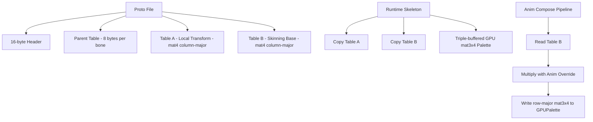

# GOWR Skeleton / Rig — Format Specification

> **Scope**: God of War Ragnarök **PC** (Steam/EGS build).
> **Status**: Reverse analysis complete.
>
> **Sources**:
> - Ghidra decompilation of `GoWR.exe` (PC)
> - Cross-referenced with PC memory dumps.

## 2. Architecture & Hierarchy



## 3. Proto file layout (goProto*)

Confirmed by triangulation between Ghidra (`FUN_1406ecc20` constructor + `FUN_1406ed6b0` memcpy), GoWRknk.cs, and GOWTool/Rig.cpp.

| Offset | Size | Type | Name | Description |
|--------|------|------|------|-------------|
| 0x00   | 16   | u8[] | Header| Content unused by parser |
| 0x10   | 2    | u16  | BoneCount| Number of bones |
| 0x14   | 4    | s32  | Unused| Padding / Unknown |
| 0x18   | 8*N  | ParentEntry| ParentTable | 3x int16 (skip) + int16 parent idx |
| +8N    | 8*N  | pad  | Padding 1 | - |
| +16N   | 16*N | pad  | Padding 2 | - |
| +32N   | 88   | block| FixedHeader| `int64 + 4x int32 + 64B` = 88B (`0x58`) |
| +32N+0x70| 64*N | mat4 | Table A | Local transforms (column-major) |
| +96N+0x70| 64*N | mat4 | Table B | Skinning Base (column-major) |

```
+0x00..0x10     header (16B, content unused by parser)
+0x10           uint16 boneCount   (high u16 = 0; reading as u32 also works)
+0x14           int32 unused
+0x18           parent table: N entries × 8 bytes
                  each entry: 3× int16 (skip) + int16 parent
+0x18 + 8N      padding 1: 8B × N
+0x18 + 16N     padding 2: 16B × N
+0x18 + 32N     fixed header block: int64 + 4× int32 + 64B = 88B = 0x58
+0x70 + 32N     **Table A**: N × 64B  (mat4 COLUMN-major — local transforms)
+0x70 + 96N     **Table B**: N × 64B  (mat4 COLUMN-major — purpose unclear)
```

> **Column-major confirmed** by Ghidra `FUN_140699110` matmul ordering: each
> mat4 entry stores 4 columns × 4 floats each sequentially. Linear bytes
> [0..15] = column 0, [16..31] = column 1, etc. Reading as row-major and
> transposing (older code) yields the INVERSE rotation and corrupts
> translation, producing the "spider" bone debug pattern.

### Parent table entry

```c
struct ProtoParentEntry {     // 8 bytes
    int16  _skip0;
    int16  _skip1;
    int16  _skip2;
    int16  parent;            // -1 = root
};
```

### Table A vs Table B

Determined via `FUN_1406ed6b0` (init copy) + `FUN_140469640` (anim compose):

| Table | Content | Runtime usage |
|---|---|---|
| A | Local parent→joint matrices (rest pose) | Copied to `skel[+0x90] + 0` during init |
| B | Pre-composed world rest matrices | Copied to `skel[+0x90] + N*64`; **read directly** as skinning palette base |

**Critical**: Table B is **NOT an IBM**. The runtime uses Table B directly as the skinning matrix (only with `anim_override × Table_B[i]` if an override is present). Our current interpretation (`worldMat = inverse(ibm)`) is **wrong** — do not invert.

## 4. Runtime skeleton struct layout

Extracted from `FUN_1406ecc20` (constructor) + `FUN_140737a20` (validators) + `FUN_140469640` (consumer).

```
GameObject @ +0x1b0  → Skeleton*
```

| Offset | Size | Type | Name | Description |
|--------|------|------|------|-------------|
| 0x40   | 32   | ptr[4]| GPU Slots| GPU bone-buffer triple-buffer slots |
| 0x58   | 8    | ptr  | ParentTable| ptr → proto data + 0x18 |
| 0x60   | 8    | ptr  | AnimOverride| ptr → proto data + 32N + 32 |
| 0x70   | 8    | ptr  | ProtoData | ptr → proto data + (N-1)*8 + 0x20 |
| 0x78   | 8    | ptr  | ReuseHandle| bone-buffer reuse handle |
| 0x88   | 8    | ptr  | AnimSkeleton| game object that drives this |
| 0x90   | 8    | ptr  | MatBuffer | Runtime mat buffer (N × 128 bytes) |
| 0x98   | 8    | ptr  | m_boneBuffer| GPU skinning palette (ALLOCATED) |
| 0xA0   | 8    | ptr  | Bitmask   | bone visibility/dirty bitmask |
| 0xA8   | 4    | int32| BoneCount | duplicate |
| 0xBA   | 2    | u16  | BoneCount | canonical |
| 0xBC   | 2    | u16  | Flags     | bit 0x80 = use GPU palette |
| 0xBE   | 1    | u8   | AnimFlag  | 3 if flag 0x80, else 0 |
| 0xBF   | 1    | u8   | DirtyFlag | atomic dirty flag |

### Buffer @ skel[+0x90]

Size: `N × 128` bytes (allocated by `FUN_1406ed1a0`/`FUN_1406ecfa0`).

```
[0      .. N*64 ]   Copy of Table A (local matrices)
[N*64   .. N*128]   Copy of Table B (skinning base matrices)  -- read by anim compose
```

### Buffer @ skel[+0x98] (m_boneBuffer)

GPU palette. **Triple-buffered** (3 slots). Each slot = `N × 48 bytes` (mat3x4 row-major affine).

Layout per bone:
```
row 0: [m00  m01  m02  tx ]
row 1: [m10  m11  m12  ty ]
row 2: [m20  m21  m22  tz ]
```

## 4. Anim compose pipeline (FUN_140469640)

```c
skel       = gameObj[+0x1b0]
animOvr    = skel[+0x60]                          // ptr to anim override header in proto
if (animOvr[+4] == 0) animOvr = NULL              // no override
else                  animOvr += animOvr[+8]      // relative offset → anim matrices

matsBase   = N*64 + skel[+0x90]                   // = base of Table B in runtime buffer

for (i = 0; i < N; ++i) {
    if (i == 0) {
        M = identity4x4                            // root is always identity
    } else {
        M = matsBase[i]                            // mat4 from Table B
        if (animOvr) {
            anim_local = animOvr[i]                // mat4
            M = anim_local × M                     // override applied
        }
    }
    // writes M as mat3x4 (3 rows × 4 cols) into the GPU palette slot
    gpu_palette[i] = mat3x4(M)
}
```

**Notes**:
- No multiplication by IBM — vertices are already in space ready for the palette
- No explicit hierarchical compose here — composition done at another stage OR Table B is already pre-composed world-rest
- No transposition between source and dest — both row-major

## 5. Ghidra reference functions (PC build)

| Symbol | Address | Function |
|---|---|---|
| `FUN_1406ecc20` | `0x1406ecc20` | Skeleton constructor (reads proto, populates struct fields) |
| `FUN_1406edd50` | `0x1406edd50` | GPU palette alloc (`m_boneBuffer`, 3× N × 48B) |
| `FUN_1406ed1a0` | `0x1406ed1a0` | Runtime buffer alloc (`skel[+0x90]`, N × 128B) |
| `FUN_1406ecfa0` | `0x1406ecfa0` | Wrapper: ed1a0 + ed6b0 |
| `FUN_1406ed6b0` | `0x1406ed6b0` | Init copy: proto Table A → skel[+0x90] |
| `FUN_140469640` | `0x140469640` | Per-frame anim compose → GPU palette write |
| `FUN_14062cc10` | `0x14062cc10` | GameObject anim orchestrator (calls ed6b0 + 469640) |
| `FUN_14061fe80` | `0x14061fe80` | GameObject ctor (creates skeleton via 6ecc20) |
| `FUN_140737a20` | `0x140737a20` | SetJointDirection (validates skel + boneCount) |