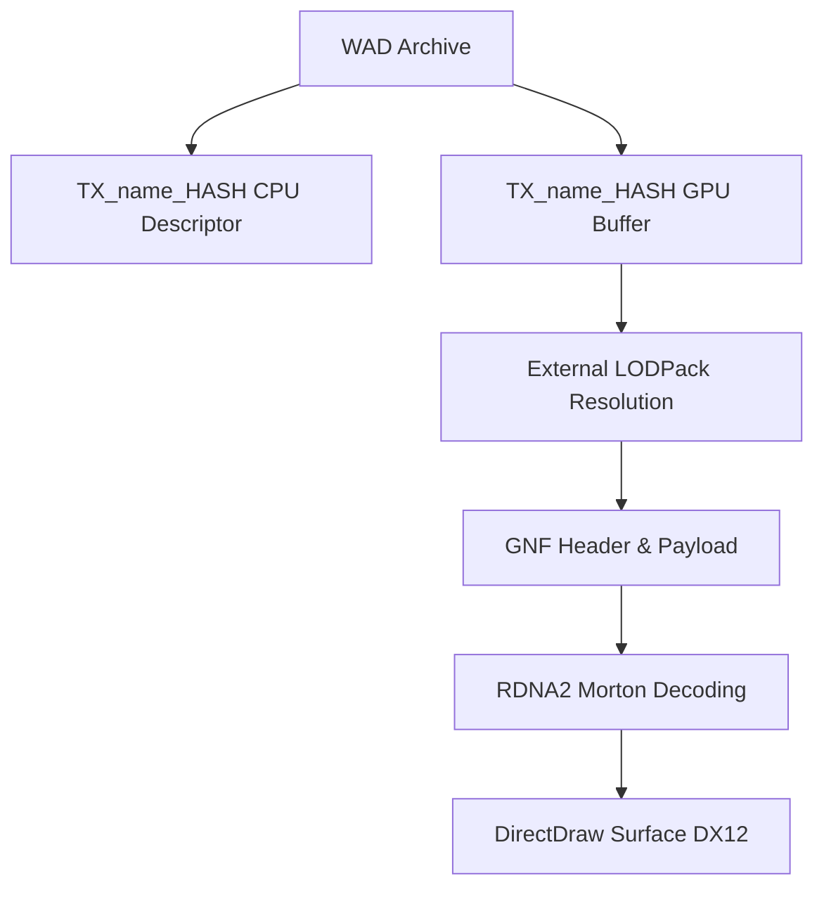

# Texture Format Specification (GoWR PC)

## Overview
Texture parsing in God of War Ragnarök is deeply integrated with the `LODPack` and `Texpack` systems. GoWR uses standard PlayStation `GNF` headers embedded within LZ4 compressed blocks, seamlessly ported to the PC architecture.

## Architecture & Hierarchy

## WAD Dual-Entry System
Every logical texture appears **twice** in the flat `FileDesc` entry list, sharing the exact same string name (e.g. `TX_angrboda_fox00_head_gen_0d_1D293ECA4DE04637`).

1. **GPU Entry (Large Size)**: Represents the compressed GPU texture data, typically resolved via an external `lodpack` stream if it exceeds the WAD's internal streaming limits.
2. **CPU Entry (Small Size)**: The descriptor/header used by the CPU to allocate the resource pointer.

> [!TIP]
> The suffix `_0d`, `_0n`, `_0g`, etc., dictates the texture slot: `d` = diffuse, `n` = normal, `g` = gloss, `ao` = ambient occlusion, `p` = parallax.

## Texpack Format
Textures are often bulk-packed in `.texpack` archives with a global `0x38` byte header:

| Offset | Size | Type | Name | Description |
|--------|------|------|------|-------------|
| 0x20   | 4    | u32  | TexturesOffset| Offset to Textures Section |
| 0x24   | 4    | u32  | BlockCount    | Total LZ4 block count |
| 0x28   | 4    | u32  | BlockInfoOffset| Offset to Block Info table |
| 0x2C   | 4    | u32  | TexturesCount | Number of textures in pack |

The data parses into `Gnf::Ps5::Header` structs which define standard properties like `width`, `height`, `format`, and `swizzle`.

## RDNA2 Custom Decoder
A major architectural milestone in the PC port is the handling of GPU swizzling. The textures are packed using AMD's RDNA2 tiling formats. Instead of relying on the proprietary Sony library (`libSceAgcTextureTool.dll`) to decode the images back to linear space, the GOWToolkit implements a native **RDNA2 Morton-code decoder**.

This allows the textures to be deterministically unscrambled and exported to standard GPU-ready DirectDraw Surface (DDS) blocks on any platform without requiring Sony SDK binaries.
