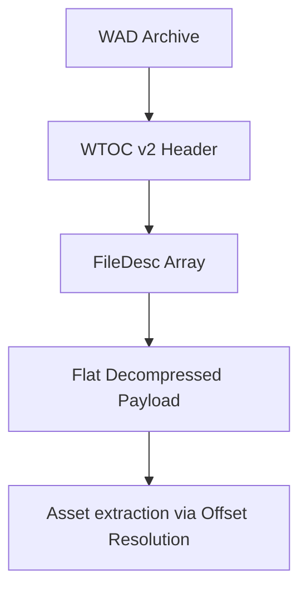

# WAD Format Specification (GoWR PC)

## Overview
God of War Ragnarök (GoWR) utilizes a `WAD` container system that operates on the **WTOC v2** header format and relies heavily on LZ4 framing for compression and streaming.

The GoWR WAD uses a completely flat directory array where entries represent physical allocations resolved by streaming groups (`blockBitSet`).

## Architecture & Hierarchy

## WTOC v2 Header
The file starts with a 16-byte WTOC header.

| Offset | Size | Type | Name | Description |
|--------|------|------|------|-------------|
| 0x00   | 4    | u32  | Magic| `0x434F5457` ("WTOC") |
| 0x04   | 4    | u32  | Version| `0x2` |
| 0x08   | 4    | u32  | Count| Number of `FileDesc` entries |
| 0x0C   | 4    | u32  | Unk0C| Unknown |

## FileDesc Structure
Each asset in the WAD is defined by a 144-byte (`0x90`) `FileDesc` entry immediately following the WTOC header.

| Offset | Size | Type | Name | Description |
|--------|------|------|------|-------------|
| 0x00   | 4    | u32  | Size | Byte size of the asset payload. `0` = pointer/reference only. |
| 0x04   | 4    | u32  | Offset| Base offset into the uncompressed stream. |
| 0x08   | 4    | u32  | Offset2| Secondary offset (used in bitSet resolution). |
| 0x0C   | 4    | u32  | Unk0C| Unknown |
| 0x10   | 4    | u32  | Unk10| Unknown |
| 0x14   | 2    | u16  | Unk14| vTable identifier (`wadContext::GetTypeId`) |
| 0x18   | ...  | ...  | ...  | Padding / Unknowns |
| 0x34   | 2    | u16  | Group| Subsystem group identifier |
| 0x36   | 2    | u16  | Type | Asset Type Enum |
| 0x38   | 8    | u8[8]| Hash | Hash / Checksum (Pattern: `0xBA`/`0xAA` fill) |
| 0x44   | 1    | u8   | BlockBitSet | Controls the payload streaming queue |
| 0x45   | 31   | u8[31]| Unk2| `Unk2[20] != 0` pushes entry into queue `8`. |
| 0x48   | 56   | char | Name | Null-terminated ASCII name |

> [!WARNING]
> Asset payloads do **not** sequentially follow their `FileDesc` entries. The actual payload offset in memory requires resolving the `blockBitSet` queues via a dynamic flush algorithm (derived in `Wad.cpp`).
