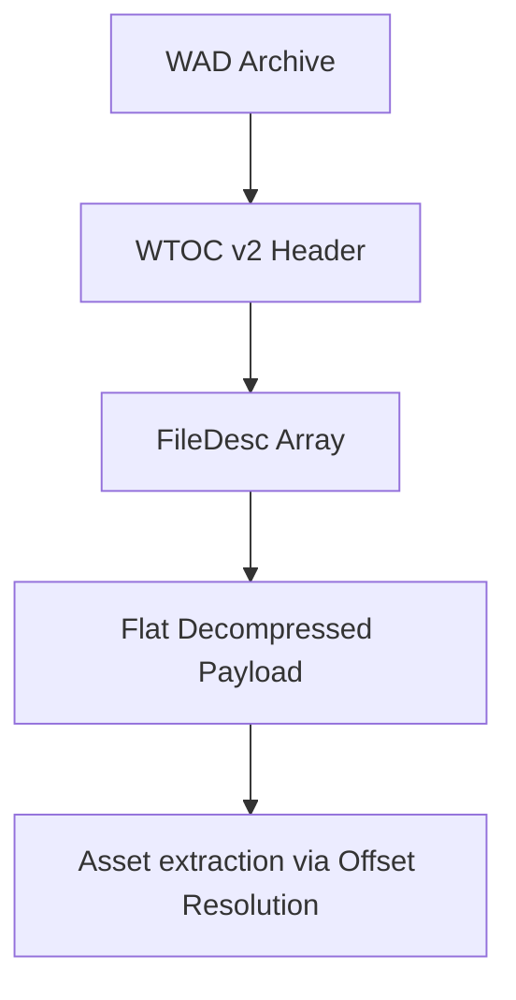

# WAD Format Specification (GoWR PC)

## Overview
God of War Ragnarök (GoWR) utilizes a `WAD` container system that operates on the **WTOC v2** header format and relies heavily on LZ4 framing for compression and streaming.

The GoWR WAD uses a completely flat directory array where entries represent physical allocations resolved by streaming groups (`blockBitSet`).

## Architecture & Hierarchy

```mermaid
graph TD
    WAD[WAD Archive] --> WTOC[WTOC v2 Header]
    WTOC --> DescArray[FileDesc Array]
    DescArray --> Data[Flat Decompressed Payload]
    Data --> SubSystem[Asset extraction via Offset Resolution]
```

## WTOC v2 Header
The file starts with a 16-byte WTOC header.

| Offset | Size | Type | Name | Description |
|--------|------|------|------|-------------|
| 0x00   | 4    | u32  | Magic| `0x434F5457` ("WTOC") |
| 0x04   | 4    | u32  | Version| `0x2` |
| 0x08   | 4    | u32  | Count| Number of `FileDesc` entries |
| 0x0C   | 4    | u32  | Unk0C| Unknown |

## FileDesc Structure
Each asset in the WAD is defined by a 144-byte (`0x90`) `FileDesc` entry. The
descriptor array begins at `0x40`, after the 64-byte WTOC header.

| Offset | Size | Type | Name | Description |
|--------|------|------|------|-------------|
| 0x00   | 2    | u16  | Group | Subsystem group identifier |
| 0x02   | 2    | u16  | Type | Asset type enum |
| 0x04   | 4    | u32  | Size | Byte size of the asset payload |
| 0x08   | 16   | u8[] | Unk1 | |
| 0x18   | 56   | char | Name | Null-terminated ASCII name |
| 0x50   | 31   | u8[] | Unk2 | `Unk2[20] != 0` pushes the entry into queue 8 |
| 0x6F   | 1    | u8   | BlockBitSet | Streaming block group; drives offset resolution |
| 0x70   | 8    | u8[] | Unk3 | `Unk3[2] == 1` triggers a queue flush |
| 0x78   | 4    | u32  | Offset | Offset within the entry's block |
| 0x7C   | 12   | u8[] | Unk4 | |
| 0x88   | 4    | u32  | Offset2 | Secondary offset, used when `BlockBitSet != key` |
| 0x8C   | 4    | u8[] | Unk5 | |

> [!IMPORTANT]
> **Names are not unique, and the duplicate is not the data.** An asset commonly
> appears twice: once with its real `Type` and payload, and once with `Type = 0`
> as a small reference stub whose payload is just a GUID followed by the name.
> In `r_athena00`, `MESH_athena10_0` exists as `Type = 0x0001` with a `0x5558`
> byte payload and as `Type = 0x0000` with a `0x9C` byte stub. Resolving an asset
> by name alone can select the stub, and parsing that stub as a mesh yields
> nonsense — a 156-byte blob reports a submesh count of 6478. Always match on
> `Type` as well as name.

> [!WARNING]
> Asset payloads do **not** sequentially follow their `FileDesc` entries. The actual payload offset in memory requires resolving the `blockBitSet` queues via a dynamic flush algorithm (derived in `Wad.cpp`).
