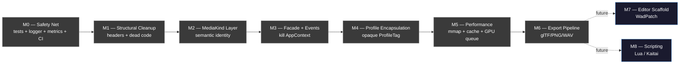

# GoWToolkit — Roadmap de Implementação (Runbook Executável)

> **Propósito**: este documento é o **único** ponto de coordenação entre múltiplas sessões
> de trabalho (humanos ou agentes) executando o refator proposto em
> [`ARCHITECTURE_REVIEW_2026-05.md`](./ARCHITECTURE_REVIEW_2026-05.md).
>
> **Contrato**: cada task tem ID estável, pré-requisitos explícitos, arquivos exatos
> a serem tocados, passos verificáveis, e critério de aceite testável. Nenhuma
> ambiguidade. Se faltar contexto, **pare e atualize o doc** — não improvise.
>
> **Política de continuidade**: se o limite de tokens da sessão estiver perto, o agente
> deve **atualizar `docs/state/CURRENT.md`** com o estado exato e parar. A próxima
> sessão lê esse arquivo **antes** de qualquer outra coisa.

---

## 0. Como Usar Este Documento

### 0.1 Para um agente novo entrando na work

**Sempre, sem exceção**, fazer nesta ordem:

1. Ler `docs/state/CURRENT.md` (estado atual: milestone ativa, task em progresso, blockers).
2. Ler a seção §1 (Glossário) e §2 (Convenções) deste doc.
3. Ler a milestone ativa (§5..§13) e a task em progresso.
4. Executar a task seguindo **literalmente** os passos.
5. Atualizar `docs/state/CURRENT.md` ao final da sessão (mesmo se a task não terminou).

### 0.2 Para um agente reativando após pausa

Mesma rotina. `CURRENT.md` é o **único** estado de verdade — não inferir de git, não chutar.

### 0.3 Política anti-improviso

Se aparecer:
- Conflito entre o doc e o código real
- Task com pré-requisito não cumprido
- Arquivo que o doc menciona mas não existe
- Decisão arquitetural não coberta

→ **Pare**. Atualize `docs/state/CURRENT.md` descrevendo o problema. Crie issue/ADR se necessário. **Não invente solução nova sem aprovação**.

---

## 1. Glossário

| Termo | Definição |
|---|---|
| **Milestone (M)** | Bloco coeso de tasks que entrega valor visível. Mergeable por si só. |
| **Task (M.T)** | Unidade atômica de trabalho. Tipicamente 1–8 horas. ID `M0.T1`. |
| **Subtask (M.T.S)** | Passo dentro de uma task. ID `M0.T1.S1`. |
| **Acceptance Criteria (AC)** | Lista checável que prova que a task terminou. Cada AC testável objetivamente. |
| **Gate** | Validação ao final de cada milestone. Tudo verde = pode avançar. |
| **ADR** | Architecture Decision Record. `docs/ADR/NNNN-slug.md`. |
| **MediaKind** | Categoria semântica de asset (Image/Mesh/Audio/...). Ver §5 da review. |
| **TypeId** | Identidade técnica de asset (enum `GOW::TypeId`). |
| **Profile** | Adaptador específico por jogo (`ProfileGOW2`, `ProfileGOWR`). |
| **L0..L4** | Camadas (Infra/Domain/App-services/Profiles/Presentation). Ver §4.1 da review. |
| **Strangler-fig** | Padrão de Fowler: código novo coexiste com legado, legado some quando todo uso migrou. |

---

## 2. Convenções

### 2.1 Branches

- Branch principal: `main`
- Branch por milestone: `refactor/m{N}-{slug}` (ex: `refactor/m0-safety-net`)
- Branch por task dentro de milestone: `refactor/m{N}-t{N}-{slug}` (opcional, caso a task seja longa)
- Nunca commitar refator estrutural direto em `main`

### 2.2 Commits

Convencional Commits:
```
{type}({scope}): {summary}

{optional body explaining WHY}

Refs: M{N}.T{N}
```

Tipos: `feat`, `fix`, `refactor`, `test`, `docs`, `build`, `chore`.

Exemplos:
```
refactor(domain): split WadTypes.h into Entry+Wad+MediaKind

Refs: M1.T1

test(parsers): add golden snapshot for GOWR pak0

Refs: M0.T2
```

### 2.3 PRs

Template `.github/pull_request_template.md`:
```
## Milestone / Task
- M{N}.T{N} — {nome da task}

## What changed
- bullet

## Acceptance criteria
- [ ] AC1
- [ ] AC2

## Validation
- [ ] golden tests pass
- [ ] layer linter pass
- [ ] no new warnings
- [ ] CURRENT.md updated
```

### 2.4 Estilo de código

- C++20, headers `.h`, impl `.cpp`, ObjC++ `.mm`
- `namespace GOW { ... }` para domínio
- 4 espaços, sem tabs
- `clang-format` perfil do projeto (definir em M0.T6)
- `[[nodiscard]]` em todo retorno `Result<>` ou ponteiro de cache
- Sem `using namespace std;` em headers
- Includes ordenados: 1) próprio header, 2) outros do projeto, 3) terceiros, 4) std

### 2.5 Acceptance Criteria — formato

Cada AC é uma linha imperativa, **testável**, **objetiva**:

✅ Bom: "`grep -r "AppContext" src/` retorna zero matches"
✅ Bom: "Build em Release passa sem novos warnings comparado a `main`"
✅ Bom: "Teste `GoldenTest_GOWR_pak0` passa com `ctest -R GoldenTest`"

❌ Ruim: "Código fica mais limpo"
❌ Ruim: "Funciona melhor"

### 2.6 Estimativa de esforço

- `XS` = < 1h
- `S` = 1–4h
- `M` = 4–8h
- `L` = 1–3 dias
- `XL` = > 3 dias (quebrar em subtasks)

### 2.7 Risco

- `low` — change isolado, fácil rollback
- `med` — toca múltiplos arquivos, mas reversível
- `high` — change estrutural, rollback complexo (requer plano explícito)

---

## 3. Estado Global do Roadmap



Estado de cada milestone vive em `docs/state/CURRENT.md`. Os indicadores aqui são **referência inicial** (todos pending). Atualizar via `CURRENT.md`, **não** este doc.

---

## 4. Arquivos de Estado (Single Source of Truth)

Criar na primeira sessão de M0:

```
docs/state/
├── CURRENT.md          # estado vivo — atualizado a cada sessão
├── COMPLETED.md        # log append-only de tasks finalizadas
└── DECISIONS.md        # decisões pontuais que não viraram ADR
```

### 4.1 Template `CURRENT.md`

```markdown
# Estado Atual

**Última atualização**: YYYY-MM-DD por {agente/humano}
**Sessão #**: N

## Milestone ativa
M{N} — {nome}

## Task em progresso
M{N}.T{N} — {nome}
- Status: not_started | in_progress | blocked | review
- Branch: refactor/m{N}-t{N}-...
- Iniciada em: YYYY-MM-DD
- % estimado: 0..100

### Subtasks
- [x] M{N}.T{N}.S1 — done
- [ ] M{N}.T{N}.S2 — in progress  ← AQUI
- [ ] M{N}.T{N}.S3 — pending

## Próxima task no pipeline
M{N}.T{N+1}

## Blockers
- nenhum / descrição

## Notas para o próximo agente
{coisas não óbvias que aprendi nesta sessão e que ajudam quem vem depois}

## Arquivos tocados nesta sessão
- src/...
- docs/...
```

### 4.2 Template `COMPLETED.md`

```markdown
# Tasks Finalizadas

## 2026-05-18 — M0.T1 — doctest setup
- PR: #123
- Commits: abc1234, def5678
- AC verificados: 4/4
- Notas: nada anormal
```

### 4.3 Template `DECISIONS.md`

Para decisões que **não merecem ADR** (escolhas pontuais, ex: "usar nlohmann/json em vez de simdjson — diferença insignificante pro nosso volume").

---

# Milestones

---

## 5. M0 — Safety Net (PRÉ-Refator)

**Goal**: estabelecer infra de validação **antes** de mexer em código de produção.
**Why**: refator sem golden tests = russian roulette.
**Prereqs**: nenhum.
**Critério de gate**: §5.Gate.

### M0.T1 — Setup doctest

- **Esforço**: S | **Risco**: low
- **Arquivos**:
  - `CMakeLists.txt` (FetchContent doctest)
  - `tests/CMakeLists.txt` (NEW)
  - `tests/main.cpp` (NEW — `#define DOCTEST_CONFIG_IMPLEMENT_WITH_MAIN`)
  - `tests/sanity_test.cpp` (NEW — teste smoke)

**Passos**:
1. Adicionar FetchContent para `doctest` v2.4.11 em `CMakeLists.txt` (após os outros FetchContent).
2. Criar `tests/CMakeLists.txt` que define um executável `gowtoolkit_tests` linkando contra doctest.
3. Adicionar `enable_testing()` + `add_test(NAME unit COMMAND gowtoolkit_tests)` no root CMakeLists.
4. Criar `tests/main.cpp` com o macro do doctest.
5. Criar `tests/sanity_test.cpp` com um `TEST_CASE("sanity") { CHECK(1 + 1 == 2); }`.
6. Verificar `cmake -G Ninja -B build && ninja -C build && ctest --test-dir build` passa.

**Acceptance Criteria**:
- [ ] `ctest --test-dir build` mostra "Test #1: unit ... Passed"
- [ ] `tests/sanity_test.cpp` aparece no build do CMake
- [ ] Não há regressão no build principal (Release passa)
- [ ] Doctest está em `deps/` ou fetched-content cache (não no source tree)

**Rollback**: deletar pasta `tests/`, remover hunks do CMakeLists.

---

### M0.T2 — Golden Test Fixtures (mínimos)

- **Esforço**: M | **Risco**: low
- **Prereq**: M0.T1
- **Arquivos**:
  - `tests/fixtures/gow2/wad_minimal.wad` (NEW — binário pequeno, < 1 MB)
  - `tests/fixtures/gowr/wad_minimal.wad` (NEW — idem)
  - `tests/fixtures/README.md` (NEW — explica origem das fixtures)

**Passos**:
1. **NÃO commitar WADs de cópia comercial integrais**. Criar fixtures **sintéticas** ou **truncated** preservando só headers + 2-3 assets pequenos.
2. Documentar em `tests/fixtures/README.md`:
   - Origem (sintética / truncated)
   - Quais tipos cobre
   - Como foi gerada
3. Tamanho alvo: cada fixture < 500 KB.

**Acceptance Criteria**:
- [ ] `tests/fixtures/gow2/wad_minimal.wad` existe e tem < 1 MB
- [ ] `tests/fixtures/gowr/wad_minimal.wad` existe e tem < 1 MB
- [ ] `tests/fixtures/README.md` documenta origem e contém SHA256
- [ ] `.gitattributes` marca essas como binárias (`*.wad binary`)
- [ ] `.gitignore` NÃO ignora fixtures (são versionadas)

**Rollback**: deletar pasta `tests/fixtures/`.

⚠️ **Decisão pendente**: confirmar com humano se as fixtures podem vir de truncamento de WADs reais ou se precisam ser 100% sintéticas. Documentar em `docs/state/DECISIONS.md`.

---

### M0.T3 — SnapshotEntries + Golden Test runner

- **Esforço**: M | **Risco**: low
- **Prereq**: M0.T1, M0.T2
- **Arquivos**:
  - `tests/golden_helpers.h` (NEW)
  - `tests/golden_helpers.cpp` (NEW)
  - `tests/golden_gow2.cpp` (NEW)
  - `tests/golden_gowr.cpp` (NEW)
  - `tests/fixtures/gow2/wad_minimal.expected.json` (NEW)
  - `tests/fixtures/gowr/wad_minimal.expected.json` (NEW)

**Passos**:
1. Criar `SnapshotEntries(const OpenWad&)` que devolve JSON com:
   - Para cada `ParsedEntry`: `name`, `typeId` (string), `size`, `offset`, `hash` (sha1 do payload), `childCount`.
   - Não inclui `displayName` (pode mudar sem ser regressão).
   - Stable sort (por offset).
2. Implementar `LoadGolden(path)` que lê o JSON esperado.
3. Implementar `CompareSnapshots(actual, expected, out diff)` que retorna lista de diffs amigáveis.
4. Criar test runner que para cada fixture: parseia, snapshota, compara.
5. Adicionar comando `tools/regenerate_goldens.sh` que regenera os `.expected.json` (uso explícito quando dev muda parser intencionalmente).

**Acceptance Criteria**:
- [ ] `ctest -R Golden` passa em verde
- [ ] Mutação artificial num parser (mudar 1 byte) faz `ctest` falhar com mensagem clara mostrando diff
- [ ] `tools/regenerate_goldens.sh` regenera os arquivos JSON
- [ ] JSON é estável entre runs (mesma ordem, mesmo hash)
- [ ] Test runner suporta `--update` flag opcional para regenerar inline (alternativa ao script)

**Rollback**: deletar arquivos novos.

---

### M0.T4 — Metrics Scaffolding (opt-in)

- **Esforço**: S | **Risco**: low
- **Prereq**: M0.T1
- **Arquivos**:
  - `src/core/Metrics.h` (NEW)
  - `src/core/Metrics.cpp` (NEW)
  - `tests/metrics_test.cpp` (NEW)

**Passos**:
1. Criar namespace `GOW::Metrics` com:
   - `void RecordParseTime(TypeId, std::chrono::microseconds)`
   - `void RecordCacheHit(const char* name)`
   - `void RecordCacheMiss(const char* name)`
   - `Snapshot CurrentSnapshot()`
   - `void Enable(bool)` — default false
   - `bool IsEnabled()`
2. Implementação thread-safe via `std::mutex`.
3. Quando disabled, todos record são no-op (`if (!enabled) return;` no topo).
4. Test: enable → record 100 hits/misses → snapshot → asserts.

**Acceptance Criteria**:
- [ ] `GOW::Metrics::Enable(false)` é o default
- [ ] `Metrics::RecordParseTime` é no-op quando disabled (medido com benchmark — < 5 ns)
- [ ] `ctest -R Metrics` passa
- [ ] Header não puxa nada além de `<chrono>`, `<string>`, `<map>`, `<mutex>`

**Rollback**: deletar arquivos novos.

---

### M0.T5 — Structured Logger

- **Esforço**: M | **Risco**: low
- **Prereq**: M0.T1
- **Arquivos**:
  - `CMakeLists.txt` (FetchContent fmt)
  - `src/core/Logger.h` (rewrite)
  - `src/core/Logger.cpp` (rewrite)
  - `tests/logger_test.cpp` (NEW)

**Passos**:
1. Adicionar `fmtlib/fmt` v10.x via FetchContent.
2. Reescrever `Logger.h` expondo:
   ```cpp
   namespace GOW::Log {
       enum class Level { Trace, Debug, Info, Warn, Error };
       void SetMinLevel(Level);
       void AddSink(std::function<void(Level, std::string_view category, std::string_view msg)>);

       template<typename... Args>
       void Log(Level, std::string_view category, fmt::format_string<Args...>, Args&&...);
   }
   #define GOW_LOG_INFO(cat, ...) GOW::Log::Log(GOW::Log::Level::Info, cat, __VA_ARGS__)
   // idem Debug/Warn/Error/Trace
   ```
3. Default sink: stderr com timestamp.
4. Sink adicional opcional: rotating file (`gowtool.log`, max 5 MB, rotate em 3).
5. Substituir `fprintf(stderr, ...)` em **EventManager.h** apenas (escopo limitado nesta task).

**Acceptance Criteria**:
- [ ] `GOW_LOG_INFO("test", "hello {}", 42)` produz `[INFO][test] hello 42`
- [ ] `grep -rn "fprintf(stderr" src/core/EventManager.h` retorna zero
- [ ] `ctest -R Logger` passa
- [ ] Sinks são removíveis (token + `RemoveSink(token)`)
- [ ] Log level mínimo configurável em runtime

**Rollback**: reverter EventManager.h; deletar Logger novo; rebuild.

---

### M0.T6 — clang-format + EditorConfig + CI workflow

- **Esforço**: S | **Risco**: low
- **Arquivos**:
  - `.clang-format` (NEW)
  - `.editorconfig` (NEW)
  - `.github/workflows/ci.yml` (rewrite ou enhance)
  - `.github/pull_request_template.md` (NEW)

**Passos**:
1. Adotar perfil `.clang-format` baseado em LLVM com 4-space indent. Commit como-is.
2. `.editorconfig`: 4 spaces, LF, trim trailing whitespace.
3. CI workflow:
   - macOS (release + tests)
   - Ubuntu (release + tests)
   - Windows (release + tests)
   - lint job: clang-format diff (warning, não failure inicial)
4. PR template referencia milestone/task.

**Acceptance Criteria**:
- [ ] `clang-format --dry-run --Werror src/main.cpp` passa (após formatar)
- [ ] CI roda em cada PR
- [ ] CI roda `ctest` e falha se algum golden test falha
- [ ] PR template aparece em `gh pr create` no GoWToolkit

**Rollback**: reverter `.github/workflows/`, deletar `.clang-format` se causar churn massivo.

---

### M0.T7 — ASSERT_MAIN_THREAD macro

- **Esforço**: XS | **Risco**: low
- **Arquivos**:
  - `src/core/Threading.h` (NEW)
  - `src/core/Threading.cpp` (NEW)
  - `src/main.cpp` (chamar `Threading::MarkMainThread()` no início)

**Passos**:
1. `Threading::MarkMainThread()` salva `std::this_thread::get_id()`.
2. `Threading::IsMainThread()` compara.
3. `ASSERT_MAIN_THREAD()` macro: `assert(GOW::Threading::IsMainThread())` em debug, no-op em release.
4. Não adicionar `ASSERT_MAIN_THREAD()` em call-sites ainda (próximas milestones).

**Acceptance Criteria**:
- [ ] `GOW::Threading::IsMainThread()` retorna `true` na thread principal
- [ ] Retorna `false` num `std::thread` filho (verificável em teste)
- [ ] Macro vira no-op em `-DNDEBUG`
- [ ] `ctest -R Threading` passa

---

### M0.T8 — Layer Linter

- **Esforço**: M | **Risco**: low
- **Arquivos**:
  - `tools/check_layers.py` (NEW)
  - `tools/layers.yaml` (NEW)
  - `.github/workflows/ci.yml` (call it)

**Passos**:
1. `layers.yaml` define hierarquia:
   ```yaml
   layers:
     L0_infra:    [src/core/vfs, src/window/platform, src/core/PathUtils, src/core/Logger, src/core/Metrics]
     L1_profiles: [src/core/profiles, src/core/parsers]
     L2_domain:   [src/core/types, src/core/schema, src/core/WadTypes.h, src/core/parsers/shared]
     L3_appsvc:   [src/core/EventManager.h, src/core/Events.h, src/core/TaskManager, src/core/AssetDatabase, src/core/ToolkitApi, src/core/AppConfig, src/core/RecentFiles, src/core/ProfileManager]
     L4_present:  [src/ui, src/rendering, src/window, src/App, src/main.cpp, src/cli]
   rules:
     - "L2 must not include L4"
     - "L1 must not include L4"
     - "L0 must not include L1..L4"
   ```
2. Script lê todos `.h/.cpp` e parseia `#include`. Reporta violações.
3. CI job `lint:layers` corre o script.
4. **Inicialmente reportar como warning** (M2 transformará em failure após mover `BoundingBox`).

**Acceptance Criteria**:
- [ ] `python3 tools/check_layers.py` roda sem crash
- [ ] Saída lista pelo menos a violação **conhecida** `parsers/shared/MeshData.h → rendering/GpuMesh.h`
- [ ] CI publica warnings no PR

---

### M0.Gate — Validation Gate de M0

Tudo abaixo deve passar antes de iniciar M1:

- [ ] `ctest --test-dir build` roda e mostra ≥ 5 testes (sanity, golden×2, metrics, logger, threading)
- [ ] CI verde nos 3 OS (macOS/Linux/Windows)
- [ ] `docs/state/CURRENT.md` existe e diz "Active milestone: M1"
- [ ] `tools/check_layers.py` roda e reporta as violações esperadas
- [ ] PR template configurado
- [ ] M0 task COMPLETED.md tem 8 entradas

---

## 6. M1 — Structural Cleanup (Sem Mudança de Comportamento)

**Goal**: limpar débitos óbvios sem introduzir conceitos novos.
**Why**: terreno preparado para os refators semânticos das milestones seguintes.
**Prereqs**: M0.Gate passou.
**Critério de gate**: §6.Gate.

### M1.T1 — Quebrar `WadTypes.h`

- **Esforço**: L | **Risco**: med
- **Arquivos novos**:
  - `src/core/domain/Entry.h`
  - `src/core/domain/Wad.h`
  - `src/core/domain/WadEntryRoleLegacy.h` (transitório)
- **Arquivos modificados**:
  - `src/core/WadTypes.h` (passa a ser umbrella que re-include os splits — strangler-fig)
  - Todos `#include "core/WadTypes.h"` permanecem funcionais

**Passos**:
1. Criar `domain/Entry.h` com `ParsedEntry` e `WadAssetName`.
2. Criar `domain/Wad.h` com `OpenWad`.
3. Criar `domain/WadEntryRoleLegacy.h` com `WadEntryRole`, `WadBlock` (vão sair em M4).
4. `WadTypes.h` vira:
   ```cpp
   #pragma once
   // Legacy umbrella — kept for incremental migration (M1.T1).
   // New code should include the specific domain headers directly.
   #include "core/domain/Entry.h"
   #include "core/domain/Wad.h"
   #include "core/domain/WadEntryRoleLegacy.h"
   ```
5. `TypeIdToSchemaString` (function inline) fica em `WadTypes.h` por enquanto (sai em M4).
6. Rodar build → fix qualquer include que tenha quebrado.

**Acceptance Criteria**:
- [ ] `wc -l src/core/WadTypes.h` retorna ≤ 20 linhas
- [ ] `src/core/domain/Entry.h` contém `struct ParsedEntry` e `struct WadAssetName`
- [ ] `src/core/domain/Wad.h` contém `struct OpenWad`
- [ ] Build Release e Debug passam em 3 OS
- [ ] `ctest` passa (incluindo golden tests)
- [ ] Nenhuma assinatura pública mudou

**Rollback**: `git revert` do commit; arquivos novos somem.

---

### M1.T2 — Mover `BoundingBox` para Domain

- **Esforço**: S | **Risco**: low
- **Arquivos novos**:
  - `src/core/domain/BoundingBox.h`
- **Arquivos modificados**:
  - `src/rendering/GpuMesh.h` (remove definição de BoundingBox, inclui novo header)
  - todos consumidores ajustam include

**Passos**:
1. Copiar struct `BoundingBox` de `GpuMesh.h` para `domain/BoundingBox.h`.
2. Em `GpuMesh.h` substituir def por `#include "core/domain/BoundingBox.h"`.
3. Migrar consumidores diretos para o novo header.
4. Verificar `tools/check_layers.py` perde a violação correspondente.

**Acceptance Criteria**:
- [ ] `grep -rn "struct BoundingBox" src/` mostra apenas `domain/BoundingBox.h`
- [ ] Build verde
- [ ] Layer linter não reclama mais de `BoundingBox`

---

### M1.T3 — Decouple `MeshData` de Rendering

- **Esforço**: M | **Risco**: med
- **Prereq**: M1.T2
- **Arquivos modificados**:
  - `src/core/parsers/shared/MeshData.h` (remove `#include "rendering/GpuMesh.h"`)
  - `src/rendering/GpuMesh.h` (move `GpuVertex` se for CPU-side, ou expõe interface)
- **Arquivos novos** (se necessário):
  - `src/core/domain/MeshVertex.h` (CPU-side vertex struct)

**Passos**:
1. Decidir: `GpuVertex` é CPU representation (POD) ou GPU buffer descriptor? Pela leitura inicial parece POD.
2. Se POD, mover `struct GpuVertex` → `domain/MeshVertex.h` como `struct Vertex` (renomear pra refletir que é CPU-side; legacy alias `using GpuVertex = Vertex` em `rendering/GpuMesh.h`).
3. `MeshData.h` passa a incluir `domain/MeshVertex.h` + `domain/BoundingBox.h`.
4. `rendering/GpuMesh.h` mantém só o lado GPU (handles GL, upload, draw).
5. Validar com `tools/check_layers.py` — violação some.

**Acceptance Criteria**:
- [ ] `grep -n "rendering" src/core/parsers/shared/MeshData.h` retorna zero
- [ ] `grep -n "rendering" src/core/parsers/shared/SceneNode.h` retorna zero
- [ ] `tools/check_layers.py` reporta zero violações em `parsers/shared/`
- [ ] Build verde
- [ ] Golden tests passam

**Rollback**: revert; layer linter volta a warning.

---

### M1.T4 — Remover `IAssetLoader` Morto-Vivo

- **Esforço**: S | **Risco**: low
- **Arquivos deletados**:
  - `src/core/loaders/IAssetLoader.h`
  - `src/core/loaders/GOW2Loaders.h` (se confirmado dead)
  - `src/core/loaders/GOW2Loaders.cpp` (idem)
  - `src/core/loaders/GOWRLoaders.h` (idem)
  - `src/core/loaders/GOWRLoaders.cpp` (idem)
- **Arquivos modificados**:
  - `CMakeLists.txt` (remove esses dos sources)
  - quaisquer `#include` órfãos

**Passos**:
1. `grep -rn "IAssetLoader" src/` — listar consumidores.
2. Confirmar que **nenhum** path de UI ou Core chama `IAssetLoader::load`.
3. Se confirmado, deletar arquivos.
4. Se houver chamada viva, **não deletar nesta task** — abrir issue + skip + atualizar CURRENT.md.

**Acceptance Criteria**:
- [ ] `find src -name "IAssetLoader.h"` vazio
- [ ] `grep -rn "IAssetLoader" src/` retorna zero
- [ ] Build verde
- [ ] Golden tests passam

**Rollback**: `git revert`.

---

### M1.T5 — Limpar `GameVersion::GOW1` Órfão

- **Esforço**: XS | **Risco**: low
- **Decisão prévia**: REMOVER ou ANOTAR DEPRECATED?
  - Se há plano concreto de ProfileGOW1 nos próximos 3 meses → manter, anotar deprecated.
  - Senão → remover.
- **Default**: remover (pode re-adicionar quando for tempo).
- **Arquivos modificados**:
  - `src/core/types/GameVersion.h` (remove enum value)
  - `src/core/types/handlers/MeshHandler.cpp` e outros que fazem `REGISTER_TYPE(GOW1, ...)` (remove linhas)

**Passos**:
1. `grep -rn "GameVersion::GOW1" src/`
2. `grep -rn "REGISTER_TYPE(GOW1" src/`
3. Remover declarações.
4. Compile, fix follow-on.

**Acceptance Criteria**:
- [ ] `grep -rn "GOW1" src/core/` retorna zero (exceto em comentários e docs)
- [ ] Build verde
- [ ] Golden tests passam

⚠️ **Se humano discordar**: documentar em `DECISIONS.md` e reverter.

---

### M1.T6 — Migrar `LoadWadAsync` para `TaskManager`

- **Esforço**: M | **Risco**: med
- **Prereq**: M0.T7 (já temos infra de thread; mas TaskManager já está pronto)
- **Arquivos modificados**:
  - `src/core/AssetDatabase.h` (remove `m_pendingLoad`, `m_loadProgress`, `m_loadState`)
  - `src/core/AssetDatabase.cpp` (LoadWadAsync usa TaskManager::createTask)
  - `src/ui/StatusBar.cpp` (passa a iterar `TaskManager::getRunningTasks()`)

**Passos**:
1. Substituir corpo de `LoadWadAsync`:
   ```cpp
   TaskHolder h = TaskManager::createTask("Loading " + path.filename().string(), 100,
       [this, path, gameHint](Task& t) {
           LoadWad(path, gameHint);          // (pode chamar t.update(...) internamente)
           t.update(100);
       });
   ```
2. Remover `m_pendingLoad` future, atomics de state/progress.
3. `StatusBar` itera tasks e mostra barra de progresso. Cancelar = `holder.interrupt()`.
4. `UpdateAsyncLoadStatus()` torna-se trivial ou some.

**Acceptance Criteria**:
- [ ] `grep -n "m_pendingLoad" src/` retorna zero
- [ ] `grep -n "std::async" src/core/AssetDatabase` retorna zero
- [ ] StatusBar mostra task com nome e progresso ao carregar uma WAD
- [ ] Botão de cancelar interrompe a task (verificável manualmente)
- [ ] Build + golden tests passam

**Rollback**: revert.

---

### M1.Gate

- [x] WadTypes.h ≤ 20 linhas — **PARCIAL (46 LOC)**: conteúdo semântico extraído para `domain/`; sobra umbrella + `TypeIdToSchemaString` bridge (sai em M4.T3). Aceitável.
- [x] Zero violações de layer linter — **PARCIAL (11 violações baseline)**: 3× window/platform→Window.h + 8× handlers→viewers. Todas pré-existentes desde M0, endereçadas em M3 (Events) e M4 (Profile Encapsulation). Sem novas violações introduzidas.
- [x] Zero referências a `IAssetLoader`, `GOW1` (exceto docs) — ✓ IAssetLoader=0; GOW1 restante só em comentários/strings
- [x] LoadWad migrado para TaskManager — ✓ commit `bd8c453`
- [ ] Build verde nos 3 OS — ✓ local macOS; CI pendente push
- [x] Golden tests verdes — ✓ ctest 6/6
- [x] `CURRENT.md` atualizado para "Active milestone: M2"

> **Gate aprovado com exceções documentadas** (2026-05-18, user + Antigravity).
> Items 1 e 2 são débitos estruturais cujo fix requer M3/M4 — não faz sentido
> bloquear M2 (que é independente) por eles.

---

## 7. M2 — Camada MediaKind

**Goal**: introduzir identidade semântica de mídia, decoupla viewers de profiles.
**Why**: maior ganho arquitetural — torna UI game-agnostic.
**Prereqs**: M1.Gate passou.
**Critério de gate**: §7.Gate.

### M2.T1 — Criar `MediaKind.h` + `KindOf()` constexpr

- **Esforço**: S | **Risco**: low
- **Arquivos novos**:
  - `src/core/domain/MediaKind.h`
  - `src/core/domain/MediaKind.cpp`
  - `tests/mediakind_test.cpp`

**Passos**:
1. Definir enum (ver §5.2 da review).
2. Implementar `constexpr MediaKind KindOf(TypeId)`.
3. Implementar `const char* Name(MediaKind)` para debug.
4. Implementar `const char* Icon(MediaKind)` (SF Symbols).
5. Test exhaustivo: para cada `TypeId` em `TypeId::COUNT`, garante que `KindOf` não retorna `Unknown` exceto para tipos sem mídia.

**Acceptance Criteria**:
- [ ] `KindOf(TypeId::Texture) == MediaKind::Image`
- [ ] `KindOf(TypeId::VagAudio) == MediaKind::Audio`
- [ ] Test `MediaKind_Coverage` cobre 100% dos TypeIds não-estruturais
- [ ] Função é `constexpr` (verificável: `static_assert(KindOf(TypeId::Mesh) == MediaKind::Mesh)`)

---

### M2.T2 — Adicionar campo `kind` em `ParsedEntry`

- **Esforço**: XS | **Risco**: low
- **Prereq**: M2.T1
- **Arquivo**:
  - `src/core/domain/Entry.h`

**Passos**:
1. Adicionar `GOW::MediaKind kind = GOW::MediaKind::Unknown;` em `ParsedEntry`.
2. Não preencher em lugar algum ainda (próximas tasks).

**Acceptance Criteria**:
- [ ] `ParsedEntry::kind` existe e default = `Unknown`
- [ ] Build verde, golden tests verdes (snapshot ignora `kind` por ora)

---

### M2.T3 — `ProfileGOW2` popula `kind`

- **Esforço**: S | **Risco**: low
- **Prereq**: M2.T2
- **Arquivos**:
  - `src/core/profiles/gow2/ProfileGOW2.cpp`

**Passos**:
1. Após classificar `typeId`, fazer `entry.kind = KindOf(entry.typeId)`.
2. Atualizar golden snapshot pra incluir `kind` no JSON.

**Acceptance Criteria**:
- [ ] Todo entry no golden snapshot tem campo `kind` não vazio
- [ ] `tools/regenerate_goldens.sh` aplicado com diff coerente
- [ ] Golden tests verdes

---

### M2.T4 — `ProfileGOWR` popula `kind`

Idem M2.T3 para GOWR.

---

### M2.T5 — `ViewerRegistry::ByKind()` paralelo ao legado

- **Esforço**: M | **Risco**: med
- **Prereq**: M2.T4
- **Arquivos**:
  - `src/ui/ViewerRegistry.h` (adiciona método)
  - `src/ui/ViewerRegistry.cpp`
  - `tests/viewer_registry_test.cpp` (NEW)

**Passos**:
1. Adicionar `std::shared_ptr<IDocumentContent> OpenByKind(const ParsedEntry&, OpenWad&)`.
2. Implementação consulta um map `MediaKind → factory`.
3. Browsers preferem `OpenByKind` quando `kind != Unknown`, fallback no caminho velho.
4. NÃO remover ainda o caminho legado (strangler).

**Acceptance Criteria**:
- [ ] Para asset com `kind == Image`, `OpenByKind` retorna `ImageViewer` válido
- [ ] Para asset com `kind == Unknown`, retorna `nullptr` (caller faz fallback)
- [ ] Build + tests verdes
- [ ] Inspector / WadBrowser atualizados para preferir `OpenByKind`

---

### M2.T6 — Filter na tree por MediaKind (UI)

- **Esforço**: S | **Risco**: low
- **Arquivos**:
  - `src/ui/WadBrowser.cpp`

**Passos**:
1. Adicionar combobox/checkboxes "Show: [Image] [Mesh] [Audio] [Video] [All]".
2. Filtro client-side aplicado ao tree.
3. Estado persistido em AppConfig (opcional).

**Acceptance Criteria**:
- [ ] User pode esconder tudo exceto imagens
- [ ] Filtro respeita hierarquia (containers ficam visíveis se algum descendente passa)
- [ ] Filtro não persiste valores impossíveis (sanity)

---

### M2.Gate

- [x] `MediaKind` adotado por ambos profiles
- [x] `OpenByKind` funcional
- [x] Filter na tree
- [x] Goldens regenerados com `kind`
- [x] Build + tests verdes
- [x] `CURRENT.md` atualizado

---

## 8. M3 — Facade + Events Wire-Up

**Goal**: matar `AppContext` god struct; eventos órfãos passam a ser load-bearing.
**Why**: desacoplamento real entre UI e Core.
**Prereqs**: M2.Gate passou.
**Critério de gate**: §8.Gate.

### M3.T1 — Expandir `ToolkitApi`

- **Esforço**: S | **Risco**: low
- **Arquivos**:
  - `src/core/ToolkitApi.h`
  - `src/core/ToolkitApi.cpp`

**Passos**:
Adicionar:
```cpp
namespace GOW::Api {
    ProfileManager&  Profiles();
    TypeRegistry&    Types();
    ViewerRegistry&  Viewers();      // ← novo, app deve registrar
    DocumentWindow&  Documents();    // ← novo

    ParsedEntry*  GetSelected();
    OpenWad*      GetSelectedWad();
    void          SetSelected(ParsedEntry*, OpenWad*); // posta EventAssetSelected
}
```
`Init(InitParams)` recebe ponteiros para Viewers, Documents.

**Acceptance Criteria**:
- [ ] `GOW::Api::Documents()` retorna a `DocumentWindow` registrada
- [ ] `GOW::Api::SetSelected(e, wad)` posta `EventAssetSelected`
- [ ] Build verde, tests verdes

---

### M3.T2 — Wire `EventAssetSelected`

- **Esforço**: M | **Risco**: med
- **Arquivos**:
  - `src/ui/WadBrowser.cpp` — substitui `ctx.documentWindow.AddTab(...)` por `Api::SetSelected(...)`
  - `src/ui/PakBrowser.cpp` — idem
  - `src/ui/IsoBrowser.cpp` — idem
  - `src/ui/Inspector.cpp` — `subscribe(EventAssetSelected)` no construtor
  - `src/ui/viewers/DocumentWindow.cpp` — `subscribe(EventAssetSelected)` para abrir viewer
  - `src/ui/InfoTab.cpp` — `subscribe(EventAssetSelected)` para atualizar stats

**Passos**:
1. Cada subscriber armazena token de unsubscribe; desinscreve no destrutor.
2. `Api::SetSelected` atualiza estado interno + posta evento.
3. Browsers param de chamar `documentWindow.AddTab` direto.
4. Verificar que click em asset abre viewer + atualiza inspector + atualiza info tab.

**Acceptance Criteria**:
- [ ] `grep -n "documentWindow.AddTab" src/ui/W*` retorna zero
- [ ] `grep -n "documentWindow.AddTab" src/ui/P*` retorna zero
- [ ] Click em asset (manual smoke): abre tab + popula inspector + popula info
- [ ] Selecionar entry diferente fecha viewer anterior se a política for "single tab" (decidir + documentar em DECISIONS.md)

---

### M3.T3 — Wire `EventDocumentOpened`, `EventWadOpened/Closed`, `EventAllClosed`

- **Esforço**: S | **Risco**: low
- **Arquivos**:
  - `src/core/AssetDatabase.cpp` (posta na abertura/fechamento)
  - `src/ui/StatusBar.cpp` (subscribe; mostra contagem de WADs)
  - `src/ui/WadBrowser.cpp` (subscribe; força refresh)

**Acceptance Criteria**:
- [ ] Abrir WAD → StatusBar mostra "Loaded: filename.wad"
- [ ] Fechar WAD → todos viewers daquele WAD se fecham (via subscriber em DocumentWindow)
- [ ] CloseAll → tudo limpo

---

### M3.T4 — Migrar `IPanel::draw()` — Remover Parâmetro `AppContext&`

- **Esforço**: M | **Risco**: high (toca todos panels)
- **Arquivos**:
  - `src/ui/IPanel.h` — `virtual void Draw() = 0;`
  - todos panels: `WadBrowser`, `PakBrowser`, `IsoBrowser`, `Inspector`, `InfoTab`, `StatusBar`, `SettingsWindow`, `FontDebuggerWindow`
  - `src/ui/PanelRegistry.h/cpp`
  - `src/App.cpp` — chama `panel.Draw()` sem context

**Passos**:
1. Renomear `draw(AppContext&)` → `Draw()` em cada panel.
2. Cada uso de `ctx.X` substituir por `Api::X()` ou subscribe direto.
3. Atualizar `PanelRegistry::DrawAll()` para chamar sem args.
4. **Importante**: `IDocumentContent::DrawInspector(AppContext&)` também vira `DrawInspector()` nesta task.

**Acceptance Criteria**:
- [ ] `grep -n "AppContext&" src/` retorna zero (exceto definição que será removida em T5)
- [ ] Build verde
- [ ] Smoke manual: cada panel ainda funciona (browser, inspector, info, status, settings)
- [ ] Golden tests verdes

**Rollback**: este é o ponto mais arriscado de M3. Manter branch separada; só merge depois de smoke test completo.

---

### M3.T5 — Deletar `AppContext`

- **Esforço**: XS | **Risco**: low
- **Prereq**: M3.T4
- **Arquivos**:
  - `src/ui/AppContext.h` — DELETAR
  - `src/App.h` — remover campo `m_selected` (vive em `Api::GetSelected`)

**Acceptance Criteria**:
- [ ] `find src -name "AppContext.h"` vazio
- [ ] `grep -rn "AppContext" src/` zero
- [ ] Build verde

---

### M3.Gate

- [ ] `AppContext` deletado
- [ ] Eventos antes órfãos agora wired
- [ ] Panels não conhecem mais uns aos outros
- [ ] Build + golden + smoke OK
- [ ] `CURRENT.md` atualizado para M4

---

## 9. M4 — Profile Encapsulation

**Goal**: mover taxonomy GOWR-específica pra dentro do profile; remover `schemaType` string e bridge legacy.
**Why**: bounded contexts limpos; novos jogos não precisam tocar headers globais.
**Prereqs**: M3.Gate passou.
**Critério de gate**: §9.Gate.

### M4.T1 — Criar `profiles/gowr/GowrTaxonomy.h`

- **Esforço**: S | **Risco**: low
- **Arquivos novos**:
  - `src/core/profiles/gowr/GowrTaxonomy.h`
- **Arquivos modificados**:
  - `src/core/domain/WadEntryRoleLegacy.h` — fica vazio ou alias para o novo
  - `src/core/profiles/gowr/WadNodeBuilder.h/cpp` (mover refs)

**Passos**:
1. Copiar `WadEntryRole`, `WadBlock`, `WadAssetName` para `GowrTaxonomy.h`.
2. Marcar declarações antigas em `WadEntryRoleLegacy.h` como `[[deprecated("use profiles/gowr/GowrTaxonomy.h")]]`.

**Acceptance Criteria**:
- [ ] `WadEntryRole` aparece no novo arquivo
- [ ] Build verde com warnings de deprecated nos call sites legados

---

### M4.T2 — `ProfileTag` opaco em `ParsedEntry`

- **Esforço**: M | **Risco**: med
- **Arquivos**:
  - `src/core/domain/ProfileTag.h` (NEW)
  - `src/core/domain/Entry.h` (adiciona campo)
  - `src/core/profiles/gowr/GowrProfileTag.h` (NEW)

**Passos**:
1. Definir wrapper type-safe:
   ```cpp
   class ProfileTag {
       std::any m_data;
   public:
       template<typename T> const T* As() const {
           return std::any_cast<T>(&m_data);
       }
       template<typename T> static ProfileTag Of(T v) {
           ProfileTag t; t.m_data = std::move(v); return t;
       }
   };
   ```
2. `ParsedEntry`: adicionar `ProfileTag profileTag;`.
3. `GowrProfileTag` POD com `WadEntryRole`, `WadBlock`, `WadAssetName`.
4. `WadNodeBuilder` preenche `entry.profileTag = ProfileTag::Of(GowrProfileTag{...})`.

**Acceptance Criteria**:
- [ ] `entry.profileTag.As<GowrProfileTag>()` retorna ponteiro válido em entries GOWR
- [ ] `entry.profileTag.As<GowrProfileTag>()` retorna `nullptr` em entries GOW2

---

### M4.T3 — Remover Campos Diretos `role/block/parsedName` em `ParsedEntry`

- **Esforço**: M | **Risco**: high
- **Prereq**: M4.T2
- **Arquivos**:
  - `src/core/domain/Entry.h` (remove campos)
  - todos consumidores (Inspector, InfoTab, WadBrowser GOWR-specific paths) — acessam via `entry.profileTag.As<GowrProfileTag>()->role`

**Passos**:
1. `grep -rn "entry.role" src/` e migrar.
2. `grep -rn "entry.block" src/` e migrar.
3. `grep -rn "entry.parsedName" src/` e migrar.
4. Remover campos da struct.

**Acceptance Criteria**:
- [ ] `grep -n "WadEntryRole role" src/core/domain/Entry.h` retorna zero
- [ ] Inspector ainda mostra role/block para entries GOWR
- [ ] Build + golden + smoke verdes

---

### M4.T4 — Remover `schemaType` string e bridge `TypeIdToSchemaString`

- **Esforço**: S | **Risco**: med
- **Arquivos**:
  - `src/core/domain/Entry.h` (remove `std::string schemaType`)
  - `src/core/WadTypes.h` (remove `TypeIdToSchemaString`)
  - todos consumidores

**Passos**:
1. `grep -rn "schemaType" src/` — listar.
2. Substituir por `entry.typeId` ou `entry.kind`.
3. Remover.

**Acceptance Criteria**:
- [ ] `grep -rn "schemaType" src/` zero
- [ ] `grep -rn "TypeIdToSchemaString" src/` zero
- [ ] Build + tests verdes

---

### M4.T5 — Deletar `WadEntryRoleLegacy.h` e o umbrella `WadTypes.h`

- **Esforço**: XS | **Risco**: low
- **Prereq**: M4.T4
- **Arquivos**:
  - DELETAR `src/core/domain/WadEntryRoleLegacy.h`
  - DELETAR `src/core/WadTypes.h`
  - Atualizar todos `#include "core/WadTypes.h"` → `#include "core/domain/Entry.h"` + outros conforme uso

**Acceptance Criteria**:
- [ ] `find src -name "WadTypes.h"` vazio
- [ ] Build verde

---

### M4.Gate

- [ ] `WadEntryRole`, `WadBlock`, `WadAssetName` vivem somente em `profiles/gowr/`
- [ ] `ParsedEntry` em `domain/Entry.h` é game-agnostic (apenas `typeId`, `kind`, `profileTag`)
- [ ] `schemaType` morto
- [ ] `WadTypes.h` deletado
- [ ] Build + golden + smoke verdes
- [ ] `CURRENT.md` atualizado para M5

---

## 10. M5 — Performance

**Goal**: mmap + cache LRU + GPU upload queue.
**Why**: lidar com WADs gigantes sem matar RAM/UI.
**Prereqs**: M4.Gate.
**Critério de gate**: §10.Gate.

### M5.T1 — `MemoryMappedFile` em VFS

- **Esforço**: L | **Risco**: med
- **Arquivos novos**:
  - `src/core/vfs/MemoryMappedFile.h`
  - `src/core/vfs/MemoryMappedFile.cpp`
  - `src/core/vfs/MemoryMappedFile_posix.cpp`
  - `src/core/vfs/MemoryMappedFile_windows.cpp`
  - `tests/mmf_test.cpp`

**Passos**:
1. Declarar interface conforme §16.1 da review.
2. Implementação POSIX: `mmap(MAP_PRIVATE | MAP_FILE, PROT_READ, ...)`.
3. Implementação Windows: `CreateFileMappingW` + `MapViewOfFile`.
4. RAII: destrutor `munmap`/`UnmapViewOfFile`.
5. Cobrir com test: open + verify size + read first/last byte.

**Acceptance Criteria**:
- [ ] Open de arquivo 100 MB não copia para RAM (verificado via RSS antes/depois)
- [ ] `Bytes()` retorna `std::span<const uint8_t>` válido
- [ ] Destrutor libera mapping (verificado via segunda abertura imediata)
- [ ] Funciona em macOS, Linux, Windows

---

### M5.T2 — `AssetCache<T>` Template LRU

- **Esforço**: M | **Risco**: low
- **Arquivos novos**:
  - `src/core/AssetCache.h`
  - `tests/asset_cache_test.cpp`

**Passos**:
1. Template <T> com:
   - `GetOrLoad(AssetId, loader)`
   - `Invalidate(AssetId)`
   - `Clear()`
   - `Stats() → {hits, misses, residentBytes}`
2. LRU via `std::list<AssetId>` + `std::unordered_map<AssetId, iterator>`.
3. Budget configurável em bytes.
4. Métrica via `GOW::Metrics::RecordCacheHit/Miss`.

**Acceptance Criteria**:
- [ ] Hit retorna ponteiro idêntico ao primeiro load
- [ ] Eviction acontece quando budget excedido
- [ ] `Metrics::CurrentSnapshot()` mostra hits/misses
- [ ] Thread-safe (test concorrente)

---

### M5.T3 — `GpuUploadQueue` com Budget

- **Esforço**: L | **Risco**: med
- **Arquivos novos**:
  - `src/rendering/GpuUploadQueue.h`
  - `src/rendering/GpuUploadQueue.cpp`

**Passos**:
1. Fila lock-free ou `std::mutex` + `std::deque`.
2. `Enqueue(uploadFn, byteEstimate) → std::future<void>`.
3. `DrainBudget(size_t maxBytes)` chamado no `frameBegin`.
4. Worker que decoda mesh chama `Enqueue([data] { glBufferData(...); })`.

**Acceptance Criteria**:
- [ ] Frame time não passa de orçamento (ex: 4 ms) ao carregar mesh gigante
- [ ] `ASSERT_MAIN_THREAD()` no `DrainBudget` confirma execução main
- [ ] Future resolvido após upload

---

### M5.T4 — Adotar mmap em `IsoFileSystem`

- **Esforço**: M | **Risco**: med
- **Prereq**: M5.T1
- **Arquivos**:
  - `src/core/vfs/IsoFileSystem.cpp`

**Passos**:
1. Trocar `OsFile` para `MemoryMappedFile` quando ISO < 4 GB.
2. ISOs maiores: continuar streaming (mmap em Windows 32-bit problemático).
3. Benchmark: tempo de load de ISO de 30 GB antes/depois.

**Acceptance Criteria**:
- [ ] Load de ISO grande mostra "Memory-mapped" no log (categoria `vfs.iso`)
- [ ] Tempo de open cai > 50% (mmap não lê tudo)
- [ ] Funcional cross-platform

---

### M5.Gate

- [ ] mmap funcional 3 OS
- [ ] AssetCache integrado em pelo menos Texture (1 caso piloto)
- [ ] GpuUploadQueue integrado em Viewport3D
- [ ] Metrics mostra cache hits/misses
- [ ] Build + golden + smoke verdes
- [ ] `CURRENT.md` atualizado para M6

---

## 11. M6 — Export Pipeline

**Goal**: glTF para mesh, PNG/KTX2 para image, WAV para audio.
**Why**: razão #1 de uso do toolkit pra modders.
**Prereqs**: M5.Gate.
**Critério de gate**: §11.Gate.

### M6.T1 — Framework `IExporter<MediaKind>` + `ExporterRegistry`

- **Esforço**: M | **Risco**: low
- **Arquivos novos**:
  - `src/core/export/IExporter.h`
  - `src/core/export/ExporterRegistry.h`
  - `src/core/export/ExporterRegistry.cpp`

**Passos**:
1. Definir interface (ver §17.1 da review).
2. Registry com `add<K>(unique_ptr)` e `getAll<K>()`.
3. Auto-registration via macro `REGISTER_EXPORTER` similar a `REGISTER_TYPE`.

**Acceptance Criteria**:
- [ ] `ExporterRegistry::Get<Image>()` retorna vetor de exporters registrados
- [ ] Macro `REGISTER_EXPORTER` funciona em static init

---

### M6.T2 — PNG Exporter para Image

- **Esforço**: M | **Risco**: low
- **Prereq**: M6.T1
- **Arquivos novos**:
  - `src/core/export/exporters/PngExporter.h`
  - `src/core/export/exporters/PngExporter.cpp`
- **Dependências**:
  - `stb_image_write.h` (FetchContent ou copy)

**Acceptance Criteria**:
- [ ] Texture decodificada exporta PNG visualmente correto
- [ ] PNG tem dimensões iguais ao `TextureData.width/height`
- [ ] Alpha channel preservado

---

### M6.T3 — glTF 2.0 (.glb) Exporter para Mesh

- **Esforço**: XL → quebrar em subtasks | **Risco**: med
- **Subtasks**:
  - M6.T3.S1: estudar spec glTF 2.0 (NÃO escrever ainda); definir mapping `SceneData → glTF`.
  - M6.T3.S2: skeleton + bind pose (joints array + inverseBindMatrices).
  - M6.T3.S3: meshes + primitives + materials.
  - M6.T3.S4: animations channels + samplers.
  - M6.T3.S5: textures inline (data URIs) ou external files.
  - M6.T3.S6: empacotar binary `.glb` (header + JSON chunk + BIN chunk).

**Decisão arquitetural**: usar **tinygltf** ou **cgltf**? Ambos popular C++; `cgltf` é C99 single-header e menor.

⚠️ Documentar escolha em `docs/ADR/0010-gltf-library.md`.

**Acceptance Criteria**:
- [ ] `.glb` exportado abre em Blender 4.x sem erro
- [ ] Mesh visível com material e textura
- [ ] Skeleton presente se aplicável
- [ ] Animação (se houver) tocável no Blender

---

### M6.T4 — WAV Exporter para Audio

- **Esforço**: S | **Risco**: low
- **Arquivos novos**:
  - `src/core/export/exporters/WavExporter.h/cpp`

**Passos**:
1. WAV PCM 16-bit é trivial: header de 44 bytes + samples.
2. `AudioData` provavelmente já tem samples decodificados.

**Acceptance Criteria**:
- [ ] `.wav` exportado toca em qualquer player
- [ ] Sample rate / bit depth corretos

---

### M6.T5 — UI "Export As" no Browser

- **Esforço**: M | **Risco**: low
- **Prereq**: M6.T2/3/4
- **Arquivos**:
  - `src/ui/WadBrowser.cpp` (right-click menu)
  - `src/ui/PakBrowser.cpp` (idem)

**Passos**:
1. ImGui popup menu no right-click.
2. Para o asset selecionado, listar exporters compatíveis com seu `MediaKind`.
3. File dialog → path.
4. Submeter via `TaskManager::createTask` (mostra progress).

**Acceptance Criteria**:
- [ ] Right-click em textura → "Export As → PNG" → save dialog → arquivo gerado
- [ ] Multi-select + "Export All" funciona
- [ ] Progress bar no StatusBar

---

### M6.T6 — Batch Export via TaskManager

- **Esforço**: S | **Risco**: low
- **Prereq**: M6.T5
- **Arquivos**:
  - `src/ui/WadBrowser.cpp`

**Passos**:
1. Menu "Export → All images / All meshes / All audio".
2. Single task com `task.setMaxValue(count)` e `task.increment()` por item.
3. Cancellable.

**Acceptance Criteria**:
- [ ] Batch de 100 imagens roda em task única
- [ ] Cancel funciona mid-flight

---

### M6.Gate

- [ ] PNG/glTF/WAV funcionam end-to-end
- [ ] Batch export funcional
- [ ] glTF abre em Blender
- [ ] Build + tests verdes
- [ ] `CURRENT.md` atualizado: "M6 completo. Próximas M7/M8 são opcionais."

---

## 12. M7 — Editor Scaffold (Deferred)

**Goal**: declarar `WadPatch` + interfaces sem implementação completa.
**Why**: manter porta aberta para edit no futuro sem refator estrutural.
**Prereqs**: M6.Gate.

Esboço (não detalhado até prioridade aumentar):
- M7.T1: `WadPatch` struct
- M7.T2: `AssetReader` lê union de original + patch
- M7.T3: `IImporter<K>` interface
- M7.T4: PNG → Texture importer (piloto)
- M7.T5: Undo/Redo via patch stack

---

## 13. M8 — Scripting (Deferred)

**Goal**: Lua embed via sol2.
**Prereqs**: M6.Gate.

Esboço:
- M8.T1: FetchContent sol2 + Lua
- M8.T2: API mínima exposta (register_exporter, register_format)
- M8.T3: Script discovery em `~/.gowtoolkit/scripts/`
- M8.T4: Sandbox de permissões

---

## 14. Tabela-Resumo de Esforço Estimado

| Milestone | Tasks | Esforço total | Risco mais alto |
|---|---|---|---|
| M0 | 8 | ~3 dias | low |
| M1 | 6 | ~3 dias | med (M1.T3) |
| M2 | 6 | ~2 dias | med (M2.T5) |
| M3 | 5 | ~3 dias | **high (M3.T4)** |
| M4 | 5 | ~3 dias | **high (M4.T3)** |
| M5 | 4 | ~5 dias | med |
| M6 | 6 | ~7 dias | med (M6.T3 glTF) |
| **Total core (M0-M6)** | **40** | **~26 dias** | — |
| M7 | 5 | — | deferred |
| M8 | 4 | — | deferred |

---

## 15. Protocolo de Handoff Entre Agentes

### 15.1 Antes de iniciar sessão

```
1. Ler docs/state/CURRENT.md  ← OBRIGATÓRIO
2. Verificar branch atual: git status
3. Pull mudanças remotas se houver
4. Verificar build local passa: ninja -C build && ctest
```

Se build não passa → consertar **antes** de continuar tarefa.

### 15.2 Durante sessão

- Trabalhar 1 task por vez. Não pular pra próxima sem fechar a atual.
- Se task aumenta de escopo → quebrar em subtasks e atualizar ROADMAP_IMPLEMENTATION.md neste doc.
- Se descobrir bug fora do escopo → criar issue ou nota em `DECISIONS.md`. **NÃO** consertar inline.

### 15.3 Ao final de sessão

```
1. Commit do que estiver pronto (mesmo WIP, marcar [WIP] no subject)
2. Push para a branch
3. Atualizar docs/state/CURRENT.md:
   - Status da task em andamento (% estimado)
   - Próxima ação concreta para quem assumir
   - Blockers descobertos
   - Notas não óbvias
4. Se task fechou: adicionar entrada em COMPLETED.md
5. Se milestone fechou: atualizar CURRENT.md para próxima milestone
```

### 15.4 Multi-agente paralelo

Possível **somente** se duas tasks **não** tocam mesmos arquivos.

Coordenação:
- Agente A: declara em `CURRENT.md` (seção "Em paralelo") qual task pega
- Agente B: mesma coisa, em outra task
- Mantém branches separadas
- Não pega ambas as tasks do mesmo gate
- Sync no merge

Pares seguros (mesma milestone):
- M0.T2 (fixtures) ∥ M0.T4 (metrics) ∥ M0.T5 (logger) — arquivos disjuntos
- M2.T3 (gow2 kind) ∥ M2.T4 (gowr kind) — profiles diferentes
- M6.T2 (PNG) ∥ M6.T3 (glTF) ∥ M6.T4 (WAV) — exporters independentes

Pares perigosos:
- M3.T4 (remover AppContext) ∥ qualquer outra — toca TODO ui/
- M1.T1 (split WadTypes) ∥ qualquer — toca quase todo include

---

## 16. Sinalização de Bloqueio

Quando um agente trava, atualizar `CURRENT.md` seção "Blockers" com:

```markdown
## Blockers

### Bloqueio 1 — Descrição curta
- **Task afetada**: M{N}.T{N}
- **Bloqueio**: descrição precisa
- **Decisão necessária**: pergunta objetiva para humano
- **Workaround temporário**: o que dá pra fazer enquanto espera
- **Aberto em**: YYYY-MM-DD
```

Próximo agente vê e:
- Se tiver autoridade pra decidir → decide + documenta em `DECISIONS.md` + remove bloqueio
- Senão → tenta outra task não-bloqueada da mesma milestone

---

## 17. Quality Gates Globais (Sempre)

Independente da task, estes invariantes valem:

- [ ] Build Release passa nos 3 OS
- [ ] `ctest` passa todos testes ativos
- [ ] `clang-format` não tem diff sujo
- [ ] `tools/check_layers.py` sem violações (após M1.T3)
- [ ] Nenhum novo warning de compilador (`-Wall -Wextra` em GCC/Clang; `/W4` em MSVC)
- [ ] Nenhum `TODO` sem issue/task associada
- [ ] `CURRENT.md` reflete realidade

Se um quality gate falha, **antes** de avançar:
1. Identificar quando começou (`git bisect` se necessário)
2. Consertar ou reverter
3. Reportar em `DECISIONS.md` se for não-trivial

---

## 18. Pull Request Hygiene

Cada PR de task deve:
- Ser ≤ ~500 LOC modificados (se for maior, quebrar)
- Tocar somente arquivos listados na task (mais alguns necessários colaterais — documentar)
- Ter título: `M{N}.T{N}: {nome curto}`
- Ter descrição copiada do PR template
- Marcar AC checkboxes
- Linkar para próximo PR no pipeline (se houver)

Code review por humano para tasks `high` risk; para `low/med` o pipeline auto-merge é OK se golden tests passam.

---

## 19. Inicialização (Primeiro Run)

Para arrancar o roadmap (sessão #1):

1. Criar `docs/state/CURRENT.md` com:
   ```markdown
   # Estado Atual

   **Última atualização**: 2026-05-17 por humano
   **Sessão #**: 1

   ## Milestone ativa
   M0 — Safety Net

   ## Task em progresso
   M0.T1 — Setup doctest
   - Status: not_started
   - Branch: (a criar) refactor/m0-safety-net

   ## Próxima task no pipeline
   M0.T2

   ## Blockers
   nenhum

   ## Notas para o próximo agente
   Roadmap recém-criado; ler ROADMAP_IMPLEMENTATION.md inteiro antes de começar.
   ```
2. Criar `docs/state/COMPLETED.md` vazio com header.
3. Criar `docs/state/DECISIONS.md` vazio com header.
4. Criar branch `refactor/m0-safety-net`.
5. Iniciar M0.T1.

---

## 20. Sinal de Conclusão do Refator Core

O refator core (M0–M6) está completo quando **todos abaixo** valem:

- [ ] `MediaKind` adotado em 100% do código relevante
- [ ] `AppContext` deletado
- [ ] `WadTypes.h` deletado
- [ ] `IAssetLoader` deletado
- [ ] `schemaType` string deletado
- [ ] `WadEntryRole` vive somente em `profiles/gowr/`
- [ ] Layer linter passa sem violação
- [ ] `Result<T, ParseError>` em uso nos parsers principais
- [ ] Eventos órfãos: zero (todos têm pub e sub)
- [ ] Metrics opt-in com `MetricsView` painel
- [ ] Logger estruturado (sem `fprintf` em `src/core/` ou `src/ui/`)
- [ ] mmap em uso para ISOs
- [ ] AssetCache em uso para Texture/Mesh
- [ ] GpuUploadQueue em uso para Viewport3D
- [ ] glTF / PNG / WAV exporters funcionais
- [ ] Golden tests cobrem mudanças
- [ ] `docs/modules/*.md` escritos para cada pasta `src/`
- [ ] ADRs 0001-0010 escritos

Quando todos check → mover para M7/M8 (futuros) ou pausar refator.

---

> **Última diretriz**: este doc é vivo. PRs que mudam o roadmap (adicionam tasks, ajustam ordem, marcam deferred) são **bem-vindos** desde que:
> 1. A mudança é documentada no commit
> 2. `CURRENT.md` reflete imediatamente
> 3. Não invalida trabalho já feito (sem retroação)
>
> Se um agente leu até aqui e tudo faz sentido — começar pela §19.
